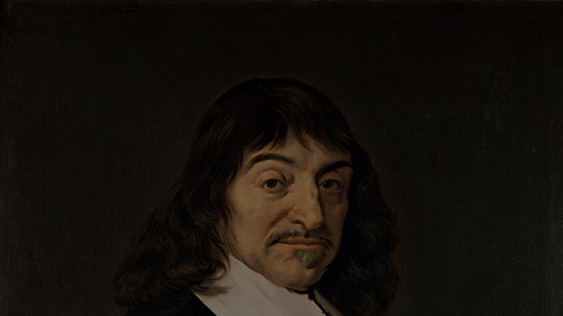

<!-- 
size: 16:9
paginate: true
-->
<!-- header: 勉強会# ― エンジニアとしての解像度を高めるための勉強会-->

# 分割と統治 (Divide and Conquer)

大きな問題はいくつかの小さな問題に分割して解決していく

---

## 大きな問題を一息で解決できる人はいない

大きな問題をそのまま解決しようとしても、たいてい遅れるか躓くかで解決できない

* 問題が複雑に絡み合っているため掌上に乗らない

・・・これは誰もが同じ

>>> Photo by Pavel Novak - Cropped and scaled down from Image:Everest kalapatthar.jpg.

<!-- 
優秀な人だって同じです。
---
そして私たちが仕事や趣味で取り組み作っているプログラムやコンテンツは、例外なく複雑なもの。いくつもの機能、画面、外部要因が絡まっているものを作り上げている。

じゃあなぜプログラマーは、これは我々も含めてですが、ものが作れているか？

そしてなぜ優秀な人ほど素早く保守性高く作れているかというと、(ページ次へ)
-->

---

## 大きな問題は小さな問題の寄せ集め

### どんなに複雑な問題も、解決可能な小さい問題に分割できる

> システム → ドメイン → 機能 → モジュール → 関数 → コード → ...

→ 山も崩せば塵となる

### 解決した小さな問題を再び組み上げれば、解決した大きな問題が出来上がる

> コード → 関数 → モジュール → 機能 → ドメイン → システム(完成!)

→ 塵も積もれば山となる

<!-- 
解決できない大きな問題があったとしても、それは解決可能な小さい問題の寄せ集めでしかない。

ここは自作するけどここは既存のライブラリを使用する。ここはバリエーションごとに不定になるから分けておく、Webから入手した情報をサニタイズするまで隔離する、アプリケーションの状態を１つのリポジトリクラスでまとめておく、などなど

世の中に優秀な人ってたくさんいますよね。我々には出来そうもないことを何の苦もなくやりのけてしまう人たち。やんなっちゃうくらいスムーズにものを作り上げてしまうんですよね。そこにしびれたり憧れたり嫉妬したりするわけで。
でもどんな優秀な人だって、あらゆるケースを想定したものを一刀彫で作れるわけではない。彼らだって同じ。

でも、問題を見てすぐに適切な単位に分解することができて、それを再構築するまでの道のりを描くことができる。私たちがいちいち迷っている間に進められる。そこが違う。
分割センス、解決可能な塊の大きさとか。
-->

---

## 分割統治＝プログラマーの第一原則

* どんな設計スタイルでも同じ
    * 構造化/オブジェクト指向/関数型プログラミング, etc.
* **分割統治を再帰的に適用し問題を解くことが プログラマーの本懐**

<!-- * アジャイル開発もそう -->

### プログラミングスキルの差＝分割の解像度

* 優れた人ほど適切に問題を分割する＆実装まで 考えた分割が出来る
* ノウハウや経験は分割の粒度の違い

<!-- ライブラリやツールの利用によりショートカット可能 -->

>>> 元の本：『人は話し方が９割』 https://www.subarusya.jp/book/b471550.html 

---

>>> 元の本：左から順に『人は話し方が９割』『伝え方が９割』『リーダーは話し方が９割』

---

## Quiz：カレー作りのライブラリ化

カレー作りのレシピを再利用性の観点でライブラリ化するとしたら、次のA～Dのどこで区切ったら良い？

<!-- ※これから独り暮らしを始める料理初心者に伝えるアドバイスとして -->

> 1. 具材を切る
> ――――――――――― (A)
> 2. 切った具材を炒める
> ――――――――――― (B)
> 3. しばらく煮込む
> ――――――――――― (C)
> 4. カレールーを入れる
> ――――――――――― (D)
> 5. いただきます

<!-- （クイズも終わったところで）

分割と統治がいつ出てきたかという話ですが、書籍プリンシプル オブ プログラミングによると、出典は1996年に出され、日本だと2000年に出版された書籍「ソフトウェアアーキテクチャ ソフトウェア開発のためのパターン体系」で、「アーキテクチャ根底技法」として挙げられた10個の技法の１つらしい。ただしこのあらゆる場面で役に立つこの言葉、歴史をもっと遡ることができる。
-->

---

## ルネ・デカルト

* フランス生まれの哲学者、数学者。合理主義哲学の祖であり、近世哲学の祖。

<!-- 「我思う故に我あり（コギト・エルゴ・スム）」が有名。他に知っている人はいる？小学生でグラフを書くときに登場した x-yの座標平面、あれをデカルト座標系という。

我思う故に～について乱暴に説明しておくと、あれは普遍的な真理にたどりつくために全てを疑うところから始めて、ただし何もかも疑っていくと自分自身まで存在を否定することになってしまう、しかしこうして疑い悩んでいるという自分自身はたしかに存在している、故に我あり、となり、そこから真理となるものを積み上げていくことができる、という話。そうはいってもどこからが自由意志でどこまでがラプラスの悪魔なのか、という話もありますが、それをしだすと話が散らかってしまうので、このくらいの乱暴さで止めておきます。

デカルトの名言、他にもあるのですが今回の話で思いつく方はいますか？方法序説という本の中で、４つ挙げた言葉の１つです。いかがでしょうか。

回答に行きましょうか。このデカルトが方法序説の中で述べた１つが、（ここでスライドをめくる）
-->

---

## ルネ・デカルト

* フランス生まれの哲学者、数学者。合理主義哲学の祖であり、近世哲学の祖。

* 1637年刊の『方法序説』で「困難は分割せよ」と記す

<!-- 
この「困難は分割せよ」です。

ほぼ400年も前に、分割統治は大事である、と言われていたのですね。これはもう、デカルトは近代哲学の祖どころか、エンジニアやプログラマーの祖とも言っても過言ではないでしょう。私たちはデカルトの手のひらの上で踊っていただけなんですから。

というわけですから、私たちプログラマーやエンジニアは常にデカルトを大事に臨むとよいというわけです。つまり「デカルトみ」を胸に分割統治を進めていくわですね。たとえばレビューをしたときにいろんな処理を１メソッドに盛り込んでいたり、神クラスを作っていたりしたら「この部分、もうちょっとデカルト味を足せない？」「おまえのデカルト味、そんなものじゃないだろう！」とか。

いいですかね？今日はデカルト味という言葉を持って帰ってください。
デカルトみです。リピートアフターミー、「デカルトみ」

ちなみに方法序説は、ある書籍の序文にあたる78ページだけを取り出したもの。だから序説とあるんですが、元は500ページを超える本で、その正式な名前は『理性を正しく導き、学問において真理を探究するための方法の話。加えて、その試みである屈折光学、気象学、幾何学。』と長い。デカルトはラノベの祖とも言えるかもしれないです
 -->

---

## まとめ

* 大きな問題は解決可能な問題になるまで分割すること
    * 小さな問題を積み重ねれば大きな問題を解決したことになる
    * なお分割には解像度が求められる

* 分割統治こそがエンジニアの本懐であり、第一原則
    * **デカルト味(み)** を胸に抱き毎日を積み重ねよう

<!-- もう一度リピートアフターミー、「デカルトみ」 -->