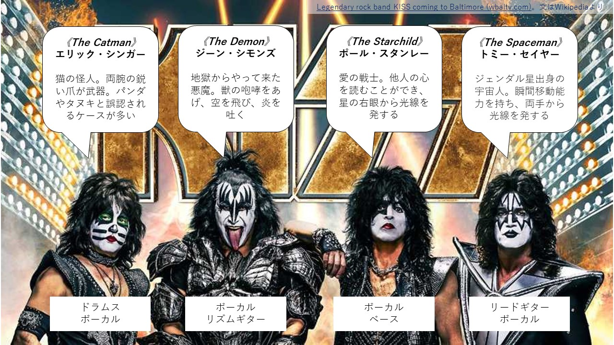

<!-- 
size: 16:9
paginate: true
-->
<!-- header: 勉強会#-->
<script type="module">
  import mermaid from 'https://cdn.jsdelivr.net/npm/mermaid@10/dist/mermaid.esm.min.mjs';
  mermaid.initialize({ startOnLoad: true });
</script>

# KISS

---


>>> https://www.wbaltv.com/article/baltimore-kiss-final-concert-tour-cfg-bank-arena/43145518

---


**※違います。**

>>> https://www.wbaltv.com/article/baltimore-kiss-final-concert-tour-cfg-bank-arena/43145518

---

# KISS (Keep It Simple, Stupid)$^1$

コードをシンプルに保つ

>>> 1: KISSは他にも「Keep It Simple and Stupid」「Keep It Super Simple」などとも言われる

---

## コードはどんどん汚くなる

* 機能追加
* 想定していなかった条件分岐
* その場しのぎのバグ修正
* 実装担当の交代
* 速度向上のための最適化

### 長生きさせるためにはシンプルさを維持しなければならない

---

## シンプルにするためのコツ

* 概念を簡素化する
  * 読んでいて疲れるコードを書かない
* わかりやすい名前を使う
* 問題を小さく分解する（分割と統治！）
* 声に出して処理を説明する

---

## シンプルなコード ≠ 短いコード

短いが、読むのが辛いコード：
```python
f = lambda x: 1 if x <= 1 else x * f(x - 1)
```

↑に比べれば長いが、格段に読みやすいコード
```python
def factorial(number: int) -> int:
    if number <= 1:
        return 1
    else:
        return number * factorial(number - 1)
```

（Quiz:これは何をする処理でしょう？）

---
## 似た意味を持つ概念

* オッカムの剃刀
* YAGNI

## 参考

* https://code-specialist.com/code-principles/kiss
* https://ja.wikipedia.org/wiki/KISSの原則

---


