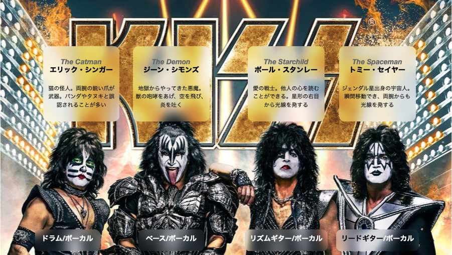

<!-- 
size: 16:9
paginate: true
-->
<!-- header: 勉強会#-->

# KISS

<!-- 皆さんKISSは知っていますよね？もちろん私も知っています。皆さんもKISSの思い出を胸に今日は臨んでくれていると思います。 -->
<!-- せっかくなので私のKISSの思い出を少し話しますね。恥ずかしいですが、聞き苦しい部分もあるかもですがすみません。 -->
<!-- はじめてKISSと出会ったのは中学時代でした。確かお店を歩いていたときに気になり聞いてみたのがとっかかりだったと思います。
それはもう電撃が走ったような衝撃でした。ビジュアルはすごいのに美しい声で歌っていて、荒々しいパフォーマンスをしながらも
完成された音楽性。日本の様々なバンドが影響を受けたのも頷けるというものです。

・・・そうです、このKISSです
-->

---


>>> https://www.wbaltv.com/article/baltimore-kiss-final-concert-tour-cfg-bank-arena/43145518

<!-- 1973年に結成され、今もなお活動を続けている伝説的なハードロックバンド。KISSです -->

---



<!-- iPadの情報を転記 -->

---


**※違います。**

>>> https://www.wbaltv.com/article/baltimore-kiss-final-concert-tour-cfg-bank-arena/43145518

---

# KISS (Keep It Simple, Stupid)$^1$

コードをシンプルに保つ

>>> 1: KISSは他にも「Keep It Simple and Stupid」「Keep It Super Simple」などとも言われる

---

## コードはどんどん汚くなる

* 機能追加
* 想定していなかった条件分岐
* その場しのぎのバグ修正
* 実装担当の交代
* 速度向上のための最適化

### 長生きさせるためにはシンプルさを維持しなければならない

---

## シンプルにするためのコツ

* 概念を簡素化する
  * 読んでいて疲れるコードを書かない
* わかりやすい名前を使う
* 問題を小さく分解する（分割と統治！）
* 声に出して処理を説明する

<!-- ラバーダッキング -->

---

## シンプルなコード ≠ 短いコード,美しいコード

短いが、読むのが辛いコード：
```python
f = lambda x: 1 if x <= 1 else x * f(x - 1)
```

↑に比べれば長いが、格段に読みやすいコード
```python
def factorial(number: int) -> int:
    if number <= 1:
        return 1
    else:
        return number * factorial(number - 1)
```

（Quiz:これは何をする処理でしょう？）

---

## 似た意味を持つ概念

* オッカムの剃刀
* YAGNI

<!-- オッカムの剃刀:「ある事実Pを同様に説明できるのであれば仮説の数（または措定される実体の数）は少ないほうが良い」。オッカムのウィリアムという14世紀の神学者であり哲学者がよく言っていた言葉 -->
<!-- You Ain't Gonna Need It -->

## 参考

* https://code-specialist.com/code-principles/kiss
* https://ja.wikipedia.org/wiki/KISSの原則

<!--Q:今あるコードがすでに汚いときはどうしたら良い？ A:ボーイスカウトルールを適用してみる-->
<!--Q:シンプルにするための具体的なコーディングガイドとか何かない？ A:個人的には
* Google C++スタイルガイド: https://ttsuki.github.io/styleguide/cppguide.ja.html
* Swift APIデザインガイド: https://www.swift.org/documentation/api-design-guidelines/
* 読みやすいコードのガイドライン: https://www.amazon.co.jp/dp/B0BGX2VGYR / https://amzn.to/3TIqF6X
-->

---

## (ついでに言語学の学習)

<!-- エンジニア界隈に多い -->

### アクロニム・頭字語(acronym)
主にアルファベットによる略語の一種。複数の単語から構成された単語の頭文字を並べて作られた語のこと。
単語として発話できない場合は **イニシャリズム** という

> AIDS, NATO, UFO, FBI, GCC, etc.

### バクロニム（backronym/bacronym）
ある単語の各文字を使って、新たに頭字語としての意味を持たせたもの

> **KISS**, DRY, Suica, R.I.P., A.R.E., etc.

<!--
AIDS: 後天性免疫不全症候群、Acquired immune deficiency syndrome
UFO: 未確認飛行物体、unidentified flying object
FBI: 連邦捜査局、Federal Bureau of Investigation
GCC: GNU Compiler Collection
-->
<!--
SOS: Save Our Ship(Souls)
Suica: Super Urban Intelligent Card / スイスイ行けるICカード
ARE: アレ。Aim, Respect, Empower
R.I.P.: Rest In Peace。本来はラテン語で「安らかに眠れ」を意味する「requiescat in pace(レクウィエスカト・イン・パーチェ)」
-->

---


>>> https://www.wbaltv.com/article/baltimore-kiss-final-concert-tour-cfg-bank-arena/43145518