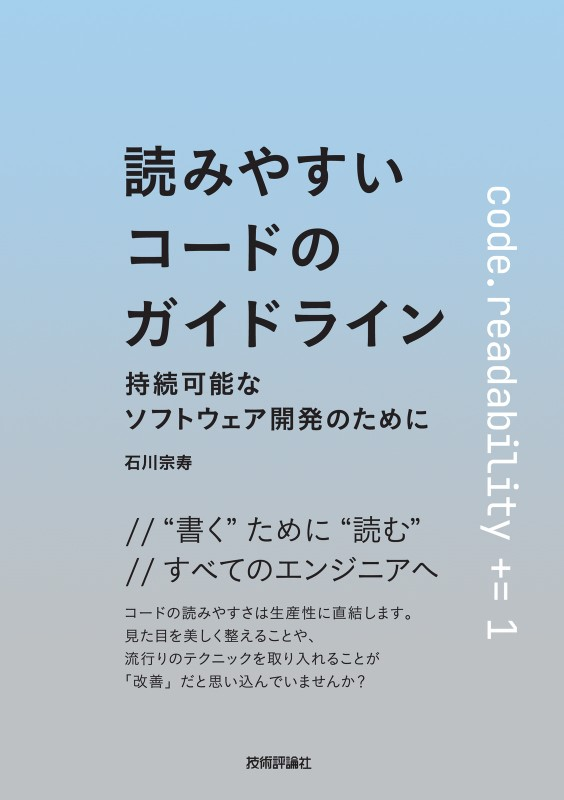

<!-- 
size: 16:9
paginate: true
-->
<!-- header: 勉強会# ― エンジニアとしての解像度を高めるための勉強会-->

# 名前重要

_Name/Naming is important_

---

> 「すべての人物・事物には真の名前があり、その名前を知るものはそれを支配することができる」  
> 
> ネイティブ・アメリカンによる言葉(出典不明)

<!-- 旧約聖書の神の名は、正しく発音できないよう「YHWH」になっている。他にも千と千尋の神隠しでは湯婆婆が名前を知って支配していたり、血界戦線という漫画では血界の眷属に対して真の名を知ることで初めて封印できるなど、名前を理解することの重要性は枚挙にいとまがない -->

---

## 名前重要

プログラミングにおいて、分割した概念に対して

* 名前を付けること
* 付けた名前そのもの

はとても重要であるという意味。Ruby言語の開発者であるまつもとゆきひろ氏が、自身の座右の銘として挙げている

>>> [プログラマが知るべき97のこと - 名前重要](https://xn--97-273ae6a4irb6e2hsoiozc2g4b8082p.com/%E3%82%A8%E3%83%83%E3%82%BB%E3%82%A4/%E5%90%8D%E5%89%8D%E9%87%8D%E8%A6%81/)より

---

## なぜ？

* 適切な名前をつけられる
    * ＝ その機能が正しく理解されて、設計されている
* 適切な名前がつけられない
    * ＝ その機能が果たすべき役割を十分に理解できていない

**適切な名前が付けられれば設計の８割が完成している。**

---

## 適切な名前とは？



* 理解が捗る
    * **コードのUI**として読める
* プロジェクトのガイドラインにしたがっている
* 脳の負担が少なく誤解しにくい
* 効果と目的(≠手段)を説明できている
* 検索しやすい

>>> 石川 宗寿 著 「読みやすいコードのガイドライン ― 持続可能なソフトウェア開発のために」 技術評論社

<!-- 他にもSwiftのネーミングルールとかオススメ
* https://www.swift.org/documentation/api-design-guidelines/#naming
-->
---

## 例

```py
def func(a, b):
    return a + b

def cubic_interpolate(y):
    # 媒介変数yを使って３次補間した値を返す
    return y * y * (3.0 - 2.0 * y)
```
↓
```py
def add(a, b):
    return a + b

def cubic_interpolate(t):
    # 媒介変数tを使って３次補間した値を返す
    return t * t * (3.0 - 2.0 * t)
```

---

## 例

```py
def ctlFlg3(is_on):
    # ドライバの制御フラグ３をON/OFFする
    ...
```
↓
```py
def setDriverFlag3State(is_on):
    ...
```

---

## (ちょっと意地悪な)クイズ

適切な関数名・変数名を考えてみよう

```py
def regist_cust(name, pwd):
    ...

def cre_task(exinf, tskatr, task, itskpri, …):
    ...

def clear_cache_and_load_data():
    ...
```

<!-- exinf:extended information, tskatr:task attributes, task: function pointer of task, itskpri: task priority(iは?) -->

<!-- 単語の命名とかも適当につけると後で後悔することに。
新幹線： こだま→ひかり→何？。。。のぞみに。ひかりで使い切った感が。希望はひかりよりも速いとか、こじつけもいいところ
英語のminutes, secondsも。もともとhourしかなかったのが文明が進んでもっと細かいのが必要になって、小さいものとして中世ラテン語の「pars minuta prima（pars＝部分、minuta＝小さい、prima＝最初の）」から「minuta」になりminuteになった。ところが更に細かい単位が必要になって、二番目の細かいもの「pars minuta secunda」のsecundaが残った。second minuteという意味。ここまではいいのだけれど、次がミリ秒とサードにならなかったのは惜しい
 -->

---

## とはいえ守るべきもの

プロジェクトで一貫性を保つことが最優先。

* 異なるネーミングルールの混在は混乱の元にしかならない
    * 名前だけでなく技術も同様。
* 悪法もまた法なり$^1$

>>> 俗にソクラテス(古代ギリシャの哲学者)が死刑判決を下された時に言ったといわれている。

<!-- ソクラテスは古代ギリシャの哲学者。BC470-399(享年71) -->
<!-- 「無知の知」が有名。自分がすべてを知っているなどということは一切なく、むしろ世界の広さ深さに比べたら無知に等しい、、、というところまでは有名だが、続きがある。彼と彼の弟子はこれを相手との議論を深める対話の中で弁証法と呼ばれる会話技術の中で使ったが、「無知であることを知っている私(弟子を含む)は、つまり知らないお前よりも賢い」というスタンスで臨んだため、もう敵が増える増える。最後はそのせいで死刑になって、そのときに言ったのが「悪法もまた～」 -->
<!-- だいたい弁証法という、会話の中で相手の矛盾を突いてより深い知識を求めるのって「豆腐は白い」という主張に対して、「白くない豆腐もありますよね」「私の豆腐は白くありませんが」「厳密にいうと薄いベージュではないか」とか矛盾を突いていくスタイルなので、今で言うクソリプおじさん。 https://togetter.com/li/646713 -->

<!-- このソクラテスのエピソードを１つ追加すると、彼は相当の醜男だったことで知られています。背が低く、頭髪は禿げ上がり、丸々と太ったブタのようだったらしい。弟子のプラトンに「我が師ソクラテスは世界で１番醜い。しかし１番賢い」と言われていたそうです。完全に舐められてます -->

<!-- ソクラテスは他にもオモシロエピソードが多すぎる人なので、気になった人は調べてみると良いです -->

---


>>>> https://x.com/lewismenelaws/status/1715367533606281464?s=51&t=8SPovdJ4_WYmWx6V6E-yLg

---


>>> https://twitter.com/sgtcoward/status/1717419972971188379?s=43

<!-- 
* うんこ: うーんっと踏ん張るから
* 震える: プルプルしてる
* ひよこ: ピヨピヨ鳴く小さいもの
    * すずめ: シュシュと鳴く群れ。カモメ、ツバメのめ
    * ねこ: ねーねー鳴く小さいもの。中国語のまおまお
* 呻(うめ)く: う！と言うから めくは春めく/ときめく
* がなる: が！と鳴るから
* 騒ぐ: ざわざわ
* 旗: パタパタ揺れるから。はためく
* 吸う、吐く、吹く: すー、はー、ふー
新明解語源辞典
* 英語
    * baby: バブバブ言うから
    * バルバロイ: 蛮族の言ってることがわからずバブバブ言ってたから。バブバブ言ってるやつが強いから、そこからブレイブ(brave)が
ルソー
-->