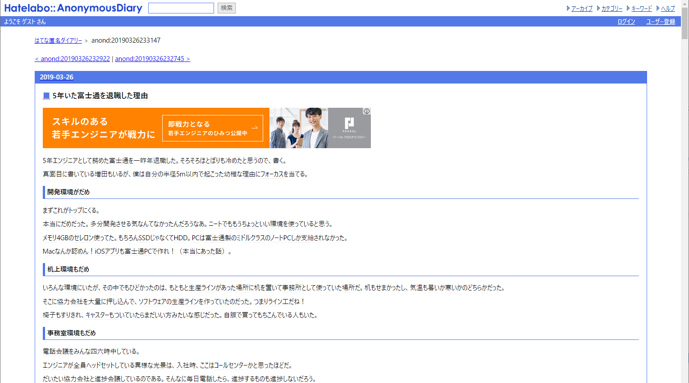
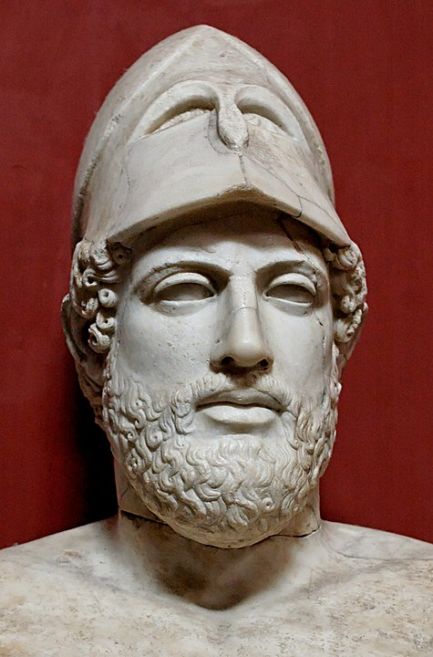

<!--
size: 16:9
paginate: true
-->
<!-- header: 勉強会#-->

# ７つの設計原理

_Seven design principles_

（副題：歴史に学ぶエンジニア生存戦略）

---

## 1989年の本に登場

* 『富士通におけるソフトウェア品質保証の実際』
    * ウォーターフォール開発が全盛の時代に書かれた
    * システムエンジニアリングの実務者向けの実践的ノウハウ書

**「エラーを作り込まない/検出できるようになるための７つの設計原理」**

---

## ７つの設計原理

コードレビューにおける観点をまとめたもの。他にも文書作成、プレゼンなど様々な場面で役立つ原理ばかり。

1. **単純原理**：単純に素人っぽくプログラミングする
2. **同型原理**：形にこだわるという原理。例外なく同じことは同じようにやる
3. **対称原理**：上があれば下、右があれば左、アクティブがあればインアクティブという対称性にこだわる
4. **階層原理**：形の階層的な美しさにこだわる
5. **線形原理**：機能はいくつの機能の重ね合わせにより実現される
6. **明証原理**：少しでも不透明なロジックは証明しておくように努める
7. **安全原理**：必然性のないところやあいまいなところは、ちょっとルーズに安全サイドで設計しておく

---

## 1.単純原理

「シンプルにこだわる」$^1$

* 初心者でも読めるよう単純なコードを書く

複雑なところにバグは出るので、ついつい高度なコードを書きたくなる誘惑に打ち勝つことが大事

>>> [KISSの回](03-kiss.md)を参照

---

## 2.同型原理

形にこだわるという原理。同じことは例外なく同じようにやること。

* コーディングガイドライン
* 公開関数の引数の並べ方
* UIのグリッドパターン
* ドキュメントの構成 … etc.

**→ 異物(不具合,仕様外動作)が見つけやすくなる**

独創性よりも一貫性$^1$

>>> 多方面にすみません

---

## 3. 対称原理

上があれば下、右があれば左、アクティブがあればインアクティブというような対称性にこだわる。

* 条件と反条件、正常系と異常系
* 命名の対称性も同様（set/get,start/stop,begin/end,push/pop）

→ **プログラム・ドキュメントを機械的に書ける**
→ 考慮漏れやケアレスミスを防ぐ

『ひなた先生が教えるデバッグが256倍速くなるテクニック』という本(良書!)でも、この対称性を強く説いている

---

## 4. 階層原理

構造が階層的であることにこだわるという原理$^1$。

* 前後関係、主従関係、本末関係、兄弟関係
    * 階層ごとに処理を決め、同じ種類の処理が異なる階層を跨らないようにする
    * 確保したリソースは同じ階層で解放する
    * 相互依存をなくすためにDIPを使う

>>> [SLAPの回](06-slap.md)を参照

---

## 5. 線形原理

処理の流れをまっすぐに読んでいける状況になっていることが良いとする原理

* 機能が他の機能を順に重ね合わせてあるコード
* 繰り返しや条件分岐、状態の数が増えるとコードが読みにくくなり不具合が出てしまう

ある機能や式を読んでいるときに必要なワーキングメモリの数を2-3個に抑えるくらいで考えると良い$^1$

>>> 「[オッカムの剃刀](https://ja.wikipedia.org/wiki/%E3%82%AA%E3%83%83%E3%82%AB%E3%83%A0%E3%81%AE%E5%89%83%E5%88%80)」が関連する

---

## 6. 明証原理

不透明で意図がわかりにくいコードを書かないよう常に注意すること。

* トリッキーなコードを書かない
    * 誰でもメンテナンスできるよう常に注意する
* やむを得ない場合もコメントや関連ドキュメントを証明しておくように努める

ドメイン駆動設計においてユビキタス言語を先に定義するのも明証原理の範疇

---

## 7. **安全原理**

* 問題が起きても安全なプログラムになるよう「もしかしたら」を意識してコードを書くこと

---

## 34年前の本だけれど今も役立つ良書

* けっこう良いことが書かれている
* 当時の最先端の知見が詰まった本

・・・けれど・・・

---

## ４年前にこんな記事が

> **「５年いた富士通を退職した理由」**
> 5年エンジニアとして務めた富士通を一昨年退職した。そろそろほとぼりも冷めたと思うので、書く。 ...
> https://anond.hatelabo.jp/20190326233147

どうしてこうなった？

---

> ### 古い方法へのこだわり _(記事より引用。強調は加藤による)_
> 社内に**とある開発標準**がある。
>
> これに従えばプロジェクトは成功すると信じられている。というよりも、何かがうまくいかなかったときに「なんで開発標準に従わなかったの？」という責められ方をする。たちの悪いISOみたいなものだ。
>
> **内容は明らかに古く、ウォーターフォールのシステム開発用にしか使えない**。これを無理やりモバイルアプリ開発に適用したり、Webに適用したりする。Webをウォーターフールでつくるもんだから、一度作ったら終わりの作りきりの製品になる。
>
> 工程だけでなく、**品質についても言及**されている。例えば試験項目の品質はいかにバグが検出されたかで測られる。...

---

## まさに「ペリクレス$^1$戦略」

スパルタとの戦争$^2$のときにペリクレスが籠城作戦を執った結果、内部で疫病が発生し市民の1/6の病死・治安も悪化するなど大失敗$^3$。
**以来「防御的な行動で敵の疲弊を待ち、現状維持を狙う戦略」をペリクレス戦略と呼ぶように**

>>> 1.ペリクレス：古代アテナイの政治家・将官。
>>> 2.ペロポネソス戦争。紀元前431年から27年続いてしまう
>>> 3.ペリクレス自身も紀元前429年に同じ疫病で病死

<!-- 写真はWikipediaより -->

---

# ７つの設計原理

_Seven design principles_

（副題：歴史に学ぶエンジニアリング）

---

# ~~７つの設計原理~~ ペリクレス戦略

_Pericles war strategy_

（副題：歴史に学ぶエンジニア生存戦略）

---

> _「貧しいことは恥ずべきことではない。しかし、その貧しさから脱しようと努めず、安住することこそ恥ずべきことであるとアテナイ人は考える」_$^1$
>
> _ペリクレス (古代アテナイの政治家。BC495-429)_

>>> https://ja.wikipedia.org/wiki/%E3%83%9A%E3%83%AA%E3%82%AF%E3%83%AC%E3%82%B9 より