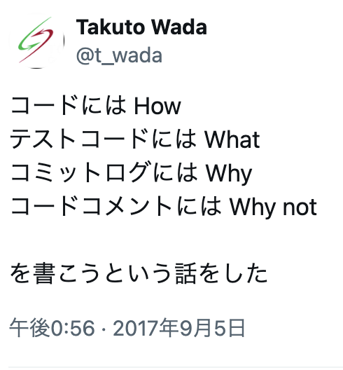

<!-- 
size: 16:9
paginate: true
-->
<!-- header: 勉強会# ― エンジニアとしての解像度を高めるための勉強会-->


# PIE

_Program Intently and Expressively_

<!-- 意図が分かりやすく、表現力豊かにプログラミングしなさい -->
---

## 『意図を表現してプログラミングしなさい』

一般的な文章と同様、誰か他の人が読んでわかるように書くということ。

- コードは1回だけ書かれて、そのあと何回も読まれる
- コードだけがソフトウェアの動作を正確かつ完全に知るための手がかり

つまり、

- **コードの読みやすさ ≫ コードの書きやすさ**

---

## 参考:文芸的プログラミング

文章とコードを混ぜて書くことで、文章の完成度を高めることがソースコードの品質を上げることにつながる仕組みのこと。ドナルド・クヌースにより提唱された考え方

```pascal
1.中心アルゴリズム
do_something()は中心となる処理内容である。
<a routine> ==
 item.do_something().

2.メインループ
あるコレクションの全ての内容を<中心アルゴリズム>で処理する。
<main> ==
for item in collection
 <a routine>
---- ↓ -----
for item in collection
  item.do_something().
 ```
<!-- クヌースはいわゆる天才。The Art of Computer Programmingという超有名な本を書くために、本を作るためのソフトウェアを書いたという -->
<!-- 今だとJupyter notebookが近いが、より連携したもの -->
<!-- 今はChatGPTがあるので不要かもしれない。コメントを上手に付けてくれるから。
- Pythonでcollectionという名前の配列を順にたどり、格納されているitemのdo_something()メソッドを呼び出す処理
 -->

---


>>> 画像は https://twitter.com/t_wada/status/904916106153828352 より

## コメントも重要

コードは「What」と「How」を表現できるが「Why」は表現できない。

→ なぜそのようなコードを書いたのか、その背景をコメントに書く

> ##### 注意: コメントもメンテナンス対象
> 
> コードは常にそのとおりに動くが、コメントは昔の内容が残り続けてしまうかもしれない。

---

## PIEまとめ

- プログラムは他の人が読みやすいように書くべき
    - 超絶技巧は不要
    - ３日後の自分も他人と心がける
- 「読みやすく書け！」ということ。対になるのは「動けばいいや」$^1$
- 書いたコードが数年後の黒歴史にならないようにしよう

>>> 1: 『[「分かりそう」で「分からない」でも「分かった」気になれるIT用語辞典](https://wa3.i-3-i.info/word18455.html)』より

---


>>> http://www.csstoday.com/Item/738.aspx より

<!-- これはカール・マルクスの書いた資本論という本の原稿。 -->
<!-- カール・マルクス(1818-1883。ドイツの哲学者、経済学者、革命家)：フリードリヒ・エンゲルスとともに、包括的な世界観および革命思想として科学的社会主義（マルクス主義）を打ちたて、資本主義の高度な発展により社会主義・共産主義社会が到来する必然性を説いた。大量の著書があるそうで、特に資本論と共産主義宣言が有名

資本論はどういう本かというと、資本主義とは資本家(ブルジョワジー)と労働者(プロレタリアート)の２グループにおいて、ブルジョワジーが労働者を搾取することでよりお金を手に入れる仕組みであると説いた本。

資本主義はやがて労働者による闘争によってブルジョワジーが淘汰され、社会主義から共産主義へと変化していくという話がマルクス主義(かなり乱暴)

マルクス経済学とともに20世紀以降の国際政治や思想に多大な影響を与えた。-->
<!-- ちなみに
社会主義：資本は国のもので、国がそれらを管理して平等にする体制。資本主義と異なり個人が資本を所有しない
共産主義: 生産手段・生産物・資本などすべてのものを共有することによって実現する貧富の差のない社会を目指す体制
  -->
<!-- マルクス影響を受けた毛沢東は文化大革命を起こす。ソ連でもレーニン→スターリンということで悪い意味での影響、と言われることもある。プーチンもスターリンの影響を受けていると言われるし。 -->

<!-- その原稿がびっくりするほど汚い。文字が読めない。どれくらい読めないかというと、Wikipediaの「悪筆 (https://ja.wikipedia.org/wiki/%E6%82%AA%E7%AD%86) 」というページの参考写真として出てくるくらい汚い -->

<!-- 第1部は、マルクス自身によって発行されたが、第2部と第3部は、マルクスの死後、マルクスの遺稿をもとに、フリードリヒ・エンゲルスの献身的な尽力によって編集・刊行された。←献身的な努力とはなにかというと、エンゲルスにしか読めないきったない字を解読するという努力。しかもそのせいでエンゲルスは目まで悪くしてしまう -->