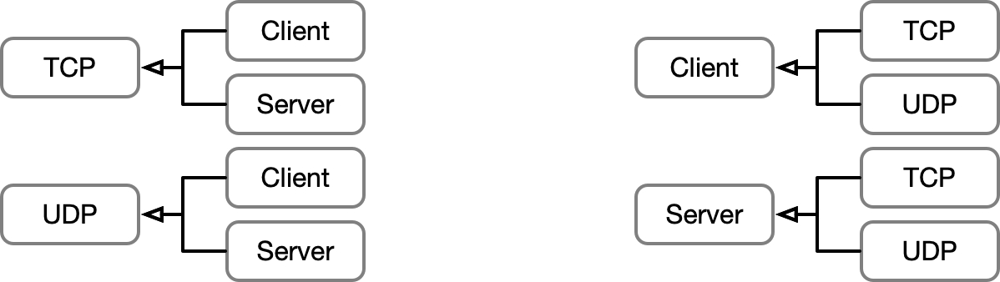

<!-- 
size: 16:9
paginate: true
-->
<!-- header: 勉強会#-->

アーキテクチャ根底技法(1)

# 抽象化

_Abstraction_

<!-- 複雑さへの武器 -->

 <!-- プリンシプルオブプログラミングでは『ソフトウェアアーキテクチャ ― ソフトウェア開発のためのパターン体型』F.ブッシュマン他, 近代科学社(2000) が原典と言うが、このことについてまとめられた情報が見つからなかった…-->

---

## 抽象＝＝概念的な線引き

* 対象について概念を見出し線引きをすること
    * 何を捨てて
    * どんな表現で一般化するか

---

## 抽象化のコツ（どこに線を引くべきか）

* 何かとの共通点を見つける
* 本質的でない余計なものを捨てる
* 今の着眼点(ドメイン知識・コンテキスト)から離れないようにする

---

## 抽象化クイズ

以下の４つの共通点を見つけて抽象化してみましょう。
* 共通の要素をもとにグループ分けして、グループに名前をつけてください。 (プログラムにおける親クラスを作るイメージ)

> `UDPClient`, `TCPClient`, `TCPServer`, `UDPServer`

---

## 抽象化クイズ

> `UDPClient`, `TCPClient`, `TCPServer`, `UDPServer`

### 解答例

---

## あるなしクイズ

|ある|ない|
|---|---|
|失(うしな)う|亡くす|
|腐る|傷(いた)む|
|飛び立つ|舞い降りる|
|取り入る|突き放す|
|捕える|逃げる|

>>> [【脳トレ】あるなしクイズ 問題018](https://arunasi.nazo2.net/tyuukyuu/018.html)より

<!-- 抽象化もおおむね分かってきたということで、オブジェクト指向と抽象化と言えばこの人、を紹介します -->

---

>>> 左の人です。

## プラトン

_(Plátōn / Plato。紀元前427年 - 紀元前347年)_

<!-- 古代ギリシャの哲学者。プラトンは西洋哲学の基礎を作った。西洋哲学の源流であり哲学者ホワイトヘッドも「西洋哲学の歴史とはプラトンへの膨大な注釈である」とまで言うほど有名な人 -->

---

## プラトン

イデア論がまさに抽象化の考え方。

<!-- 現実世界とは別に「イデア界」とよばれる理想的な世界が存在し、《美そのもの》《正そのもの》《善そのもの》など純粋な対象が存在している。現実世界はその劣化コピーであり、学問や深い思考を経てイデアに近づく -->

> 「知覚を超越した場所に存在し、直接には知覚できずに想起によってのみ認識し得る、抽象化された純粋な理念のこと。そして、対象を対象たらしめている根拠であり本質、真の存在」$^1$

>>> https://news.mynavi.jp/article/20210525-1880768/

<!-- ものごとの本質を見極め、複数の具象から、それぞれたらしめている要素を見い出して、その純粋な概念や本質を抽象物として取り出す。 -->
<!-- たぶん、プラトンはオブジェクト指向のことを考えてるときにこのイデア論を考えだしたと思う -->

<!-- ちなみにこのプラトンはレスリングが強い。レスリング選手として大会にも出ている。プラトンの本名は「アリストクレス」で古代ギリシャ語で「肩幅が広い」という意味のあだ名「プラトン」をレスリングの師匠に付けられたという説がある。 -->

---

## オブジェクト指向プログラミング ＝ プラトニックな愛

<!-- 精神的な気持ちを大切にすること、見ているそのものという現実世界の具象を見るのではなく、そのイデア(本質)を見るということの大切さ -->
<!-- オブジェクト指向設計の本質とまさに同じ。つまりオブジェクト指向プログラミングはプラトンの愛であり、プラトニック・ラブである -->

>>> プラトンは恋愛について「尊いのは"肉体"への恋ではなく、"魂"への恋だ」と言ったらしい