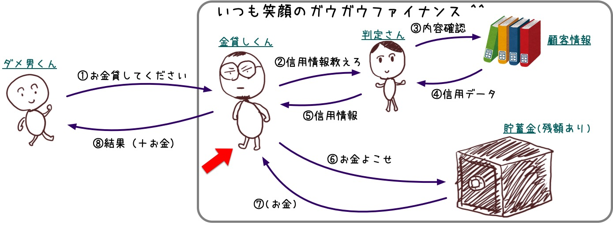

<!-- 
size: 16:9
paginate: true
-->
<!-- header: 勉強会#-->

アーキテクチャ根底技法(2,3,4)

# カプセル化 / 情報隠蔽 / パッケージ化

_Encapsulation_
_Information Hiding_
_Packaging_

<!-- 分割と独立性 -->

---

## カプセル化: データとロジックとでグルーピング

* データと、それに関連するロジックとをまとめる
    * → クラスやモジュールという膜で包む
* カプセル化 ∈ オブジェクト指向設計
    * カプセル化 = オブジェクト指向設計 ではない
    * **カプセル化 = 情報隠蔽 でもない**

<!-- カプセルの中にカプセルがあっても良い。むしろそういうもの -->

---

## 情報隠蔽: 必要のないものは見せない

カプセル化によってグループ化されたもののうち、外には必要のないものを見せないようにする

* 関係性をシンプルにできる
* 使う側も悩まなくて済む

世の中で言う「カプセル化」は解像度を上げると **「カプセル化＋情報隠蔽」** になる

---

## カプセル化と隠蔽化の違い

### カプセル化

* 同じコンテキストを持つデータやメソッドをグルーピングすること
* 可視性については述べていない

### 情報隠蔽

* 使用者/開発者に不要な情報は隠蔽すること
    * プライベートメンバー変数 / プライベートメソッド

この区別が出来ると設計の解像度が上がる

---

## パッケージ化: ソフトウェア全体視点でのグルーピング

モジュールやクラス群を意味のある単位でグルーピングすること。

* ソフトウェア全体を意味のある単位に分割すること。

* ソフトウェア全体の物理的な構造を**ボトムアップ**でパッケージにまとめていく
    * **NOT トップダウン**。クラスやモジュールが出来上がってきたときに継続的に適切なパッケージに分類していく

（現代のソフトウェア開発ではマッチしない原則かも…）

<!-- リファクタリングフェーズの話になる？ちょっと適用する箇所が分からない -->

---

## カプセル化と隠蔽化・パッケージ化によるメリット

* 関連のない要素が混じらないため、コードが見やすくなる
* 変更時の影響がクラスやモジュール内に閉じることになる
* 影響度が明確になるので、コードの変更が容易になる
* それぞれが独立した部品になるので、再利用性が高まる
* 小さい単位に分割されるので、複雑な問題にも柔軟に適応できる

>>> 『プリンシプルオブプログラミング - ３年目までに身につけたい一生役立つ101の原理原則』より
<!--  -->

---

## ドメイン駆動設計における「コンテキストの境界付け」

> ソフトウェアで解決したい部分(専門領域)を、ソフトウェアの設計にそのまま反映させる、もっと簡単にいうと**業務をちゃんと理解した上でソフトウェア開発を行う**といった意味合い

>>> [【設計手法】ドメイン駆動設計(DDD) is 何? 【初心者にも分かりやすく】](https://qiita.com/kim_t0814/items/1a50bbdd8ef3ec780185)

* 問題対象の専門家(ドメインエキスパート)と一緒になって進める
* 現場と使うのと同じ用語で話/プログラミングをすること(ユビキタス言語)
* コンテキストを境界付けすること **←コレ!**

---

## パルナスの規則 (_Parnas' Principles_)

* モジュールの使用者には、サービスを利用するために必要なすべての情報を提供する必要がありつつも、他の情報を提供していてはならない
* モジュールの実装者には、機能実現に必要なすべての情報を提供する必要がありつつも、他の情報は提供していてはならない

>>> デイビッド・ロージ・パーナス/パルナス（David Lorge Parnas、1941年2月10日 -）

<!-- オブジェクト指向の基礎となったモジュール設計の概念を生み出したソフトウェア工学の先駆者。オブジェクト指向設計がない時代から、結合度を下げ凝集度を上げる設計こそが良いと説いていた -->

---

## クイズ

図に示す金融システムが機能するために最低限必要な体制を考えてください。

1. 金貸しくん(赤矢印)は何/誰を知っていれば良いでしょうか？
2. 金貸しくんはおダメ男くんに何を公開し、何を隠したらいいでしょうか？
3. 判定さんは何を外に見せていれば業務が回るでしょうか？
4. ダメ男くんはガウガウファイナンスの何を知っていれば良いでしょうか？

