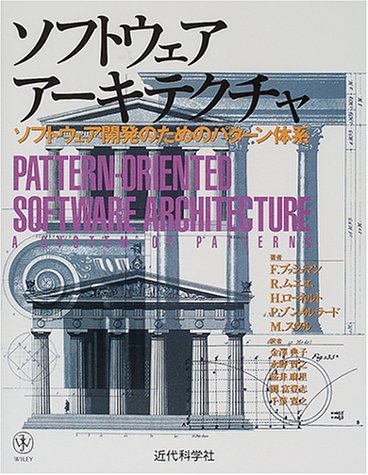
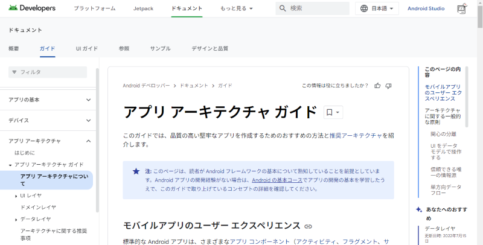

<!-- 
size: 16:9
paginate: true
-->
<!-- header: 勉強会# ― エンジニアとしての解像度を高めるための勉強会-->

アーキテクチャ根底技法(5)

# 関心の分離

_Separation of Concerns (SoC)_

---

## たぶんタネ本

### 『ソフトウェアアーキテクチャ 　 ― ソフトウェア開発のためのパターン体系』
* F.ブッシュマン(著), 金澤 典子(訳)
* 近代科学社刊(2000/12/1)

<!-- ソフトウェアアーキテクチャ ― ソフトウェア開発のためのパターン体系: https://www.amazon.co.jp/dp/4764902834 -->

---

## 『関心の分離』とは

**定義**: ものごとを関心（責任・何をしたいのか）ごとに分離された構成要素で構築すること$^1$

* 分割統治(デカルトみ)において**どうやって分割するか**の指標になる重要な原則

>>> 1: [Wikipedia『関心の分離』](https://ja.wikipedia.org/wiki/%E9%96%A2%E5%BF%83%E3%81%AE%E5%88%86%E9%9B%A2)をもとに加筆
---

<!-- Googleが公開しているアプリアーキテクチャガイド( https://developer.android.com/topic/architecture?hl=ja )では「最も重要な原則は関心の分離です」とある。あらゆる処理を１つのクラスにまとめないようにすることを求めている -->

---

## 目標

複雑な相互依存システムをより効果的に理解、設計、管理すること

* 他の機能から独立した最適化の実施、他機能との隔離、機能の再利用、保守性の向上

### 分離のポイントになりやすい箇所

* 機能, 階層(レイヤー), 共通部/変動部, API/ロジック, UI/ロジック, 副作用の有無, 時間的な処理のまとまり, システム状態

---

## 関連ワード

* プレゼンテーションとドメインの分離（Presentation Domain Separation）
* 構造と見た目の分離（Separation of Presentation and Content）

<!-- ユーザーインターフェースコードをその他のコードを分離する。アプリを作る人にとっては必須の知識。そうでなくても、たとえばJupyter notebookで計算処理とグラフ表示を別ブロックに分けること、ファームでも別モジュールとの接平面になるファイルと実際の処理とを別ファイルで実現すること -->