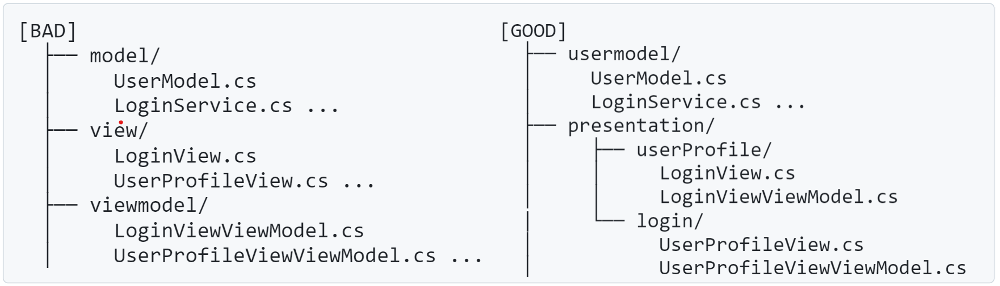

<!-- 
size: 16:9
paginate: true
-->
<!-- header: 勉強会# ― エンジニアとしての解像度を高めるための勉強会-->

アーキテクチャ根底技法(5)

# 関心の分離

_Separation of Concerns (SoC)_

---

## タネ本

### 『ソフトウェアアーキテクチャ 　 ― ソフトウェア開発のためのパターン体系』
- F.ブッシュマン(著), 金澤 典子(訳)
- 近代科学社刊(2000/12/1)

<!-- ソフトウェアアーキテクチャ ― ソフトウェア開発のためのパターン体系: https://www.amazon.co.jp/dp/4764902834 -->

---

## 『関心の分離$^1$』とは

<b>定義</b>: ものごとを関心（責任・何をしたいのか）ごとに分離された構成要素で構築すること$^2$

- 分割統治(デカルトみ)において**どうやって分割するか・何をグルーピングするか**の指標になる重要な原則

>>> 1. 提唱: Dijkstra, E.W. (1974). E.W. Dijkstra Archive: On the role of scientific thought (EWD447).
>>> 2. [Wikipedia『関心の分離』](https://ja.wikipedia.org/wiki/%E9%96%A2%E5%BF%83%E3%81%AE%E5%88%86%E9%9B%A2)をもとに加筆
---

# 『最も重要な原則は関心の分離です』

<!-- ここでアーキテクチャガイドのURLをチャットに投稿する -->
<!-- Googleが公開しているアプリアーキテクチャガイド( https://developer.android.com/topic/architecture?hl=ja )では「最も重要な原則は関心の分離です」とある。あらゆる処理を１つのクラスにまとめないようにすることを求めている -->

---

## 目標

複雑な相互依存システムをより効果的に理解、設計、管理すること

- → 他の機能から独立した最適化の実施、他機能との隔離、機能の再利用、保守性の向上

### 分離のポイントになりやすい箇所

- 機能, 階層(レイヤー), 共通部/変動部, API/ロジック, UI/ロジック, 副作用の有無, 時間的な処理のまとまり, システム状態

様々な箇所・階層で考えられる

---

## レイヤーではなくドメインで分離する

ドメイン駆動設計の基本。横でなく縦(境界づけられたコンテキスト)にまとめる
**→ Clean Architecture等のレイヤードアーキテクチャでやらかすことが多いので注意**

<!-- この考え方で１つ注意点がある。データをどう見るかという話。
たとえば３層アーキテクチャを考えると、画面、処理、データの３つに分かれるので、データ関連は１つのモジュールにまとめてしまおうとか、
あるいは信頼できる情報源（あるデータのオーナーが誰かという話）はデータ層にすべてまとめてしまおうとか。

前者の３層アーキテクチャでデータレイヤーを１つのモジュールに安易にまとめてしまうと、アプリ全体の設定とログインユーザーの情報とを
同じクラスで扱ってしまい、凝集度が低くなってしまう。
後者のデータの所有者・オーナーをすべて下位層のデータレイヤーにまとめてしまうという考えでは、画面上のリストが選択されている状態や
ラベルに表示する文字列のような、画面なりそのViewModelが持つべき情報をデータ層にまとめてしまうことになり、やはり凝集度が下がってしまう。
 -->

<!-- 関心の分離は、異なるトピック・コンテキスト・ドメインの要素を分離するという考え方だけでなく、
似たものは同じ場所にグルーピングするという、いわば「関心の集約」という言葉も暗に含んでいることを覚えておいてほしい -->

---

## 関連ワード

- プレゼンテーションとドメインの分離（Presentation Domain Separation）
- 構造と見た目の分離（Separation of Presentation and Content）

<!-- ユーザーインターフェースコードをその他のコードを分離する。アプリを作る人にとっては必須の知識。そうでなくても、たとえばJupyter notebookで計算処理とグラフ表示を別ブロックに分けること、ファームでも別モジュールとの接平面になるファイルと実際の処理とを別ファイルで実現すること -->

<!-- あらゆるデザインパターンや設計パターン、アーキテクチャパターンはこの関心の分離を何らかの方法で満たしている -->