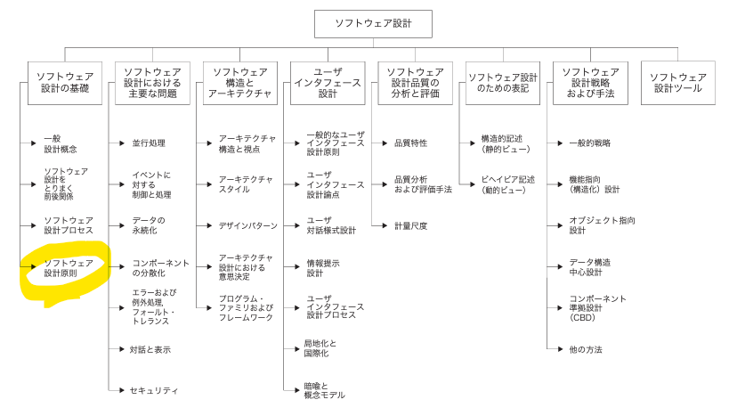

<!-- 
size: 16:9
paginate: true
-->
<!-- header: 勉強会#-->

# 充足性 & 完全性 & プリミティブ性

_Sufficiency, Completeness, Primitiveness_

分離した関心が満たすべき要件

---

## SWEBOK v3.0$^1$による定義

> **充足性、完全性、プリミティブ性**
> 充足性と完全性を達成するということは、ソフトウェア・コンポーネントが抽象化のすべての重要な特徴を確実にとらえ、それ以上のものはないということである。プリミティブ性とは、実装が容易なパターンに基づいて設計すべきであることを意味する。

<!-- ソフトウェアエンジニアリングを事業として営むために必要な、ソフトウェアエンジニアリング知識体系（SWEBOKと略称）をまとめた本。ソフトウェア産業に従事する者および教育者にとって理解しておきたい一冊 -->

>>> Software Engineering Body of Knowledgeの略。v3.0は2013年に発行。[英語版](https://ieeecs-media.computer.org/media/education/swebok/swebok-v3.pdf)は無料で読める

---

## 充足性＆完全性

クラスやモジュールが表現しようとしている抽象が、オリジナルの概念を伝えるために十分であるか(充足性)、対象のすべての特徴を備えているか(完全性)

## プリミティブ性

表現しようとしている抽象は純粋か(無駄や重複がないか)

---

## 抽象(モジュール・クラスなど)が満たすべき要件

* 例：抽象化したものがコレクションを表す場合…
    * **充足性不足**: removeメソッドはあるがaddがない、１つ１つ数え上げようとしてもスキップしてしまう
        * (基本要件の欠如)
    * **完全性不足**: 要素数を取得するメソッドがない、処理例外の判断が網羅されてない
        * (機能のムラ)
    * **プリミティブ不足**: addメソッドの他にもadd2, add10メソッドがある
        * (機能のムダ)

表現している抽象を正確に表現できているかどうかをチェックできる

<!-- この考え方は逆にも使えて、あるクラスやモデル、モジュールの名前が適切かどうかの判断にも使える。たとえば
* フラグを立てるcontrol()という名前の関数、
* ファイルからデータを読み込み/保存するDataManagerというクラス
があったとして、フラグを立てるためだけ、データを読み書きするだけのためにこういう名前が付いているのは大げさ、という判断になる。toggleXXFeature(), DataReaderWriterとかになる。Data～はさらに分割する判断にもつながる -->

---

## 分割統治との関係

分割統治するにあたっての方法を表す

### 関心の分離
対象をどうやって分割するか

### 充足性/完全性/プリミティブ性
分割した抽象が妥当かどうかチェック

---

## 演習

### 「エンジンの機能分割」

エンジンに必要な機能を、**関心の分離**により明らかにし、その分け方が適切かどうかを**充足性/完全性/プリミティブ性の観点**から見てみましょう。