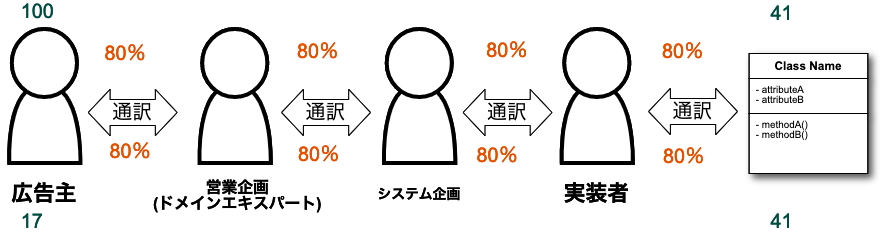
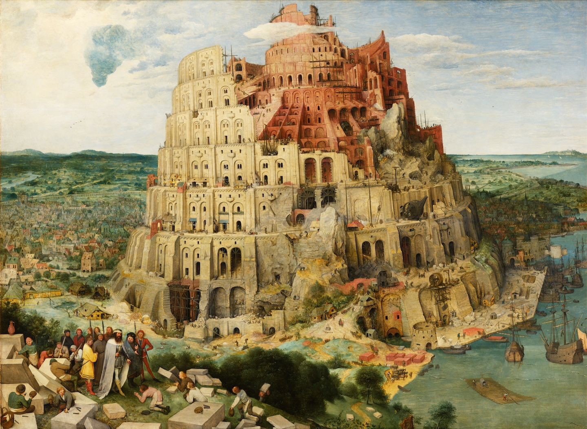

<!-- 
size: 16:9
paginate: true
-->
<!-- header: 勉強会# ― エンジニアとしての解像度を高めるための勉強会-->

# ユビキタス言語
同じ言葉を使い、同じものを認識するための辞書とその活動

<!-- 「ユビキタス」とは、いつでもどこでも存在するという遍在を表す言葉です(everywhereとほぼ同じ)。 ITにおいては、コンピューターやネットワークが遍在し、使いたいときに場所を選ばずに利用できることなどを表す用語としてユビキタスが使われている。
https://www.ntt.com/bizon/glossary/j-y/ubiquitous.html -->
<!-- 元はエリック・エヴァンスの書いた「ドメイン駆動設計」という本で出てきた用語。ドメイン駆動設計は、開発対象をドメインという同じ言葉が通じる範囲で区切って、設計やコミュニケーションから実装に至るまで同じ言葉を使って設計していく開発、というかモデリング手法 -->

---
## プロジェクトあるある

* 専門用語の意味が分からず、話についていけなくなる
* プログラムの中に分かりにくい造語や用語が存在する
* 文脈によってどちらとも取れるような用語が出てきて迷う

>>> https://blog.flinters.co.jp/entry/2021/03/10/150000

<!-- これはつまりそれぞれの人やドキュメント・ソースコードが別の言葉を話しているのと同義 -->

---
## ユビキタス言語

* 関係する全員が同じ言葉を使って話せるようにすること
    * あらゆる意思疎通の場面で同じ言葉を使う
        * 要件定義・打ち合わせ・コーディングなどなど
    * クラスや関数や変数の名前も同じ用語にすることを意識する

ドメイン駆動設計の重要な要素。全体が同じ言葉を話せば、コミュニケーションロスなく開発ができる。

<!-- 対象領域のエキスパート、あるいは仕様を具体的にイメージできている人の鋭い指摘が伝わらないと大惨事が目に見える。 -->

---

## 「ユビキタス言語」のよくある誤解

* **✕**: 業務で使う言葉を定義した用語集である
    * **◯**: 業務に関わる人たち誰もが普段から使う言語
* **✕**: プロジェクト全体で統一された用語を使う
    * **◯**: ドメインが同じ環境で同じ用語を使う
* **✕**: プロジェクト開始時に作成する
    * **◯**: プロジェクトを通じて取捨選択し育てていく
* **✕**: 単語や用例で管理する
    * **◯**: 図などを使っても良い。共通認識を作り維持することが大事

<!-- 「いつでもどこでも誰もが」と「使う」という2つの観点がポイント。使わなければ意味がない。 -->

<!-- そもそも「言語」と言っているのがポイント。 -->
<!-- ユビキタス用語集と呼んでいないのに注意 -->
<!-- ユビキタス自体がどこにでもあるという意味を持っているように、開発のあらゆる場面で使うからこそ効果が出るという話 -->
<!-- 新しい言葉をみんなで作り出しても良い -->

<!--みんなでやるからこそ難しい。オランダ語で書かれたターヘル・アナトミアを杉田玄白や前野良沢(りょうたく)らが解体新書として翻訳・出版するときにどれだけ苦労したか。神経とか -->
---

## どうやって管理するか

統一された書式は存在しない。Markdown, Excel, DBなんでもOK

|列名|内容|
|---|---|
|会話(日本語)|日本語での用語|
|プログラム(英語)|ソースコード中で使うときの用語|
|説明|説明や背景および注意事項|

プログラムで使うときまで意識が及んでいるとベター。他にも「よくある間違い」「モデル」などを入れる事例もある。
エンジニア以外のメンバーに翻訳不要で伝えられていればOK。

---

>>> ピーテル・ブリューゲル『バベルの塔』（1563年頃）、ウィーン・美術史美術館蔵。Wikipediaよりダウンロード
<!-- 
天にも届く神の領域まで手を伸ばす塔を建設しようとしたが、神によって阻まれ失敗してしまった。空想的で実現不可能な計画を「バベルの塔」と揶揄することがある。
神がこの建設を阻止した方法はなんだったか。それは「言語」だった。共通の言語の下で建設を進めていた中、神はそれぞれが異なる言語を話すようにした。これによって現場は混乱し、塔の建設を止め、世界各地に散ってしまった。
名前を付け、共通の認識とすることがいかに大事か、という話。 -->
<!-- 旧約聖書 「創世記」11章1-9節 にある。 https://ja.wikipedia.org/wiki/%E3%83%90%E3%83%99%E3%83%AB%E3%81%AE%E5%A1%94#%E8%81%96%E6%9B%B8%E3%81%AE%E8%A8%98%E8%BF%B0 -->
<!-- * ユビキタス言語とバベルの塔 -->

---

## 演習

下の言葉を共通語として**日本語**で言い換えることになりました。それぞれ日本語での表現を考えてみよう。

* エンジン
* カンガルー
* コロッケ
* コントラバス

置き換えの例

* 野球:「ストライク/ボール→よし/駄目」「ファール→圏外」
* 放送: 「アナウンサー→放送員」「マイク→送話器」
* 食べ物: 「カレー→辛味入汁掛飯(からみいりしるかけめし)」

<!-- 解答を見せる際のコメント： -->
<!-- 太平洋戦争前後のおり、アメリカやイギリスとの対立が深まる中で英語を敵性語とみなし「言動が軽々しく浮わついている(軽佻浮薄(けいちょうふはく))」といって排除する行動が高まった。政府の統制によるものだけでなく、民間団体や町内会からも発生していたというバカみたいなことをやってたわけで。今日の問題はその中で登場した置き換えを例に挙げてます -->

---

## 参考URL

* DDD難民に捧げるDomain-Driven Designのエッセンス
    * https://www.ogis-ri.co.jp/otc/hiroba/technical/DDDEssence/chap1.html
* ユビキタス言語づくりには、どんなメリットがあるのか
    * https://note.com/aguri/n/nc3478ea605b7
* ドメイン駆動設計(DDD)との格闘 - ユビキタス言語には不屈の闘志が不可欠
    * https://blog.flinters.co.jp/entry/2021/03/10/150000
<!--
言語の本質は心理的な相互作用。音声でも文字でもない
これはエドワード・サピアというアメリカの人類学者・言語学者が言っていることの解釈。
言語学は話し言葉にあるとしつつも、心理学も重要だと説いている

- 言語って話し言葉から生まれている。そりゃそうだ。
- 話し言葉や音声もあくまで口という本来食べるための器官に音を出させているもの
    - 人間/生物って音声器官を持っていない。ピアノを弾く指が演奏器官と言わないのと同じ(レトリックに偏っているが)
- 文字や書き言葉は話し言語を書き下したもの
- つまり言語とは、文字や音を相互に交換することによる、お互いあるいは集団の心理的な相互作用

順番を心理面から並べて言うと、言語とは心理ではあるが、それを口という器官に目的外のことをさせて音に変換・記号化して、それを耳で聞いたものを文字や書き言葉に記号化している。書き言葉って二次創作物。
そしてそれを私たちはプログラムコードの中で使っている。

この状況において、曖昧適当な命名をしてしまうと、心理という一番伝えたいものの記号の記号（二次創作）を
めちゃくちゃにしてしまうので、命名ってすごく大事。
 -->