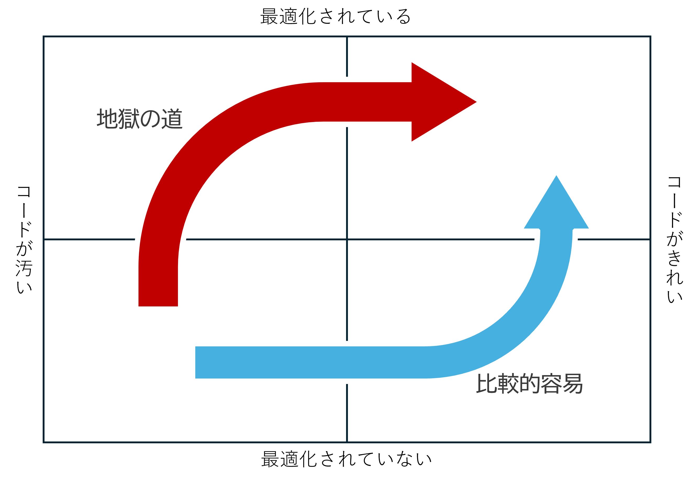

<!-- 
size: 16:9
paginate: true
-->
<!-- header: 勉強会# ― エンジニアとしての解像度を高めるための勉強会-->

# ボーイスカウトの規則 & 最適化のルール

---

## 1.ボーイスカウトの規則

**コードを来たときよりもきれいにして帰る**

---

## 2種類の掛け算

* 1.01 * 1.01 * 1.01 * … → ∞
* 0.99 * 0.99 * 0.99 * … → 0

<!-- 「割れ窓理論」とは、1枚の割られた窓ガラスをそのままにしていると、さらに割られる窓ガラスが増え、いずれ街全体が荒廃してしまうという、アメリカの犯罪学者ジョージ・ケリング博士が提唱した理論(https://www.pref.kyoto.jp/anshin/waremado.html) -->
<!-- 「俺達は腐ったミカンじゃない」は1980年頃放送された『3年B組金八先生』の中で使われた言葉だそう。しらんけど-->

---

## コードをきれいにするとは

* **追加**: 不足しているコメントやテストの追加
* **削除**: 不必要な依存関係・メンバー・条件式の削除
* **名前の変更**: クラス・関数・変数などの名前を適切に
* **分割**: 大きすぎるクラスや関数・深いネスト・呼び出しの連鎖を分割
* **構造化**: 依存関係・抽象化レイヤー・継承の構造を適切化

>>> 『読みやすいコードのガイドライン』より

---

## いつきれいにする？

個人の意見もあるが、以下の順が良い。

1. 今のルールで実装
2. きれいにする

差分レビューがしやすいため。

gitを使う場合、実装するブランチときれいにするブランチとを分けると、レビューしやすくなる

<!-- 先にきれいにすると、これまでとの違いがわからなくなってしまう。
きれいにしたあとのコードを知らないので、リーディングの認知負荷が高まる

きれいにすることは大事だが、機能を実装すると、きれいにするは目的が異なる。
さらに言えば、汚いけどコードの方が、きれいだけど動かないコードよりも何千倍も価値がある。
もちろんいろいろな視点はあると思う。チューニングできていないギターで弾いたって良い演奏はできないとか。

なおリファクタリングをするときのセオリーは、まず動いていることを検証できる環境を用意すること。
テストコードを書いておくのが一般的で、安心して手を加えてもよい状況になったら手を加える。
『レガシーコード改善ガイド』ではレガシーコード(古びたコード)を「テストコードが無いコード」と定義している
-->

---

## 2.最適化のルール

<!-- ここでの最適化とは「パフォーマンス・チューニング」のことを指す。
動作の速いコードを書くこと。 -->

```cpp
int sum = 0;
for (int i = 1; i <= N; i++) {
  sum += i;
}
printf("sum: %d\n", sum);
```
↓

```cpp
int sum = (N * (N + 1)) / 2;
printf("sum: %d\n", sum);
```

---

## 最適化で守るべき２つのルール

最適化には２つのルールがある。

1. 最適化を行ってはならない
1. <b>???</b>　(hint:専門家やベテラン向け)

---

## 最適化で守るべき２つのルール

最適化には２つのルールがある。

1. 最適化を行ってはならない
1. **まだ行ってはならない**(専門家やベテラン向け)

---

## 最適化のルール

> 「早すぎる最適化は諸悪の根源である」
> premature optimization is the root of all evil
> ――― Donald E. Knuth

---

## 早計な最適化 ＝ 諸悪の根源

早々に速くしたコードが失うものは大きすぎる

* 可読性、品質、複雑性、保守性、移植性、...etc.

```cpp
int count_bits(int n)
{
  n = (n & 0x55555555) + (n >> 1 & 0x55555555);
  n = (n & 0x33333333) + (n >> 2 & 0x33333333);
  n = (n & 0x0f0f0f0f) + (n >> 4 & 0x0f0f0f0f);
  n = (n & 0x00ff00ff) + (n >> 8 & 0x00ff00ff);
  n = (n & 0x0000ffff) + (n >> 16 & 0x0000ffff);
  return n;
}
```

>>> [Henry S. Warren著『Hacker's Delight』より](https://www.amazon.co.jp/exec/obidos/ASIN/0201914654)

<!-- 渡した数値のビットの1の数を数えるコード。1960年代に考案 -->
<!-- Intel x86 アーキテクチャが SSE 4.2 から導入した population count 命令の POPCNT を使うのが何倍も速い。 -->
<!-- C++20でも int n = std::popcount(n); と書ける。 -->
---

## 非可逆変換

* <b>容易</b>:<br> きれいなコード<br> → 最適化されたコード
* **激ムズ**:<br>  最適化されたコード<br> → きれいなコード



---

## いつ・どうやって最適化するか

1. 最適化の必要性を確認する
2. パフォーマンスを計測し、ボトルネックを特定する
3. ボトルネック部のコードを最適化する
4. 最適化の結果を計測する
5. 問題のないことを検証する

<!-- ユーザーはそこまで必要性を感じていないかもしれない -->
<!-- ボトルネックを見つけることが先決。特定の部分だけに時間の多くがかかっていることがほとんど。だから計測すること。
パレートの法則も適用される。ボトルネックに関する経験則として、全体の1%〜25%のコードが75%〜99%のリソースを消費すると言われている。（Wikipedia: 最適化） -->
<!-- ようやくここで最適化。 -->
<!-- まだ終わっていない。そのあと計測して、本当に速くなったかを確認する -->
<!-- そして動作の検証。ここまでやってようやく最適化が終わる -->

---

## とはいえ

アーキテクチャ設計のときには早い段階でパフォーマンスを考慮するべき

* 通信プロトコル
* データの永続化方式
* 分散処理のノードやモジュールの構成

<!-- アーキテクチャは影響が広範囲に渡るため、あとから問題が見つかっても変更が困難だから。
もう少し一般化した表現にすると、あとからの変更が困難であるほど設計も慎重にならざるをえない。
前回のYAGNIでファームのコードは消しづらいというのも、あらゆることに慎重にならざるを得ないから。
 -->
<!-- 銀の弾丸は存在しない、を説明したときに、銀の弾丸は存在すると言ったことを覚えているか。
本質的な複雑性と偶有的な複雑性の2つがあって、後者には結果を激変させる特効薬が存在すると。
アーキテクチャ選定、ファーム開発、ミッションクリティカルな処理に対して、早い段階での詳細な検討は銀の弾丸になりうることを覚えておいてほしい -->

---

## まとめ

* ボーイスカウトルール
    * 少しずつ改善を蓄積していくと貯金が増える
* 最適化のルール
    * 最適化しない
    * 計測してから最適化を始める
    * アーキテクチャ設計時は最適化も意識する

<!-- 最適化しなければならない場合、アドバイスとしてパフォーマンス計測処理を自動化しておくと良い。
何度も測れるようにして効率化しておけば、 -->

---

## 関連する原則

* ボーイスカウトの規則: [KISS(Keep it simple, stupid)](03-kiss.md)
* 最適化のルール: パレートの法則
