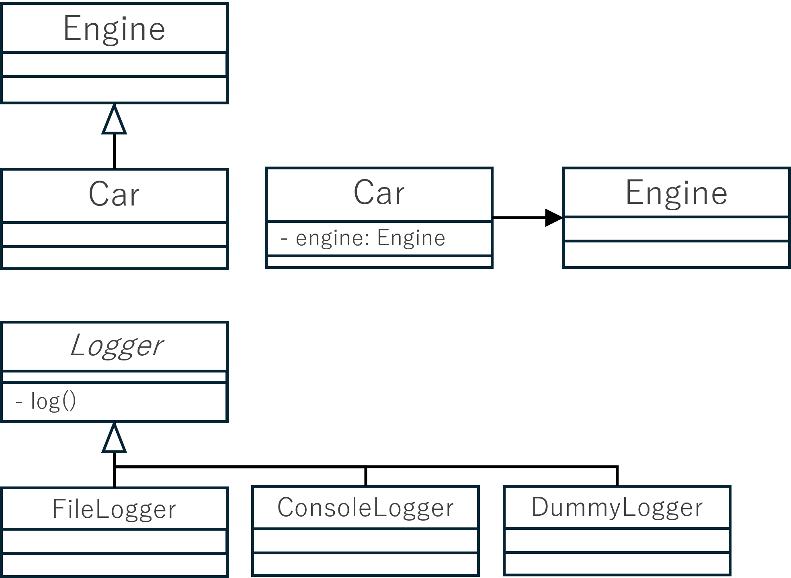

<!-- 
size: 16:9
paginate: true
-->
<!-- header: 勉強会# ― エンジニアとしての解像度を高めるための勉強会-->

# もう一度学ぶオブジェクト指向

_抽象を意識したプログラミングの実践技法_

---

## タネ本
### 『ちょうぜつソフトウェア設計入門<br>　―― PHPで理解するオブジェクト<br>　 指向の活用』

- 田中ひさてる(著)
- 技術評論社 2022/12/22 初版


---

## 「オブジェクト指向」ってなんだと思いますか？

「オブジェクト指向」と聞いたときに何を思い浮かべるでしょうか？

* クラスを使った型を大事にしたプログラミング？
* 状態変化の管理単位？
* 昔から何か言われているバズワード？

---

## オブジェクト指向の定義はない

世の中でも明確な定義はないまま「なんとなくこれがオブジェクト指向だろう」で扱っている状態

* ❌️ オブジェクトは現実を再現する
* ❌️ プログラミング言語の文法である
* ❌️ 状態管理をするものである
* ❌️ 手続き型プログラミングである

厳密な意味を求めようとせず、ソフトウェア開発に便利な考え方(の１つ)として捉えるようにする

<!-- あえて言うなら…「ものが物体として存在するイメージでプログラミングをうまくやろう」 -->

---

## オブジェクト指向のメリット

1. カプセル化
1. 多態性(ポリモーフィズム)
1. 継承/汎化

<!-- ただし、メリットはある。 -->

---

## 1.カプセル化

カプセル化＝「グルーピング」と「情報隠蔽」

### グルーピング
* 関係の強いものを１つの概念単位(クラス, パッケージ, etc.)にまとめる
* 適切にグルーピングできている → **凝集度が高い**

### 情報隠蔽
* 他に見せなくて良いものは隠す
* 知識最小の原則

---

## 問題

なぜカプセル化が大事と言われるのでしょうか？

---

## 問題

なぜカプセル化が大事と言われるのでしょうか？

### 答： 関心の分離(Separation of Concerns, SoC)を実現できるため

> * 関心の分離： 異なる機能・役割を持つものを分類する設計原則
> 凝集性を高め、保守性を上げられる

---

## 2.多態性(ポリモーフィズム)

乱暴に言ってプラグインを実現する仕組み。

* 仕様に準拠していれば、中身を変えても同じように使える
* 使う側のロジックをシンプルにできる  

```cpp
struct Runnable { virtual void run() = 0; };
struct Car: public Runnable { void run() {...} };
struct Dog: public Runnable { void run() {...} };

Runnable *a = new Car();
a->run(); // Carのrun()が呼ばれる
delete a;
a = new Dog();
a->run();  // Dogのrun()が呼ばれる
```

---

## 多態性とクラスや親子関係の有無は別問題

呼び出し側が「同じと認識してよい」と見立てたものに対して、複数種類の実体がある点に着目した概念

* JavaScriptやPythonのように型チェックしない書き方ができる言語
    * 同じ名前のメソッドがあれば問題なく呼び出せる（ダックタイピング）
* C++においては「型」が見立ての基準になっているだけ

```js
// JavaScriptの例。dogとcatに継承関係はない
dog = {"howl": ()=>{console.log("bow")}};
cat = {"howl": ()=>{console.log("meow")}};
pet = dog; // catも代入できる
pet.howl(); // bow or meow
```
---

## 3.継承/汎化

他のオブジェクトの特性を引き継ぐこと

```cpp
struct Base {
    virtual ~Base() {}
    int state = 193;
    void methodA() {}
    virtual void methodB() {} // 派生クラスでの上書きを許可
};
struct Derived: public Base {
    virtual ~Derived() {}
    void methodB() override { std::cout<<state; } // 親クラスの処理を上書き
    void methodC() {} // 新しいメソッドを定義
};

Base *obj = new Derived();
obj->methodB(); // → 193
```

---

## 抽象クラス / インターフェース

```cpp
// 抽象クラス。実処理が(一部)書かれている。
struct AbstractBase {
    virtual ~AbstractBase() {} // 仮想デストラクタ
    int state = 193;
    void methodA() {...} // 実処理を持つ
    virtual void methodB() = 0; // 実処理を持たない
};

// インターフェースクラス。一切の実装を持たない
struct SomeInterface {
    virtual ~SomeInterface(){} // 仮想デストラクタ
    virtual void methodA() = 0;
    virtual void methodB() = 0;
}
```

---

## 問題

継承の目的は何？

---

## 問題

継承の目的は何？

1. **特化・汎化をするため**
2. **差分プログラミング・サブタイピングをするため**

>>> 差分プログラミングはお勧めしないので注意(後述)

---

## 特化と汎化

クラスの持つ特性を元に具体化(=特化)すること・抽象化(=汎化)すること

### 特化(Specialization) → 具象
* 親クラスの処理をより具体化したり、特定ドメインにフォーカスすること
* 親クラスから見れば、子クラスはすべて特化したもの<br>(になるはず)

### 汎化(Generalization) → 抽象
* いくつかのクラスが持つ特性を包括的/汎用的にした上位抽象
* 子クラスから見れば、親クラスは自分/兄弟クラスの内容を汎化したもの<br>(になるはず)

---
## 差分プログラミング・サブタイピング

継承して何をするか、という話。

### 差分プログラミング
* 既存クラスに新機能を付け足すことで、低コストで再利用を目論む
    * 共通処理をまとめて親クラスにする用法も同じ
* **オススメしない用法**

### サブタイピング
* 子クラスを作成しても親クラスのインターフェースでのみ使う
    * 子クラスを差し替えても動く・親が子クラスの抽象を表している
* **正しい継承**

---

## なぜ差分プログラミングをオススメしないのか

誤った継承の温床になるため。
* コードの可読性と保守性の低下
* 依存関係の増加:
* 再利用性の低下
* テスト難易度の増加

> 継承はいくつかの具象から抽象概念を見出すために使うと良い。
> 手順: **具象クラスの作成 → 抽象に着目 → 親クラスの作成**

<!-- 
* コードの可読性と保守性の低下:
差分プログラミングでは、クラスの変更が積み重なることで、コードが複雑になりやすいです。これにより、他の開発者がコードを理解しにくくなり、保守が困難になります。
* 依存関係の増加:
継承を多用すると、サブクラスがスーパークラスに強く依存するようになります。これにより、スーパークラスの変更がサブクラスに影響を及ぼしやすくなり、予期しないバグが発生するリスクが高まります。
* 再利用性の低下:
差分プログラミングでは、特定のクラス階層に依存するため、コードの再利用が難しくなります。コンポジション（オブジェクトの組み合わせ）を使用する方が、再利用性が高まります。
* テストの難易度の増加:
継承を多用すると、テストが複雑になり、すべてのクラスの組み合わせを網羅するのが難しくなります。これにより、テストのカバレッジが低下し、バグが見逃される可能性が高まります。
 -->

<!-- 継承のもともとの用法として考えられていた。「オブジェクト指向によって再利用性を高める」という視点。 -->

<!-- 本にあるエンジンを継承して車、の例を出す。電動モーターの車を作るときになったらどうする？もう一回、電動モーターから車クラスを作る？ -->

---

## 「継承より委譲」をもっと解像度高く


「差分プログラミングより委譲」として覚える。サブタイピングとしての継承は善

* **has-a**を継承にしない
* **is-a**は継承で良い

継承は必ずしも悪ではない

---

## 実装を持てない型(**インターフェース**)が用意されたプログラミング言語もある

C++の純粋仮想関数のみ使ったもの

```cpp
// C++
struct Foo {
    virtual int calc(int a, int b) = 0;
};
  ↕ 同じ
// Java
public interface FooInterface {
    int calc(int a, int b);
}
```

なぜ他言語ではあえてinterface型を用意しているのか考えてみよう

<!-- インターフェースによって抽象(コンセントという規格)をしっかり定義することで、その先の実装とを分割する境界が引けるようになる。
仕様を決めるという側面が、設計でも実装でも先行投資として大きくレバレッジを効かせられる -->

<!-- 歴史を踏まえて。interfaceはもともとなくて、提供されるようになって、デフォルト実装も持つようになって(Java8) -->

---

## まとめ

* オブジェクト指向の定義はない
* ただしメリットはある
    1. カプセル化
    1. 多態性(ポリモーフィズム)
    1. 継承/汎化
* 差分プログラミングではなく、抽象と具象とを見出すために継承を用いる
    * 差分プログラミングには委譲を用いる

<!-- 継承は設計段階で考えるもの。抽象と具象、安定と非安定とを区別するためのもの -->