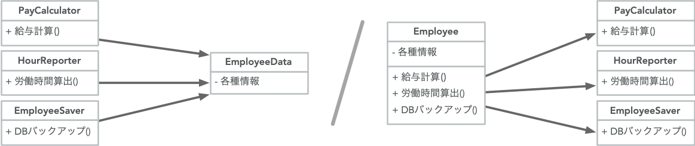

<!-- 
size: 16:9
paginate: true
-->
<!-- header: 勉強会# ― エンジニアとしての解像度を高めるための勉強会-->

# SOLID #1 単一責任の原則(SRP)
_Single Responsibility Principle_

---

## SOLIDの５原則

> ### SOLID(堅牢)なアーキテクチャを作る５原則を集めたバクロニム$^1$

* S: 単一責任の原則: Single Responsibility Principle(SRP)
* O: 開放閉鎖の原則: Open/Closed Principle(OCP)
* L: リスコフの置換原則: Liskov Substitution Principle(LSP)
* I: インターフェース分離の原則: Interface Segregation Principle(ISP)
* D: 依存関係逆転の原則: Dependency Inversion Principle(DIP)

<!-- これらを実践することで堅牢なアーキテクチャを持つソフトウェアができる。 -->
<!-- 待って、そもそもアーキテクチャって？ -->

---

## 『アーキテクチャ』の定義をあらためて考える

アーキテクチャとは…

* 複数の階層をなしたもの
    * ↓
* システムの全体的な形状と構造を定義するもの
    * ↓
* モジュールやコンポーネント・クラスの構造とその相互接続

### ソフトウェア全体だけでなく、細かなクラス設計も含めた構造のこと

>>> Robert C. Martin氏(通称:ボブおじさん)による論文「Design Principles and Design Patterns」より

<!-- 全体を考える人だけが意識すればよいものではない。１つ１つのクラスを考える皆も自分ごとであると考えてほしい -->
<!-- アーキテクチャとは何のためにあるか。効率的な開発・メンテナンスのためにある。
 一瞬で作れて以降の変更も要らないものにアーキテクチャは不要。
 時間がかかり、人が絡み、変化していくものにはしっかりしたアーキテクチャが必要
 （つまり書き捨てのスクリプト以外には必要と考えて良い） -->
<!-- 書籍クリーンアーキテクチャの中で「ソフトウェアアーキテクチャの目的は、求められるシステムを構築・保守するために必要な人材を最低限に抑えることである」 -->

<!-- 設計とアーキテクチャは同じである。大きな視点で考えるときも、小さな視点で考えるときも必要なこととして考えてほしい -->

---

## 質問： 「SOLID(堅牢)なソフトウェア/アーキテクチャ」とは？

---

## 『SOLID』を実践できていると

オブジェクト指向のクラス設計・任意のモジュール設計において**超**重要

* スパゲティコードがなくなり読みやすくなる
* 機能拡張に素早く柔軟に対応できる
* 長期間にわたってメンテナンスしやすくなる

>>> バクロニム（backronym または bacronym）とは、ある単語の各文字を使って新たに頭字語としての意味を持たせたもの。逆頭字語。
<!-- SOLIDというオブジェクト指向設計をスマートにできるようになりたい場合に「まず習っておけ」と真っ先に伝えている5大原則 -->

---

# SOLID #1 単一責任の原則(SRP)
_Single Responsibility Principle_

> ## モジュールを変更する理由はたったひとつだけであるべき

---

## 単一責任の原則(SRP)の解釈

> ### モジュールを変更する理由はたったひとつだけであるべき

↓ 言い換えると

> ### モジュールは単一の顧客に対して責務を負うべきである

↓ つまり

> ### モジュールは同じ種類のアクター(≒モジュール使用者)に対して責任を負うべき
> * 複数のアクター(使用するモジュール)がいるコードは別々に分割しよう
> * アクターの異なるコードを同じモジュール/クラスにまとめないようにしよう

<!-- SRPのよくある間違い。単一責任ということで、関数では１つのことだけを行うべきという意味で捉えられることが多く、それもそれで原則として存在しているが、
もう少し抽象化してほしい。ボブおじさんも名前付けがよくなかったと後悔している。 -->
<!-- 元々はこんな意味だった 【１つ目】-->

<!-- ここでのモジュールとは、ソースコードのあつまりだけでなく、画像などのリソース、データベースや通信プロトコルなどをまとめた凝集性のあるもの -->
<!-- システムに手を加えるきっかけは、ユーザー/顧客の要求を満たすため。
顧客こそが「変更する理由」であり、これを言い換えると…  【２つ目】-->

<!-- 単一の顧客といっても、〇〇さんという特定の個人を指すのではなく、同じような要求を持った人やドメイン・レイヤーを抽象化したものになる、ここではそれを「アクター」と言い換えて、つまり【３つ目】 -->

---

## つまり単一責任の原則(SRP)とは

どのような凝集度で __まとめるか__ を表した原則

* モジュール・クラス・関数が対象

「分割」だけで考えず「グルーピング」の視点も持つと、単一責任の原則を多層的に適用できるようになる

<!-- 分割するという字面だけでなく、凝集性をもつ単位でグルーピングしようという話も含まれています -->

<!-- 勘違いしないでほしいのが、責任を分割していくという点は確かにベースとしてある。それはそれでいい。しかしそれだけを考えると細かくなりすぎてしまい崩し過ぎたチリに埋もれてしまう。
なのでこれとこれは同じ責務の範囲をまとめるというグルーピングの考え方もあるし、それを階層ごとに異なる粒度で汎化していく階層型クラスタリングの考え方もSRPには含まれると理解してほしい -->

---

## とはいえ、似ているからといって安易なグルーピングをしない

同じような処理だからとまとめるのは安直なリファクタリングあるある

* 別モジュールにも似た名前/メンバーを持つクラスがあるので１つにまとめる
* 複数で同じ処理をCommon/Utilityクラスでまとめる

<!-- この例だと同じ雇用者(Employee)だからと１つのクラスにまとめてしまったことで、本来関係のない処理が混じってしまっている。経理向けに変更した処理が人事向けの方で悪影響を及ぼしたり、あるいは悪影響の無いように手が出せなくなったり。 -->
<!-- クラスの共有だけでなく、その中のアルゴリズムの共有でも同じ -->

---

## どうすればよいか

安定しているデータを切り離す ＆ ロジック(とその先のデータ)を切り離す$^1$

**責任の境界**を見出す。

>>> 1:諸説あります

---

## 単一責任の原則は要求分析の時点から始まっている

* Employeeで１つにまとめるのは誰の都合？
* この『生徒』はどんなときにも同じ概念か
* 『ドライバー』という単語はOSのドライバーとは意味が違う…？

アクターやドメインが異なれば別のクラスやモジュールとして表現すべき

---

## 演習問題 ①

電子メトロノーム機器のアーキテクチャを考えてみよう

構成要素を責任ごとにモジュール単位でグループ化してみよう

* テンポ(bpm)を設定できる
* リズムや拍子を指定できる
* 状態を液晶で確認できる
* 音を鳴らせる

>>> https://jp.yamaha.com/products/musical_instruments/winds/accessories/metronomes/me-55be/index.html

<!-- オシレータ・シーケンサー・シンセサイザー -->

---

## 演習問題 ②

**スマホアプリ版**の電子メトロノームのアーキテクチャを考えてみよう

構成要素を責任ごとにモジュール単位でグループ化してみよう

* テンポ(bpm)を設定できる
* リズムや拍子を指定できる
* 状態を液晶で確認できる
* 音を鳴らせる

<!-- オシレータ・シーケンサー・シンセサイザー -->

---

## SRPはどう使う？
 
* **設計時**：役割(責務という)が十分に小さく直交するよう気をつける
* **違反の臭い**：異なる理由の変更作業なのに同じクラスに手を入れていた。複数の使用者が同じクラスを参照している
* **消臭方法**：責務が同じもの同士、別ドメインや別クラスに分割する
