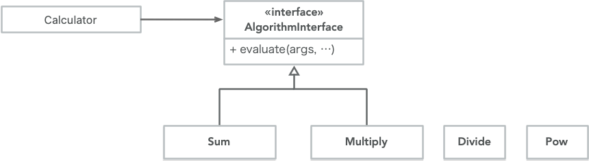
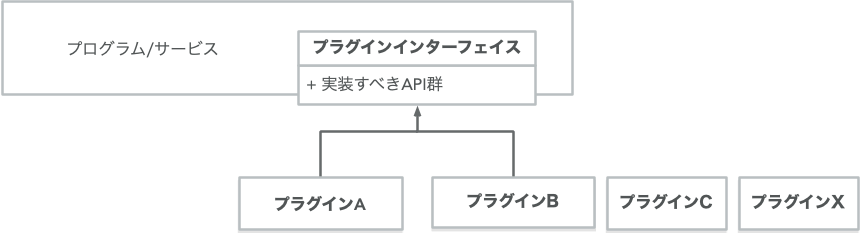

<!-- 
size: 16:9
paginate: true
-->
<!-- header: 勉強会# ― エンジニアとしての解像度を高めるための勉強会-->

# SOLID #2 開放閉鎖の原則
_Open Closed Principle_

> ### ソフトウェアの構成要素は拡張に対して開いていて、<br>修正に対して閉じていなければならない$^1$

>>> バートランド・メイヤー『オブジェクト指向入門』1988年 アスキー刊

<!-- 今回はOCP。SOLIDというオブジェクト指向設計するときに常に手元においておきたい５大原則のうち、保守・拡張しやすい構造の到達点を示した原則です。
２つは一見矛盾した性質のように見えますが、これこそがオブジェクト指向プログラミングのゴールを表しているということで楽しんで参加してください。 -->

---

## SOLIDの５原則

* S: 単一責任の原則: Sindle Responsibility Principle(SRP)
* O: 開放閉鎖の原則: Open/Closed Principle(OCP)
* L: リスコフの置換原則: Liskov Substitution Principle(LSP)
* I: インターフェース分離の原則: Interface Segregation Principle(ISP)
* D: 依存関係逆転の原則: Dependency Inversion Principle(DIP)

<!-- これらを実践することで堅牢なアーキテクチャを持つソフトウェアができる。 -->
<!-- 他の原則が割と覚えてからしばらく経つと使いこなせるようになるものが多いのに対して、この原則はすぐに設計や実装に使えるのが特徴です -->

---

## 拡張に対して開いて、修正に対して閉じる？ 🤔

わかりやすく言い換えると、既存の処理を修正せずに各要素の振る舞いを拡張できる状態のこと

* **拡張に対して開いている:** 機能追加がしやすいこと
* **修正に対して閉じている:** 機能追加時に既存コードの書き換えが不要なこと

### → OCP = アーキテクチャが満たす根本的なゴール

<!-- 拡張と修正の言葉の言葉の意味を整理しておく。
1. 拡張:
  * 新しい機能や振る舞いを追加すること。
  * 既存のコードを変更せずに新しいモジュールやクラスを追加することで行われる。
2. 修正:
  * 既存のコードの変更。
  * バグの修正や既存の機能の変更など、すでに存在するコードの内容を直接変更する行為。

OCPの目的は、新しい機能や変更が必要なとき、既存のコードを変更するのではなく、新しいコードを追加することでその要件を満たすことができるような設計を心がけること
https://zenn.dev/naas/scraps/41ed1c120aff53
-->

<!-- ちょっとした拡張のために大量の書き換えが必要になるようなら、そのプロジェクトは大失敗への道を進んでいることになる -->

<!-- もう一度繰り返しておくと、既存コードが修正不要で機能拡張できることがOCP -->

---

## OCP実現例

* プリンタ/スキャナドライバをOSに追加する仕組み
* ソフトウェアのプラグイン機構
* DI (Dependency Injection。依存性注入)
* ゲームのMOD

どれも既存の処理・コードを変更することなく機能追加できている

<!-- 考えてみるとすごい状態。OS,ソフトウェア,ゲームソフト本体のコードを一切変更していないのに、これまでと同じ機能が同じように動作し、新しい機能も問題なく動いている。これがOCPが実現する世界。 -->
<!-- 自分たちの作るものもこんな風にできたら良いと思いませんか？今まで作ったものに手を触れずに、安心して新しい機能を追加できる。
自分はオブジェクト指向言語じゃないといって関係ないわけでもない。Cで書かれたLinuxでも同様にOSビルド不要でデバイスドライバを追加できるし。
OSみたいな大きなプログラムだけがメリットを享受するわけではない。AIや数理最適化の処理においても「この部分のロジックだけを別のものに取り替えてみたい」という試行錯誤が簡単にできるようになる。 -->
<!-- ちょっとOCPに興味が湧いてきましたよね -->

<!-- ただ、OCPはSOLIDの順番でこそ２番めに出てきているけれど、SOLID全般で目指すゴールの状態でもあるので、実現に必要なテクニックにはO以外の全部(S/L/I/D)すべての考え方が必要になる。なので今日は全体像を掴むための説明と、その説明理解に必要な概念を紹介します -->

---

## 「OCP」が指すものは２種類ある

歴史的に２つの意味合いを持っている

1. 1988年にバートランド・メイヤーが提唱したOCP
2. 1996年頃にロバート・C・マーチン(Bobおじさん)らが提唱したOCP


>>> 写真: https://en.wikipedia.org/wiki/Robert_C._Martin , https://en.wikipedia.org/wiki/Open–closed_principle
<!-- OCPには歴史的に２つあるので、それを紐解きつつ具体例を示していきます -->

---

## 1.バートランド・メイヤー版OCP(原始OCP)

OCPの原点。オブジェクトのクラス構造として拡張性を取り入れることが主点。

* **開放されたモジュール**＝拡張可能なもの
* **閉鎖されたモジュール**＝内部の実装を意識せず仕様に従い安定して使える

→ 要は **「クラスやモジュールでポリモーフィズムを実現しましょう」** ということ



>>> 1988年のバートランド・メイヤー著書『Object Oriented Software Construction』で提唱

<!-- 親クラスで安定した仕様をしっかり定義しておき、それを継承する各サブクラスで実装の修正または拡張を行なっていくことで、具体的な処理はサブクラスで実装すれば、使用者にとっては親クラスを使っているつもりで処理を切り替えることができる。使用者は実体につられてソースコードを変更しなくても良い -->
<!--
 つまりメイヤーの原則では、具象メソッド（シグネチャ＋コード）の実装継承（implementation inheritance）と、サブクラスを追加定義していく深い継承が基本になる。
 親クラスは単なるインターフェースを定義するだけでなく実際の処理を持っていても良く、また子だけでなく孫クラスや曾孫クラスになることを想定している -->

---

## 2.ロバート・C・マーチン版OCP(新OCP)

メイヤーのOCPをより高い視点に。モジュールを実行時に差し替えることを想定$^1$

* プリンタ/スキャナドライバをOSに追加する仕組み
* ソフトウェアのプラグイン機構
* ゲームのMOD

モジュールとして仕様に従ったものを作れば **プログラムの再ビルドすら不要**



>>> 1996年の論文[『The Open-Closed Principle』](https://docs.google.com/a/cleancoder.com/viewer?a=v&pid=explorer&chrome=true&srcid=0BwhCYaYDn8EgN2M5MTkwM2EtNWFkZC00ZTI3LWFjZTUtNTFhZGZiYmUzODc1&hl=en)で提唱

<!-- クラス構造の視点でいうと、マーチンの原則では、実装を持たない抽象メソッドだけ定義したインターフェースクラスを定義し、それを界面継承（interface inheritance）することが基本になる。継承関係はインターフェースの実装のみに留めて、実装の継承は抑えることがメイヤー版との違い。 -->

<!-- 一般的にOCPでググると出てくるのは、メイヤーのようにコードレベルでの話をしているものが多い。ただし最近は親クラスといっても実装を持たないスタイルが主流になっているので、その点ではボブおじさんのインターフェースのみ用意してそれを継承するという内容に近い -->

<!-- ちなみに昔はたくさんあったTwitterクライアントも広義のボブおじさん版OCPの適用例と言える。どのクライアントアプリもTwitterのAPIというインターフェースを守っていれば同じようにタイムラインを見たり投稿できた。このときにTwitterサービスそのものを修正する必要はない。 -->

---

## 例: 印刷時にPDFも作れるようにする

下のクラスを「出力先をPDFにもできるようにしてほしい」と言われたとする

```cs
// ある内容をプリンターに出力する処理
class PrinterPresenter {
    public void print(String contents);
}
 
var presenter = new PrinterPresenter();
presenter.print(contents);
```

---

## だめな追加方法
 
```cs
class PDFPresenter {
    public void createPDFFile(String contents);
}
```
↓
<!-- ❌ メソッド名がヤバい。PrinterPresenterとは関係なくてヤバい -->

```cs
// ✕ 使う側で処理の書き換えが必要
if (target == OutputType::Printer) { // プリンターで印刷するとき
    var presenter = new PrinterPresenter();
    presenter.print(contents);
} else { // それ以外
    var presenter = new PDFPresenter();
    presenter.createPDFFile(contents);
}
```
<!-- もしかすると次はディスプレイに表示することになるかもしれない。そのときにif文を追加する？ -->

---

## 解決策
 
GoFの**Template Methodパターン**や**Strategyパターン**など、インターフェースに対する実装ができるパターンを使う$^1$
 
```cs
interface IOutputtable {
    public void output(String contents);
}

// どちらもIOutputtableを継承する
class PrinterPresenter: IOutputtable {
    public void output(String contents) { … }
}
class PDFPresenter: IOutputtable {
    public void output(String contents) { … }
}
```

>>> 1: Template Method Patternを使うのがMayer版OCP、Strategy PatternがUncle Bob版OCP

---

## 解決策を使ったときの使用例
 
```cs
IOutputtable outuputPort = 〜
outputPort.output(contents);
```
 
* 修正するときは`IOutputtable`を継承したクラスを追加するだけ(＝閉じている)
* 拡張しても使う側の変更は不要(=開いている)
 
→ **OCPの秩序が守られた状態に**
 
<!-- ちなみに上のコードはメソッドをより抽象的な`output()`にしているのもポイント -->

<!-- C言語みたいに言語でOOPがサポートされないものでも、ヘッダファイルに対応する.cファイルを別のファイルにすることでビルド時に差し替えられる。C/C++のテストライブラリなんかはこの方法でmain()関数を差し替えている。
また実行時のポリモーフィズムにおいても関数ポインタなどを保持できる構造体と同じメモリアラインメントを持つ構造体を作って、そのポインタを保持するという方法で実現できる。参考までに。 -->

<!-- さて、このような状態を実現するためには、普段から何に気をつけていれば良いと思う？

それは「将来インターフェースを使って拡張するプログラマーのために、インターフェースや抽象クラス/モジュールのドキュメントをしっかりと書く」ということです。クラスやインターフェースの継承は何かと厄介です。新しいサブクラスによって既存のコードが予測不可能な方法で破壊されるかもしれません。そうならないためにも、継承をサポートするクラス等を書くときには、ドキュメンテーションをめちゃくちゃ頑張るというのがとても重要です。 -->

<!-- 一方で、インターフェースを定義するなどして拡張に対して開き変更に閉じているコードを作ると、その瞬間からその境界に対して将来の変更を不可能にしてしまうリスクもはらんでいる。そこも注意してほしい。新しいバージョンのインターフェースを作ってver2として公開するか、それともみんなにゴメンナサイして変更するか。 -->

---

## OCPはどう使う？
 
* **設計時**：変動部と固定部の見極め・分離
* **違反の臭い**：機能のバリエーションを増やすときに使う側でも修正している
* **消臭方法**：Template Method, Strategy, Factoryなどなどを考える
 
「不必要な複雑さ（＝設計過剰）」に注意

<!-- 「変更に対して閉じている」についてもう少し広い例外も紹介しておきます。
あるモジュールやコードの、クライアント側(つまり使用する側)を変更する必要がない限り、既存の提供側すべてのコードを変更しても良い、という例外です。
これは内部では様々なコードが変更されている状況ではあるものの、それを使う側は変更前後でまったく同じように使えるようになっているというインターフェースの境界が作れていることを表します。これはこれで、当該コードとクライアントとの間に明確な境界が引かれていて不可侵な状態になっているので、変更に対して閉じていると言える。

つまり、疎結合になっていることはOCPの１つの実現された状態になっている -->

---

## 関連原則

[アーキテクチャ根底技法3「情報隠蔽」](01-basics/13-encapsulation_infohiding_pkg.md)で紹介したパルナスの規則も同じ$^1$

> * モジュールの利用者には、そのモジュールを利用するために必要なすべての情報を与え、それ以外の情報はいっさい見せないこと
> * モジュールの作成者には、そのモジュールを実装するために必要なすべての情報を与え、それ以外の情報はいっさい見せないこと

>>> 1:というか、ボブおじさんがnew OCPを提唱する際にパルナスの規則と関連付けている
