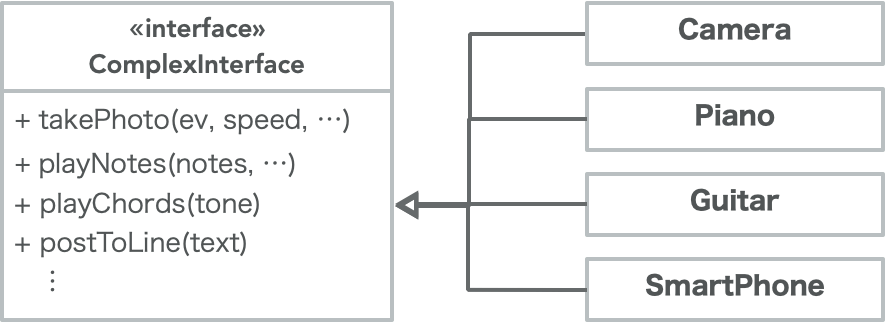
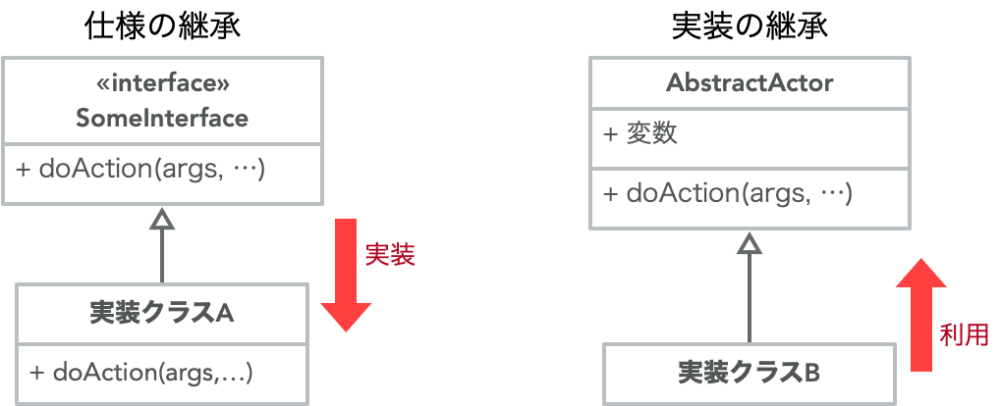

<!-- 
size: 16:9
paginate: true
-->
<!-- header: 勉強会# ― エンジニアとしての解像度を高めるための勉強会-->

<!-- インターフェース分離の原則によって何が理解できるようになると思いますか？（質問）
そうです。人間のエゴ、あるいは悲しい性(サガ)ですね。 -->

# SOLID #4 インターフェース分離の原則
_Interface Segregation Principle_

> ### クライアントに、 クライアントが利用しないメソッドへの依存を強制してはならない
 
<!-- あるインターフェースを用意するときに、仮想メソッドに複数の役割を詰め込まない。 -->

---

## SOLIDの５原則

* S: 単一責任の原則: Sindle Responsibility Principle(SRP)
* O: 開放閉鎖の原則: Open/Closed Principle(OCP)
* L: リスコフの置換原則: Liskov Substitution Principle(LSP)
* I: インターフェース分離の原則: Interface Segregation Principle(ISP)
* D: 依存関係逆転の原則: Dependency Inversion Principle(DIP)

<!-- これらを実践することで堅牢なアーキテクチャを持つソフトウェアができる。 -->
<!-- 他の原則が割と覚えてからしばらく経つと使いこなせるようになるものが多いのに対して、この原則はすぐに設計や実装に使えるのが特徴です -->

---

## インターフェース分離の原則

異なる責務のインターフェースを安易に混ぜてはいけない

* 単一責任の原則のインターフェース版

---

## 前提1: 「インターフェース$^1$」 is

情報の授受を行うシステム間のプロトコルまたはその接続部分の抽象的な表現
プログラミングでは外部と内部とで適切に処理を継続するための界面の仕様

> * HDMI/USB/Wi-Fi/Ethernet/シリアルポート
> * ライブラリAPI/クラスの公開メソッドや変数/ABI/UI
> * 仕様書なども広義のインターフェース

→ 複数のクラスが汎用的に満たす仕様を定義した型のこと。**継承**して使う
* `interface`(Java, C#, TypeScript) / `protocol`(Swift) / `trait`(Rust)など

>>> 1.「外来語の表記」（平成3年　内閣告示第二号）の電子・情報通信分野の用語集では「**インタフェース**」と表記

<!-- ただし慣用表現としてのインターフェース・インターフェイスも禁止されていないので、ここではインターフェースと読むことにしてます。 -->
<!-- オブジェクト指向プログラミングにおいて、複数の種類のオブジェクトを多態性によって統一的に利用するため、境界部分の汎用的な共通規格を定義したもの。
共通規格を表す型にはクラスが使われることが多いが、その中でも
**実際に実行されるロジックを持たず、メソッド名だけを定義したもの**
を特にインターフェース型と呼ぶことが多い
(C#,Swiftなど言語によってはインターフェース専用の型がある)
C言語だとヘッダファイルが近い概念。 -->

---

## 前提2： 継承は「仕様の継承」と「実装の継承」の２種類がある$^1$

* **仕様の継承**: 親では何をするかの仕様だけを定義し、派生側で具体的な実装を持つ
* **実装の継承**: 親が具体的な実装を持っていて、派生側はそれを再利用する

インターフェースの役割は「仕様の実装」

>>> まつもと直伝　プログラミングのオキテ 第3回（3） | 日経クロステック（xTECH） (https://xtech.nikkei.com/it/article/COLUMN/20050915/221232/)

<!-- PythonやJavaScriptなどの動的オブジェクト指向言語では、仕様の継承と実装の区別はあまり重要ではない。継承関係がなくても自由にメソッドが呼び出せるから。
ただし重要でないからと忘れて良いわけではなく、今は継承をあまり使わないと言っていることのコンテキストは「実装の継承ではなく仕様の継承をしなさい」という意味合いなので注意 -->

<!-- 仕様の継承だけでも不便は不便なので（実装を持てないから）、RubyではMix-in型が用意されたし、Swiftも途中から実装付きのインターフェースが持てるようになった -->

---

## 改めてISPとは

> 異なる責務のインターフェースを安易に混ぜない

* Camera/Piano/Guitar/SmartPhoneは責務が異なる
    * SRPと同様に責務でグルーピング

---

## 改善例

**
↓
**

---

## ISP違反の何が問題か？

インターフェースも**太る**。**依存体質になる**

* メソッドが大量に集まり始める → 肥満インターフェース
* 複数ドメインの事情が絡み始める → 神インターフェース
* 特定のライブラリ仕様に依存しきったモジュール → 癒着インターフェース

UIの便利な部品を作ろうとすると太りがち・使っているライブラリのデータ設計に寄せがち

<!-- 原則に違反した場合の問題は、神インターフェース型が存在してしまうということ。 -->
<!-- 洗濯機を操作していてエラーが出た時に、その原因を調べるために何百ページもあるマニュアル(目次や索引なし)を渡されたら読みこなせる？普通の操作方法から、開発の内部資料までのっているようなものを見せられて喜ぶ人がいる？ -->

<!-- UIはボタン・スライダーなど入り口となるインターフェースが固定されているので、分離するタイミングを逃しづらい。その間に「こういうことができたらいいな/便利だな」が積み重なりインターフェースにAPIが増えていくことが多い。 -->
<!-- C/C++界隈だとエラーコードを１つの定数ファイルにまとめて書いているのも同じなので注意。errno.hという、Cの様々な標準ライブラリ関数の返す正の整数がどういうエラーを表すかを１つのファイルにまとめたものがあるが、ファイルが使用中で開けない、認証エラー、送信先IPアドレスが不正、タイムアウトなどの様々なエラーが一緒になってしまっていて、ある関数が何を返すのかがまったく分からない状態になっている -->

---

>>> swiftdoc.orgよりSwift 3.1時代のInt型

<!-- インターフェースをどれだけ分離したらいいかという１つの例。Swift3.1時代で、整数型はこのように表現されていた。様々な特性が集まって、整数であることが表現されていた -->

---

## ISPはどう使う？
 
* **設計時**：クラス設計で単一責任の原則を守り、複数の機能を詰め込まない
* **違反の臭い**：(提供側)関係ないメソッドまで実装することを強いられている / (使用側)どのメソッドを使えばいいのか分からない
* **リファクタリング**：インターフェースの粒度を役割ごとに分ける

<!-- さて、冒頭に質問をしました。ISPで何がわかるようになるか。何だったか？
人間のエゴであり性(サガ)がわかると。これはどういうことでしょうか？

よくよく考えてみてください。会社や友人関係でいい姿を見せようとしてアレもこれもと頑張っていくうちに肥大化した周囲からの自分のイメージに押しつぶされてしまう人とかいますよね。あるいはそういうのが嫌だからとはじめからグループごとに淡白なインターフェースしか見せないから「何か付き合い悪いよね、疎結合だよね」と言われてしまったり。
それぞれにいろいろ思惑があって生きているわけですが、人間それぞれはインターフェースを経由してしか付き合えないから、結局のところ実装という中身が分からないという悲しさがあるわけです。

（そんな身近な話以外にも、イギリスのかの有名な三枚舌外交、これは第一次世界大戦のときにアラブ人とユダヤ人とフランスやロシアそれぞれに矛盾した約束(つまりインターフェース)を秘密に交わし、そして戦後すべて反故にした、いまのイスラエル ガザ地域の紛争にもつながる中等の火種を作ったひどい外交政策もあります）

インターフェース分離の原則は、まさにそういう、こうありたいというエゴや悲しい人間の性(サガ)を的確に表した原則というわけです。がってん、いただけましたでしょうか？
 -->

<!-- 三枚舌外交
第一次世界大戦を有利に戦うため行い、中東の火種をつくったイギリスの秘密外交

https://solver-story.com/?p=1776

1. 第一次世界大戦でイギリスはオスマン帝国(トルコ)と敵対
    * 三国同盟{イギリス/フランス/ロシア} vs. 三国協商{ドイツ/オーストリア/イタリア+オスマン帝国}
2. イギリスはアラブ人(トルコ国内で反乱を促す)、ユダヤ人(資金援助)の協力を得ようとした
3. それぞれに秘密外交で矛盾した約束
    * アラブ人に… 旧トルコ領にアラブ人独立国家の建設を約束(1915年「フセイン＝マクマホン協定」)
    * ユダヤ人に… パレスチナにユダヤ人国家の建設を認める(1917年「バルフォア宣言」)
    * フランス・ロシアに… 旧トルコ領は我々だけで分割しよう(1916年「サイクス・ピコ協定」)
    * （アラブ/ユダヤに国を作ると言っておきながら最終的には自分たちのものにしようとしていた）
4. 大戦後、旧トルコ領の一部を英仏が委任統治
    * 両国の利害のみで中等を分割
    * そのまま各国が独立したため民族や宗教の対立が残った
* 第２次大戦後、英国からパレスチナ問題を丸投げされた国連はパレスチナ分割を決議
    * 米国の意向で、少数派のユダヤ人に約６割、アラブ人に約４割を割り当て、宗教対立の火種となる聖地エルサレムは国際管理とした
    * 決議に基づいて建国したイスラエルと、認めないアラブの間で中東戦争が発生
        * 勝利したイスラエルはエルサレム西側を領有し、後に東側も実効支配
        * 土地を追われた多くのパレスチナ人は難民となり、紛争は今もなお続いている -->
