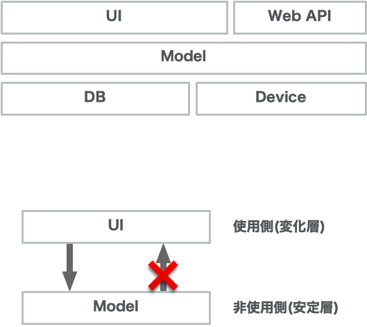

<!-- 
size: 16:9
paginate: true
-->
<!-- header: 勉強会# ― エンジニアとしての解像度を高めるための勉強会-->

# SOLID #5 依存関係逆転の原則
_Dependency Inversion Principle_

> ### 上位のモジュールは下位のモジュールに依存してはならない。どちらのモジュールも「抽象」に依存すべきである
> or
> ### 「抽象」は実装の詳細に依存してはならない。実装の詳細が「抽象」に依存すべきである

<!-- オブジェクト指向らしさを決定的に示すことのできる象徴的な原則。 -->
<!-- 他のSOLIに比べるとより具体的なプログラミング技法を紹介したものだけれど、非常に興味深い技法。 -->
<!-- 自分はこのDIPを知ったとき「うわ、こんな考え方ができるのか。もっと昔から知っておけばよかった」と感動した -->

<!-- 石畑清著の、コンピュータ科学を学ぶものにとってバイブルと呼ばれる書籍『アルゴリズムとデータ構造』まえがきにこんな記述がある。
「良いアルゴリズムの巧妙なトリックを学んで快い驚きを感ずることは，プログラミングを学ぶ意欲をかきたてる何よりの刺激となろう」
問題に対して銀の弾丸のごとく解決する技術を知ることで、プログラミングそのものの面白さにより向き合えるようになるといった意味。

今回のDIPは、構造化プログラミングで明確な答えを持てなかった、依存関係の方向を整えるための方法について巧妙なトリックを与え、皆さんに快い驚きを提供すると思う -->

---

## 依存関係逆転の原則とは

クラス・モジュール間において単一方向の依存関係を維持したまま、双方向の処理を実現する技術。

* アーキテクチャが絶対に守るべき依存関係の流れを整理する
* インターフェースを使用することで制御の流れに対して依存の向きを逆にする


---

## 前提: 安定しているアーキテクチャ



* 階層構造を持つ
    * 役割が分担されている
* 安定している層と変化しやすい層とが分かれている
    * 変化しやすい層に依存していない$^1$
* 各階層は、単一方向の依存関係を持つ
    * 使う側と使われる側の役割を明確に分ける(双方向に依存しない)
    * 変化しやすい層は安定層のことを知っている。逆(安定層→変化層)は知らない

>>> 1: 安定している層(OSやプラットフォーム)に依存するのは構わない
<!-- 階層構造の例： UI/ビジネスロジック/データベース、MVC、共通部/機種依存部 -->


<!-- お互いに知っていると、循環参照の輪に入ってしまい容易に差し替えができなくなる -->

---

## 問題１


* 変化層→安定層の呼び出しはOK。<br>けれど逆方向にもデータ/イベントを伝えるにはどうしたらいい？
    * デバイスドライバからのイベント通知、アプリ状態の変化をUIに表示、など。

<!-- グローバル変数を用意する？惜しい。 -->
<!-- ここでちょっと考えてもらう -->

---

## 問題２

* 下位層の変更に上位層が振り回されてしまう
    * 差し替えやバージョンアップのたびにリビルドが必要
* 安定した処理を集めたはずなのに…


<!-- 安定した処理を集めたはずなのに、不安定な層に振り回されてしまっている -->

---

## 構造化プログラミング設計$^1$では明確な答えを持っていない

各自のノウハウでやり過ごしていた(いる)

```py
class USBPort:
    # 悪い設計。安定すべきモジュールに不安定な処理が紛れている
    def plugKeyboard(...): …
    def plugStorage(...): …
    def plugMouse(...): …
```


>>> 1:厳密には構造化プログラミング設計の中の『機能分割』という考え方

<!-- 構造化プログラミングでは機能を細かく分割していき、ツリー型のトップダウン構造を構成する。これ自体は違和感のない自然な考え方。
しかし、その機能呼び出しの際に、実質的に上位構造(安定している層)の正しさが下位の実態の動作に依存してしまう問題について、構造化プログラミングは明確な答えを持っていなかった -->

<!-- 左側の構造は構造化の方法でも良い場合。min/maxはどちらも仕様がブレることはありえない。そしてこれ以上分けられることはない非常に安定した構造になっている。この場合は使っている上位が依存するのは問題ない -->
<!-- ところが右側を同じ構造で考えると問題が出てくる。USBポートという汎用的な通信端子からUSBメモリーにデータを送る状況で、USBポートが数あるメーカーの１つのUSBメモリーの具体的な実装を知っているのは、安定しているはずのUSBポートでいちいちソースを書き換えないといけなくなってしまう。
これをどうしたら良いか、構造化プログラミングでは答えを持っていなかった -->

---

## 依存関係逆転の原則を適用する ①

安定と不安定の境界を見出す
* この場合はUSBPortと各デバイスの間


---

## 依存関係逆転の原則を適用する ②

不安定側が満たすインターフェース(仕様)を**安定側**に作成
* メソッド名なども特定のモジュールに依存しない名前にする
* USBPortから呼び出したい処理には関数オブジェクトを登録できるようにする


---

## 依存関係逆転の原則を適用する ③

安定側はインターフェースに対して会話する
* 安定側から処理を呼び出すときは登録した関数オブジェクトを呼ぶ
不安定側はインターフェースに準拠させる **← 依存関係が逆転している!**

#### 安定した部分に触らず差し替えたり、双方向で通信ができるようになった

※ ライブラリなど直接触れないものはAdaptorクラスを介在させる$^1$


>>> Adaptorは不安定側の持ち物として作成

---

## 依存関係が逆転した！


**<center>↓</center>**


---

## 誰がインターフェースを持つのか

**安定している側**が持つ
不安定な方にルールを守らせること。


---
 
## ソースコードの依存関係と「制御の流れ」


* **ソースコードの依存関係** : コード上の関係
* **制御の流れ** : 処理が呼ばれるときの関係

```js
class Peripheral {
  constructor(parent) { parent.action = this.add; }
  add(a, b) { return a + b; }
}

class CoreLogic {
  action = null;
  calc(a, b) { return this.action(a, b); }
}

const parent = new CoreLogic();
const child = new Peripheral(parent);
console.log(parent.calc(2, 3));  // 6を出力
```

---

## DIPはどう使う？

* **設計時**：依存関係を単方向にする / ロジックから実装の詳細を切り離す / 変化しやすい方(クラス・モジュール)にソースコードを依存させない
* **違反の臭い**：ビジネスロジックがDBやWebを直接操作している / お互いの関数を双方向で直接呼んでいる
* **リファクタリング**：上位のモジュールが「どうしたいか」をインターフェイスに公開する。下位のモジュール
 
**「ポリモーフィズムは依存関係をコントロールするための技術」** なんていう表現も
 