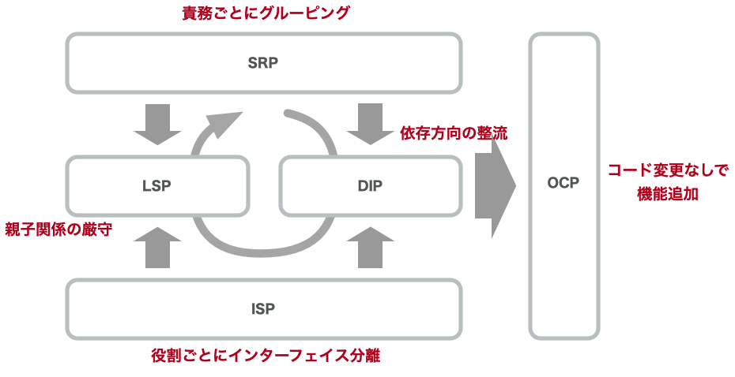

<!-- 
size: 16:9
paginate: true
-->
<!-- header: 勉強会# ― エンジニアとしての解像度を高めるための勉強会-->

# SOLIDまとめ

---

## 『SOLID』とは

> ### SOLID(堅牢)なソフトウェアを作る原則を集めたバクロニム

オブジェクト指向のクラス設計・任意のモジュール設計において **超**重要

- SOLIDを実践できていると…
    - スパゲティコードがなくなり読みやすくなる
    - 機能拡張に素早く柔軟に対応できる
    - 長期間にわたってメンテナンスしやすくなる

<!-- SOLIDというオブジェクト指向設計をスマートにできるようになりたい場合に「まず習っておけ」と真っ先に伝えている5大原則 -->

---

## SOLIDの５原則

- S: 単一責任の原則: Single Responsibility Principle(SRP)
- O: 開放閉鎖の原則: Open/Closed Principle(OCP)
- L: リスコフの置換原則: Liskov Substitution Principle(LSP)
- I: インターフェース分離の原則: Interface Segregation Principle(ISP)
- D: 依存関係逆転の原則: Dependency Inversion Principle(DIP)

<!-- これらを実践することで堅牢なアーキテクチャを持つソフトウェアができる。 -->
<!-- 他の原則が割と覚えてからしばらく経つと使いこなせるようになるものが多いのに対して、この原則はすぐに設計や実装に使えるのが特徴 -->

---

## 各原則の振り返り

<!--
とりわけ依存関係逆転の法則は設計界隈においては大きなインパクトファクターを持つ原則だった。

昔からある構造化プログラミングの技法(機能分割)によって、大きな１つのプログラムは分割統治され機能ごとに細かくなった。
それによって責務が分離して、１つ１つのモジュールや関数では１つのことだけを考えれば良くなっていった。

しかし、分割したものを管理するのは上位の概念であり、つまり安定している側の処理が、変化の大きい不安定な処理を知ってしまっているという、保守性においては歪な構造が生まれてしまっていた。
分割統治とは、そもそも抽象的なものを手に取れる大きさに具象化していく行為であるため、小さく具象化すればするほど１つ１つは吹けば飛んでしまうように色々な要因で変化しやすいものになるから、仕方ないとも言える。

依存関係逆転の原則は、この課題に対して「安定側がインターフェースを用意し、不安定側がインターフェースに依存する」考え方の一大転換を持ち込んだことで、構造化プログラミングでは具体的な解決策を持たなかった課題について解決策を与えることになった。
デカルト味で覚えてきた分割と統治の考え方は、依存関係逆転の原則によって完成したといっても過言ではない、ということだ。 -->

<!-- クリーンアーキテクチャも何なら同じ。人々がいつものように、

 ドメインロジック → DB操作

みたいなあたり前のコードを書いていたところに、ある日、ボブおじさんがやってきて、

 制御フロー : ドメインロジック → DB操作
 依存関係: ドメインロジック ← DB操作
と、制御の方向はなにも変えなくて良いんだけど、依存方向だけこのように「逆」になるんだぜ。みたいなことを言いに来た。という事件のことをクリーンアーキテクチャと呼ぶ。

https://scrapbox.io/hadashiA/%E3%82%B2%E3%83%BC%E3%83%A0%E9%96%8B%E7%99%BA%E3%81%AB%E6%89%80%E8%AC%82%E3%81%AA%E3%82%A2%E3%83%97%E3%83%AA%E3%82%B1%E3%83%BC%E3%82%B7%E3%83%A7%E3%83%B3%E8%A8%AD%E8%A8%88%E3%83%91%E3%82%BF%E3%83%BC%E3%83%B3%E3%82%92%E9%81%A9%E7%94%A8%E3%81%99%E3%82%8B%E3%81%AE%E3%81%AF%E9%9B%A3%E3%81%97%E3%81%84
 -->
---

## 各原則の関係

---

## コードの「臭い」

<!-- 私も参加した本「iOSアプリ設計パターン入門」ではソースコードが抱えている問題を
「臭い」と表現し、その主要な臭いをいくつかに分類しています。 -->

- **硬さ**: 設計変更が困難
- **もろさ**: ある変更が他の箇所に影響を与える。設計が壊れやすい
- **移植性のなさ**: 設計の再利用が困難
- **扱いにくさ**: 正しい設計をするのが困難
- **不必要な複雑さ**: 行き過ぎた設計。「あとで必要になるかも」
- **不必要な繰り返し**: 似たようなコードがいたるところに
- **不透明さ**: 整然としない表現

<!-- 悪いコードは臭いがします。その臭いがする箇所を残したままにしておくことは、
将来に渡って悪影響を及ぼします。箱の中の腐ったみかんは周囲のコードまで汚染していきますし、
割れ窓理論のように一部の悪い環境は悪習慣を生み出します。臭いは早めに消臭しないといけません。 -->

---
<!-- これらの臭いに対してSOLIDはどのように適用できるかを示したのがこのスライドです -->

## コードの「臭い」

- **硬さ**: 設計変更が困難 ← **OCP, ISP, DIP**
- **もろさ**: ある変更が他の箇所に影響を与える。設計が壊れやすい ← **OCP, ISP, DIP**
- **移植性のなさ**: 設計の再利用が困難 ← **OCP, DIP**
- **扱いにくさ**: 正しい設計をするのが困難 ← **LSP**
- **不必要な複雑さ**: 行き過ぎた設計。「あとで必要になるかも」 ← **SRP, ISP**
- **不必要な繰り返し**: 似たようなコードがいたるところに ← **SRP, ISP**
- **不透明さ**: 整然としない表現 ← **SRP, OCP, ISP**

---

## まとめ

- SOLIDはオブジェクト指向で設計する際に重要な設計原則
    - コードの抱える問題(臭い)に客観的に気づける
    - 保守性を高め、変更に強い構造にできる
- オブジェクト指向でなくても役に立つ部分は多い

### SOLIDを活用して、良い設計ができるようになりましょう！

<!-- 個人的な意見だが、SOLID以前と以後という時代の区別も出来るくらいに重要なものの寄せ集め -->
<!-- ぜひSOLIDを手中に収めて良い設計ができるようになりましょう -->
