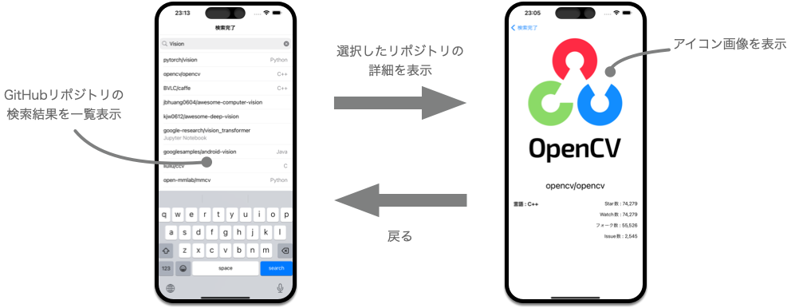

<!-- 
size: 16:9
paginate: true
-->
<!-- header: 勉強会# ― エンジニアとしての解像度を高めるための勉強会-->

### コンポーネントの原則 #2, #3

# 閉鎖性共通の原則(CCP)
_The Common Closure Principle_

# 全再利用の原則(CRP)
_The Common Reuse Principle_

---
## タネ本

### 『クリーンアーキテクチャ 　 ― 達人に学ぶソフトウェアの構造と設計』
- Robert C. Martin(著), 角征典, 髙木正弘(訳)
- アスキードワンゴ刊

---

## 閉鎖性共通の原則(Common Closure Principle)

> 同じ理由、同じタイミングで変更されるクラスをコンポーネントにまとめること。変更の理由やタイミングが異なるクラスは別のコンポーネントに分けること

## 全再利用の原則(Common Reuse Principle)

> コンポーネントのユーザーに対して、実際には使わないものへの依存を強要してはいけない

---
## SOLIDのSRP, ISPと同じ
> _Single Responsibility Principle_(単一責任の原則)  & _Interface Segrecation Principle_(インターフェース分離の原則)

視点/抽象度の違いでしかない

**閉鎖性共通の原則(CCP)** == **単一責任の原則(SRP)**
**全再利用の原則(CRP)** == **インターフェース分離の原則(ISP)**

<!-- 閉鎖性共通の原則は単一責任の原則をコンポーネント向けに言い換えたもの。
多くのアプリケーションにおいて、再利用性よりも保守性が大事。何かの糸のためにコードを変更しなければならないときに、ひとつのコンポーネントに変更対象がまとまっていたほうがありがたい。そうすれば、変更後に再デプロイ・リリースするときにリリースするのはそのコンポーネントだけで済む。言い換えると、SOLIDのSRPだけでなくOCP(Open Closed Principle)にも密接に関連する。開放閉鎖の原則は、クラスは修正に対しては閉じていて、拡張に対しては開いていなければならないとした。
この教えを更に噛み砕いて、「変更の種類が似ているクラスを同じコンポーネントにまとめる」という意味にしたのが閉鎖性共通の原則(CCP/Common Closure Principle)である。 -->

<!-- 全再利用の原則も同じ。インターフェース分離の原則をコンポーネントに言い換えたもの。たとえば配列やマップ/ディクショナリのようなコレクションクラスと、それに対応するイテレータのようにまとめて再利用すべきものであれば、同じコンポーネントにまとめておくべき。
これは逆に言うと全再利用の原則(CRP,Common Reuse Principle)はどのクラスやデータを同じコンポーネントにまとめるべきではないかも示す。コンポーネントの一部を使用しているだけなのに、その他のAPIも大量にあり、その変更があるたびに手元のコンポーネントを使ったコードも全て再ビルド・再デプロイするのは非常に大変。密結合していないクラスを同じコンポーネントにまとめるべきではない。 -->

---
## ３つ原則の３すくみ

<!-- ３つの原則がどのように影響を及ぼすかを表したもの -->
<!-- コンポーネントの凝集性に関する３つの原則は、相反するところがあるのが注意点。前回のREPとCCPは包含関係にあり、どちらもコンポーネントの規模を大きくする方向に働く。再利用できる単位で１つにまとめようとすること。同じ理由で変更されるものは１つにまとめようとすること、だから想像がつくと思う。しかしもう１つの全再利用の法則(CRP)はコンポーネントのサイズを小さくする方向に働くものになる。それがこの図。 -->
<!--
図の辺にある記述は、３つのうち２つを選んで、残りの１つを無視したときに何が起こるかを表したものになる。 

- REPとCRPだけに力を入れようとすると、些細の些細な変更が大量のコンポーネントに影響を与えてしまうことになる(左の矢印)
- 一方でCCPとREPに力を入れると、リリースの回数が無駄に増えてしまう(中央上の矢印)

優れたアーキテクトであれば、開発チームの現在の懸念事項に見合った落とし所を見つける。そして、時が経てばその懸念事項も変化していくことを心得ている。たとえば、開発初期にはREPよりも閉鎖性共通の原則(CCP)のほうがずっと重要。開発初期は再利用性よりも、開発効率のほうが重要だから。

一般的に、プロジェクトの初期はこの三角形の右側を重視する傾向、つまり再利用を犠牲にする傾向があり、プロジェクトが進み別のプロジェクトからも利用される頃になると左側に写っている。どう使われるかが重要になっていくため。
このように、時間や進行とともにコンポーネントに求められるものが変化していくことに注意してほしい。-->

---
## エクササイズ： iOSアプリのクラス分割

iOSアプリに使われているクラスを初見でグルーピングしてみよう。

>>> 参考リポジトリ: https://github.com/yumemi-inc/ios-engineer-codecheck (株式会社ゆめみの入社テスト)
