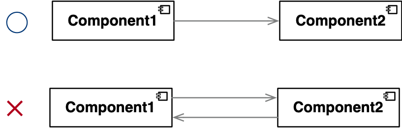
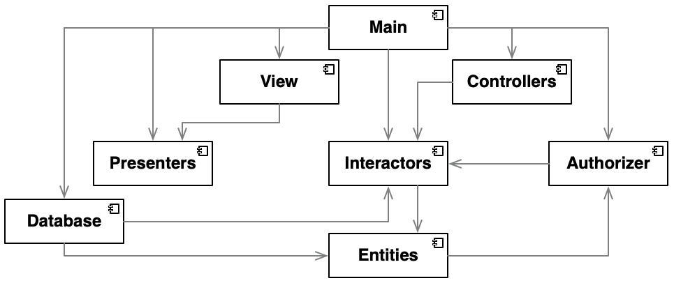
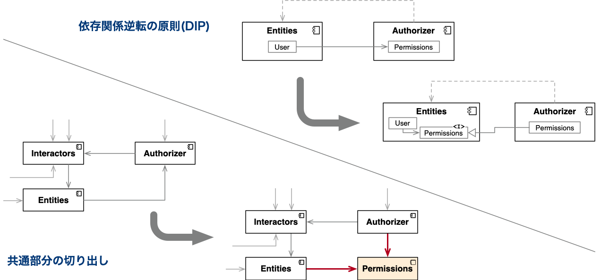

<!-- 
size: 16:9
paginate: true
-->
<!-- header: 勉強会# ― エンジニアとしての解像度を高めるための勉強会-->

### コンポーネントの原則 #4

# 非循環依存関係の原則(ADP)
_Acyclic Dependencies Principle_

---
## タネ本

### 『クリーンアーキテクチャ<br>　 ― 達人に学ぶソフトウェアの構造と設計』
- Robert C. Martin(著), 角征典, 髙木正弘(訳)
- アスキードワンゴ刊


---

## 非循環依存関係の原則(ADP)

循環した依存関係を作らないようにする
使用関係、知識の関係が単一方向になるように注意する
　


<!-- 単一方向になっていること -->
<!-- MVC,MVP,Clean Architectureなどなど、世の中にたくさんアーキテクチャのパターンがあるけれども、どのアーキテクチャも絶対に守っているのがこの単方向の依存関係。これが双方向になってしまうのはどんな事情があっても絶対に避けるべき -->

---

## ソースコードでも同じ

お互いに保持することでメモリが解放されなくなる$^※$

```py
class A:
    def __init__(self):
        self.b_instance = None

class B:
    def __init__(self):
        self.a_instance = None

a = A()
b = B()
a.b_instance = b
b.a_instance = a # 循環参照の発生。a,bの参照を外してもメモリー上に残り続ける
```

>>> ※Pythonは世代別ガーベージコレクションも実装しているので、いつかは解放される。

<!-- 注意：Pythonは参照カウンタ型のガーベージコレクションだけでなく、循環参照にも対応した世代別ガーベージコレクションも実装しているので、上のコードがメモリが解放されなくなる、というのは正確には嘘。たくさんのオブジェクトが作られた時には解放してくれている。 -->

---

## 循環依存を探せ



<!-- 正解: Interactors→Entities→Authorizer→Interactors→… -->

---

## 循環依存の除去



---

## 非循環依存関係の原則(ADP)まとめ

- 循環依存・循環参照はソフトウェア開発では常に悪
    - 何１つメリットがない
    - 依存関係逆転の原則(DIP),共通部分の切り出しで矢印の流れを整理する


<!--現実世界でも同じ。共依存という言葉を知っていますか？
共依存(Co-addiction)とは、自分と特定の相手がその関係性において必要以上に依存していて、その人間関係そのものに囚われている関係を指します。

アルコール依存症の夫とその夫を支える妻の例が有名。アルコール依存症の夫に代わって、妻が過剰な献身をしてしまうというもの。
妻は自己の存在意義を認めてもらうため夫に尽くし、夫は妻に甘えて都合の良いように飲み放題。結果として、どちらにとっても良くない状況から抜け出すことができなくなる。
「私がいなければあの人はやっていけない」
「この子の育児には私がいつも絶対に必要」
「今日のレイドバトルにヒーラーの私が参加しないと勝利できず報酬も貰えない」

 -->
 <!-- この共依存を解決する策はおもに
 1. 自分に自信を持つこと。自己肯定感を高めること
 2. 書籍やセミナーなどで共依存の知識を身につけること
 3. カウンセラーに相談すること

共依存カップル、循環依存の関係は帰り道のない地獄の旅行と同じとも言われています。モジュールがお互いを甘やかしている状態なんです。
今日学んだADP, 非循環依存関係の原則を使って、みなさんも共依存から抜け出していきましょう

- https://oggi.jp/6703280
- https://heart-door.jp/blog/counseling/2655/
- https://monjiro-official.com/kyouizon/
-->
