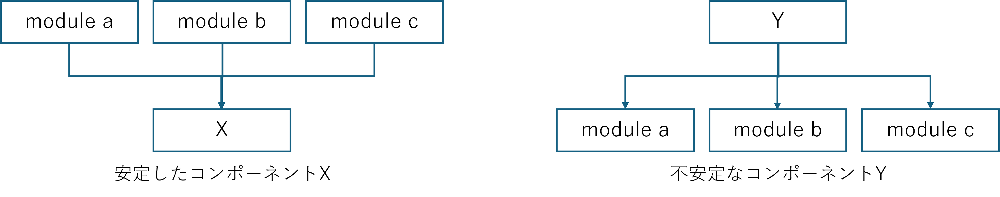
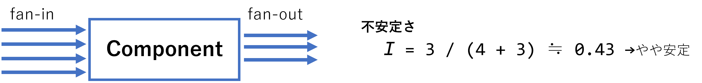
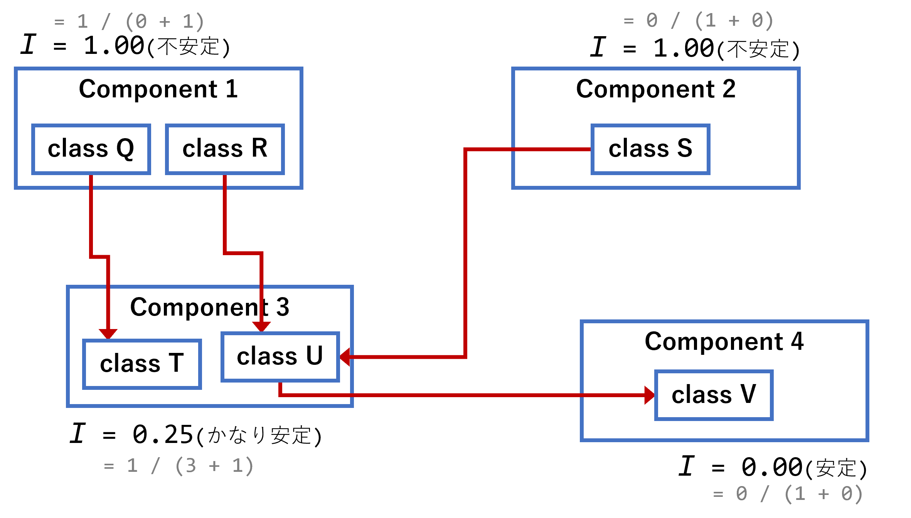
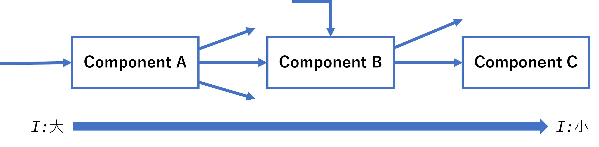

<!-- 
size: 16:9
paginate: true
-->
<!-- header: 勉強会# ― エンジニアとしての解像度を高めるための勉強会-->

### コンポーネントの原則 #5

# 安定依存の原則(SDP)
_Stable Dependencies Principle_

---
## タネ本

### 『クリーンアーキテクチャ 　 ― 達人に学ぶソフトウェアの構造と設計』
* Robert C. Martin(著), 角征典, 髙木正弘(訳)
* アスキードワンゴ刊

---

## 安定依存の原則(Stable Dependencies Principle)

安定しているコンポーネントが不安定なコンポーネントに依存してはいけない。

２つのコンポーネントA,Bに依存関係があり、

* コンポーネントA： **安定**（変更しにくい・されにくい）
* コンポーネントB： **不安定**（変更しやすい・されやすい）

の場合、安定なAが不安定なBに依存しないようにする

<!--
そもそも設計をどこかで完全に確定し、以降触る必要もなくするというのは不可能です。使い続けていくとどうしたって変化は生まれる。
このときに閉鎖性共通の原則(CCP)を満たすようにすれば、特定の変更以外には影響を受けないコンポーネントを作れる。
このようなコンポーネントは、変わっていくことを想定した設計をしているといえる。変わりうるものであると想定しているわけ。
このときの変わりやすさは、設計に慣れた人であればコンポーネントごとにある程度の差が出るように作る。
* これは今後も変化していくだろう
* ここの仕様が変化することは稀だろう、など
重要なのは、この変更を想定したコンポーネントは、変更しづらいコンポーネントから依存されてはいけない。なぜなら変更が難しくなってしまうから。変更しやすい想定で作っているのに、他のコンポーネントから依存されているしがらみで都度ネゴが必要になって手を加えにくくなってしまう。
このときに、今回紹介する安定依存の原則を満たしていれば、機種依存部、データ操作のアルゴリズムバリエーションなど変更されることを前提に作ったモジュールを、気兼ねなく変更していけることになる。
 -->

---

## (この原則における)安定/不安定とは

どれだけのモジュールに依存している/されているか。
安定＝「皆に頼られていて変更しづらい」の意味

* 多くのモジュールに依存されている → **安定している**
* 多くのモジュールに依存している → **不安定である**
　
　

<!-- ちょっとわかりにくいので説明すると、「安定している」とは変更しづらいという意味。変更しづらいというのは「他のクラスやパッケージから依存されている」（＝責任を負っている）パッケージ。 -->
<!-- 逆に不安定であるとは、他モジュールの変更の影響を敏感に受けるという話。
なので分かりにくく変な感じはするけれど、安定性とはすなわち「変更する難易度」とでもいうもの。
安定しているパッケージは修正が難しく，不安定なパッケージは修正が容易，ということです。変な感じですが。
そしてSDP(安定依存の原則)は，パッケージの依存関係はより安定しているパッケージへと向かうべき，ということです． -->

---

## ファンイン・ファンアウト(安定度の指標)

コンポーネントの安定度は依存関係から計算できる

> **不安定さ(Instability): I = fan-out数 ÷ (fan-in数 + fan-out数)**
>
> * ファンイン(fan-in): あるコンポーネントがどれだけ依存されているか
> * ファンアウト(fan-out): あるコンポーネントがどれだけ他を依存しているか
>
> `I=0.0 : もっとも安定 / I=１.0 もっとも不安定`

<!-- 回路設計において、デジタルICの入出力ピンに接続できる、動作可能なデバイスの数のこと。ファンアウトは、1つの出力ピンに接続されている回路に入力できるデバイスの数。ファンインは、1つの入力ピンに接続されている回路から出力できるデバイスの数。 -->
<!-- ファンイン・ファンアウトのファンとは扇のこと。扇の骨が集まっていく・広がっていくイメージを考えると分かりやすい -->

---

## Instabilities

---

## 安定依存の原則 ≠ すべてに高安定性を求めること

ここでの「安定性」とは「変更のしにくさ」の意味。安定依存の原則のポイントは

* 安定→不安定の流れになるようモジュール関係を整流すること
    * ＝ 依存関係の先に行くほど不安定性(=Iの値)が減少していくべき
* 逆方向になるとせっかくの安定性が崩れてしまう

> **安定依存の原則(SDP) = コンポーネントのI値を依存先のIより大きく維持すること**
>　
> 

<!-- すべて安定していたとしたら、変更しにくいコンポーネントばかりになるため手を加えることができなくなる -->
<!-- 不安定であるということは「容易に変更できる」ことになるため、不安定なコンポーネントはどんどん仕様変更、実装修正が入ることになる。それに依存した、変更したくない安定したモジュールも引きずられて変更が入ってしまう -->

---

## 安定依存の法則をどう管理・維持するか

図を書くときに、不安定なコンポーネントほど上に書くと分かりやすい。
そうすればコンポーネントの関係を不安定→安定でソート＆可視化できる。

→ 逆方向の矢印(下から上)がある ＝ 安定→不安定の依存関係が発生している
　
――――――――――――――
　

#### 最後にクイズ： 依存関係を整えたい場合は何を使ったら良いか

> 　　**1:SRP**　／　**2:DIP**　／　**3:REP**　／　**4:ADP**

<!-- 
SRP: Single Responsibility Principle
DIP: Dependeny Inversion Principle ← 正解
REP: The Reuse/Release Equivalence Principle : 再利用・リリース等価の原則
ADP: Acyclic Dependencies Principle : 非循環依存関係の原則
 -->