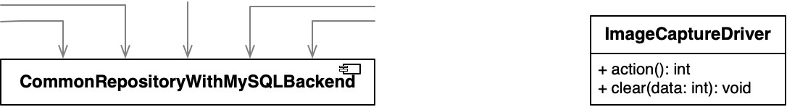

<!-- 
size: 16:9
paginate: true
-->
<!-- header: 勉強会# ― エンジニアとしての解像度を高めるための勉強会-->

### コンポーネントの原則 #6

# 安定度・抽象度等価の原則(SAP)
_Stable Abstractions Principle_

---
## タネ本

### 『クリーンアーキテクチャ<br>　 ― 達人に学ぶソフトウェアの構造と設計』
- Robert C. Martin(著), 角征典, 髙木正弘(訳)
- アスキードワンゴ刊


>>> 他の参考リンク: [SOLIDとパッケージ設計の原則とクリーンアーキテクチャとの関係性](https://zenn.dev/katzumi/scraps/7a4acc51793977)

---

## 安定度・抽象度等価の原則(SAP)

「コンポーネントの安定度 == コンポーネントの抽象度」で設計する

変更がしづらいコンポーネントは抽象的であるべきで、変更がしやすいコンポーネントは具体的であるべき

⇒ コンポーネントの変更や再利用の効率や品質を向上できる

---

## 安定度と抽象度

- **安定度**: 他からどれくらい依存されているか。変更がどれだけ影響を与えるか
    - <b>安定度が高い</b> = 多くのコンポーネントが依存している
    - <b>不安定さ</b> **_I_**(_Instability_) = `fan-out数 ÷ (fan-in数 + fan-out数)`
- **抽象度**: 具体的な技術要素からどれだけ離れているか
    - <b>具体的な技術要素</b> = 保存先(ファイル,DB)/UIフレームワークの種類
    - <b>抽象度が高い</b> = 具体的実装がなく作成システムや概念,本質に注目している
        - 文字列・日付操作/ドメインデータ/コアロジック/アルゴリズム/etc.

⇒ 安定度の高いコンポーネントは抽象度も高くあるべき
　⇔ 具体的な実装を持つコンポーネントは他から依存されないようにすべき

---

## 逆だったらどうなる？（原則に違反している世界）

- <b>安定したコンポーネントが具体的になっている</b>
    - ⇒ 変更によって依存元コンポーネントも変更しなければならない
    - ⇒ 細かな変更で大掛かりな修正が必要になり、再利用の妨げにもなる
- <b>不安定なコンポーネントが抽象的</b>
    - コンポーネントの実装を隠蔽することになる
    - ⇒ コンポーネントの内部構造や動作が理解困難に
    - ⇒ テストやデバッグの困難さにつながる</br>　.



<!-- 
1. 具体的な実装にみんなが依存している。具体実装が変わった途端に大惨事

-->
---

## Which is better?

```py
value = commonModule.getDataWithSqlViaUdpNetwork()
```
or
```py
value = commonModule.getData()
```

---

## Which is better?

```py
value = inkjetPrinterModule.action(data)
```
or
```py
value = inkjetPrinterModule.print(data)
```

---

## 違反しているときの改善方法

- 安定したコンポーネントの抽象度が低い場合…
    - インターフェイスや抽象クラスを提供し、具体的な実装・データ構造を隠蔽
        - ビジネスロジックへの直接依存からインターフェイスや抽象クラスへの間接依存(DIPからのOCP)
    - 安定度が高くても拡張可能なモジュールになる
- 不安定なコンポーネントの抽象度が高い場合…
    - 具体的な実装やデータ構造を公開し、抽象的な型を減らす
    - → デバッグが容易に

<!-- 例えば、コンポーネントXはビジネスロジックを表すインターフェイスやクラスを提供し、その実装やデータ構造は別のコンポーネントに移動させることができる。
 -->

---

## 安定度・抽象度等価の原則(SAP)まとめ

- 他から多く使われるものに内部詳細が分かる名前を付けないようにしよう
    - 変えないといけないときに困るよ
- 他を使っているだけのコンポーネントの一般的な構造・命名で悩むのは無駄
    - 依存され始めたときに一緒に考えるのでも間に合う

<!-- グループの親会社と子会社という関係にも似ている。親会社がコロコロ制度を変えたりしたら、
そのルールの下で動いている子会社が振り回されて大変だよね。他にもワンマン経営者とか、会社の人事制度とか、
会社の情報にアクセスするURLがコロコロ変わるような名前だったり、やたら具体的な値が書かれていたりとかでも良い。
皆が依存している、安定度の高いものをコロコロ変えることの危険性が分かると思う -->
<!-- 脱線するけど、このようにプログラミングだったり設計だったりテストだったりの行動を身近なものに例えて表現してみると、
そのたとえ先の知識も一気につながるようになって視野が広くなったりするのでオススメ。ベテランの皆さんには耳タコな話だと思うけれど、
いろんな人が参加しているので伝えておきます。 -->

---

1. [凝集性] 再利用・リリース等価の原則(REP)
    - 利用者が再利用しやすいタイミングでリリースすること
2. [凝集性] 閉鎖性共通の原則(CCP)
    - コンポーネントは変更の理由が同じものでまとめること
3. [凝集性] 全再利用の原則(CRP)
    - 玉虫色のコンポーネントにしないこと
4. [結合性] 非循環依存関係の原則(ADP)
    - 循環依存は断固避けること
5. [結合性] 安定依存の原則(SDP)
    - 依存関係は不安定→安定の流れにすること
6. [結合性] 安定度・抽象度等価の原則(SAP)
    - よく使われるものほど抽象度を高めること

---

## SOLIDとの関係性

- <b>閉鎖性共通の原則(CCP)</b> == **単一責任の原則(SRP)**
- <b>全再利用の原則(CRP)</b> == **インターフェース分離の原則(ISP)**
- <b>安定依存の原則(SDP)</b> + <b>安定度・抽象度等価の原則(SAP)</b><br> == **依存関係逆転の原則(DIP)**

- 再利用・リリース等価の原則(REP), 非循環依存関係の原則(ADP)は<br>コンポーネント独自

よく出来たコンポーネントは、常に個別にリリース出来る状態を保てる

<!-- コンポーネントはライブラリ、パッケージ、自分の担当範囲でもいい。何かしらのリリースの単位で考えてほしい -->
<!-- SOLID, コンポーネントの原則をうまく使って開発に役立ててほしい -->