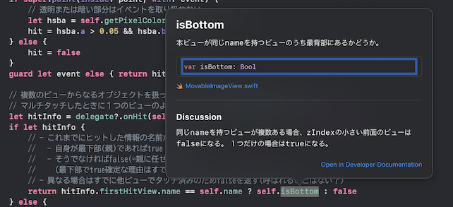

<!-- 
size: 16:9
paginate: true
-->
<!-- header: 勉強会# ― エンジニアとしての解像度を高めるための勉強会-->

# 読みやすいコードの作り方 - コメント(1)

_Code Readability_

---

## タネ本

### 『読みやすいコードのガイドライン<br>　 持続可能なソフトウェア開発のために』
* 石川宗寿(著)
* 技術評論社 2022/11/4初版


---

## コメント

1. コメントの種類と目的 **←ｲﾏｺｺ!**
2. ドキュメンテーション
3. 非形式的なコメント

---

## コメントはなぜ存在するのか

コードだけでは高い可読性を維持できるとは限らないため

* 命名の工夫、簡潔なコードでも伝えられない事柄がある


>>> 画像は https://twitter.com/t_wada/status/904916106153828352 より。[PIEの説明](../01-basics/09-pie.md)でも登場しました。

<!-- 「Why not」というのは「なぜ別のやり方を採用しなかったか」「あえてやっていないこと」という意味。
そこでコメントを書く目的や書く際の注意点を含め、どのようなコメントを書くべきかについて説明していく -->

<!-- ただ、これも当てはまる場合とそうでない場合もある。その解像度を上げていきましょう -->

---

## ドキュメンテーションコメントと非形式的なコメント

* **ドキュメンテーションコメント**: 形式的な説明。クラス/関数/変数の宣言や定義に使う
    * pydoc, Documentation Comment, Doxygen, etc.によりドキュメントを自動生成、ツールで表示(下図)
* **非形式的なコメント**: 定義・宣言に限らずコードのあらゆる場所に書かれる



---

## コメントを書く理由

1. コードの理解を加速させる
2. ミスを防ぐ
3. リファクタリングを促進する
4. IDEやドキュメンテーションツールを用いた開発の補助

これらの恩恵が特にない場合、コメントを書く必要なし

---

## コメントからのリファクタリング

```kotlin
/** <<BAD>>
 * キーワードとその説明文のペア [newData] を追加する。
 *
 * 追加した定義は [getDescription] メソッドで参照できる。
 * もしキーワードが追加済ならば、何もせずに `false` を返す。
 * それ以外の場合の追加処理は成功し、 `true` を返す。
 */
fun add(newData: Pair<String, String>): Boolean
```

---

## コメントからのリファクタリング

```kotlin
/** <<BAD>>
 * キーワードとその説明文のペア [newData] を追加する。
 *
 * 追加した定義は [getDescription] メソッドで参照できる。
 * もしキーワードが追加済みならば、何もせずに `false` を返す。
 * それ以外の場合の追加処理は成功し、 `true` を返す。
 */
fun add(newData: Pair<String, String>): Boolean
```

* `add`というメソッド名の意味が実際の動作と比べて広すぎる
* `newData`という仮引数名の情報量が少ない
* 追加済みの場合の挙動が一般的ではない

---

## リファクタリング後

```kt
/** <<GOOD>>
 * キーワード[keyword]に対する説明[description]を新規に登録、もしくは上書きする
 *
 * 登録された定義は、[getDescription]によって取得できる。
 */
fun registerDescription(keyword: String, description: String)
```

---

## その他のコメントの目的

* 統合開発環境(IDE)やエディタのためのコメント
    * `// TODO: 〜`, `//FIXME: 〜`, `#region 〜 #endregion` など
* メタプログラミングを行うためのコメント
    * `#!/bin/sh` と書くなど$^1$
* 型や制約の検証・解析を摺るためのコメント
    * Pythonの型コメント(PEP484)、Closure compilerの型アノテーションなど
* 継続的インテグレーション
>>> 1: UNIXスクリプトで１行目にインタプリタを指定する方法。shebang。

    