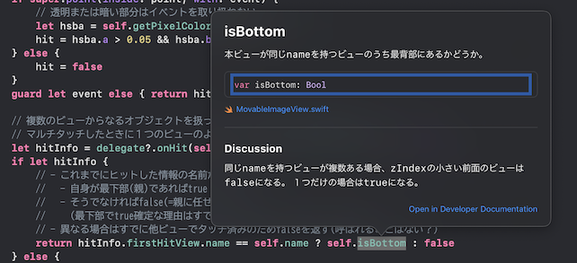

<!-- 
size: 16:9
paginate: true
-->
<!-- header: 勉強会# ― エンジニアとしての解像度を高めるための勉強会-->

# 読みやすいコードの作り方 - コメント(2)

_Code Readability_

---

## タネ本

### 『読みやすいコードのガイドライン<br>　 持続可能なソフトウェア開発のために』
* 石川宗寿(著)
* 技術評論社 2022/11/4初版


---

## コメント

1. コメントの種類と目的
2. ドキュメンテーション **←ｲﾏｺｺ!**
3. 非形式的なコメント

---

## ドキュメンテーションコメント

コード中の宣言や定義に対して決められた書式で書くコメントのこと

* 関数・クラス・ファイルやパッケージなど
* プログラミング言語やドキュメンテーションツールによって異なる
    * Python(PyDoc): `""" 〜 """`, C++/C#系: `/** 〜 */`で括られたコメント
* APIリファレンスや、エディタ上でのクイックヒントなどに使われる



---

## ドキュメンテーションコメントのアンチパターン

1. 自動生成されたドキュメンテーションの放置
2. 宣言と同じ内容を繰り返す
3. コードを自然言語に翻訳しただけ
4. 概要を書かない
5. 実装の詳細に言及する
6. コードを使う側の内容に言及する

---

### 1. 自動生成されたドキュメンテーションの放置

```kt
/** <<BAD>>
 * @param keyword
 * @return
 */
fun getDescription(keyword: String): String { … }
```

### 2. 宣言と同じ内容を繰り返す

```kt
/** <<BAD>>
 * [keyword] に対する説明を取得する。
 */
fun getDescription(keyword: String): String { … }
```

---

## 3. コードを自然言語に翻訳しただけ

```kt
/** <<BAD>>
 * もし`conditionA`が成り立つなら[doA]を呼び出す。
 * そうでないなら[doB]を呼び出し、さらにもし`conditionC`が成り立つなら …<snip>
 */
fun getDescription(keyword: String): String {
    if (conditionA) {
        doA()
    } else {
        doB()
        if (conditionC) { … }
    }
}
```

---

## 4. 概要を書かない

```kt
/** <<BAD>>
 * 与えられた[keyword]が空文字の場合は、例外を投げる。
 */
fun getDescription(keyword: String): String { … }
```

## 5. 実装の詳細に言及する

```kt
/** <<BAD>>
 * プライベートメンバーの[dictionary]が保持している文字列を返す。
 */
fun getDescription(keyword: String): String { … }
```

---

## 6. コードを使う側の内容に言及する

```kt
/** <<BAD>>
 * ・・・(概要)・・・
 * この関数は[UserProfilePresenter]によって使用される。
 */
fun getDescription(keyword: String): String { … }
```

---

## では何を書けばいいのか

* コードが何であるのか・何をするのかを最初に簡潔に説明する
* 抽象度や粒度をコードよりも高く保つ
* 実装の詳細やコードを使う側に言及しない

要約と詳細を書き、トップダウンで読み進められる内容を心がける

---
