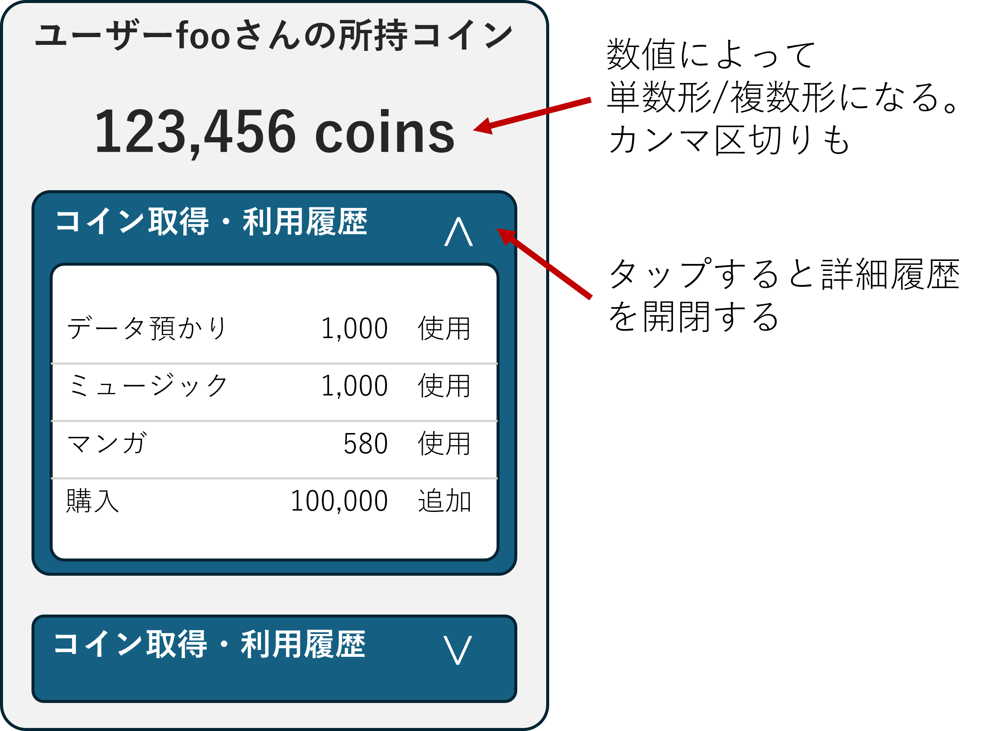

<!-- 
size: 16:9
paginate: true
-->
<!-- header: 勉強会# ― エンジニアとしての解像度を高めるための勉強会-->

# 読みやすいコードの作り方 - 状態(1)

_Code Readability_

---

## タネ本

### 『読みやすいコードのガイドライン<br>　 持続可能なソフトウェア開発のために』

- 石川宗寿(著)
- 技術評論社 2022/11/4 初版


---

## 状態とは？

プログラムの振る舞いを決定するデータとその組み合わせ。

1. 変数の状態
    ```py
    counter = 0  # counterの初期状態は0
    counter += 1  # counterの状態が1に変わる
    ```
2. オブジェクトの状態
    ```py
    class Dog:
        def __init__(self, name):
            self.name = name
            self.hungry = True  # 初期状態ではお腹が空いている

        def feed(self):
            self.hungry = False  # feedメソッドで状態を変更する
    ```

<!--
定義は、日常で使う「状態」と同様で問題ない。ただし、ソフトウェア開発においては以下の特徴がある。
* 状態は、時間の経過により変化するものに対して適用される
* 状態は、過去の処理結果を先々使用するために適用される
(https://mejiro8.hatenablog.com/entry/2021/11/07/003043) -->

---

## 状態とは？ (cont.)

プログラムの振る舞いを決定するデータとその組み合わせ。

3. プログラムや処理のフロー
    ```py
    logged_in = False
    ︙
    if logged_in:
        print("Welcome back!")
    else:
        print("Please log in.")

4. 処理の状態
    ```cpp
    enum class TcpConnectionState { CLOSED, LISTEN, SYN_RCVD, SYN_SENT, ESTAB, … }
    ```

<!--
もっと突き詰めて言うと、プログラムは入力がまったく同じである場合は同じように動き、一方で入力のほんの一部でも異なっていれば異なる動きをする(ことがある)。
これはつまりそのプログラムが「変化しうる変数や入力情報のすべての組み合わせからなる状態数」を持っているということになる
-->

---

## クイズ

お互いに独立した５つのフラグ変数(true/falseのみ持つ)を持つプログラムの状態の数は最大いくつになるか？

```py
isDebug = False
connected = True
isOpened = False
shows_dialog = True
shouldUpdate = True
```

##

---

## クイズ

お互いに独立した５つのフラグ変数(true/falseのみ持つ)を持つプログラムの状態の数は最大いくつになるか？

```py
isDebug = False
connected = True
isOpened = False
shows_dialog = True
shouldUpdate = True
```

**答：**  2 x 2 x 2 x 2 x 2 = 32。32もの状態を持っている

<!-- この32種類のどこにいるかを考えないといけない。この状態で、それぞれの組み合わせで別の処理をしないといけない。
現実はさらに難解で、この内のいくつかの組み合わせは存在してはならないというケースも合ったりする。それをきちんと管理できる？
だから状態は少ない方が良いことが分かる -->

<!-- ・・・とはいえ、状態はどうしても作らなければならないことがある。その状態とどう向き合うか、が長年我々が取り組んでいること -->

---

## 状態の複雑さへの一般的な対処法

GoFのState Patternなどを使う。


状態ごとに処理をクラスやモジュールに分けて、処理が混ざらないようにする

→ けれども直前の$2^5$種類の状態ぶんだけサブクラスを作ることは非現実的

>>> 画像は https://reactiveprogramming.io/blog/en/design-patterns/state より

<!-- ある状態のときの処理をクラスの中に閉じ込められるので、他の状態のことを考えなくてもよくなる -->

---

## 複雑な状態への対処方法

1. 変数の**直交性**を意識する
2. 状態の**遷移**を設計する


<!-- この本ではどのような点に注意すると良いと言っているか -->

---

## 変数間の直交性を意識する

複数の変数が「直交」するように状態を作る

### 変数が**直交**している =

> **定義**:
> ２つ以上の変数について、それぞれの値の取りうる範囲（変域）が他の値に影響されない場合、それらの変数は互いに直交の関係にある。
>
> 直交 ⇔ 非直交

= お互いに独立していて関連がない・変数の値が他の変数に影響を与えない。

---

## 例: 保持コインの管理画面



### 直交しているケース:
```cpp
struct OwnedCoinView {
    // コイン所持量
    int ownedCoins;
    // 詳細履歴の表示状態
    bool isTransactionHistoryShown;
};
```

この２つはお互いにどのような状態であっても影響を与えない

→ ２つの変数の関係は**直交である**

---


### 非直交のケース(1):

```cpp
/* BAD */
struct OwnedDisplayModel {
    // コイン所持量
    int ownedCoins;
    // コイン所持量を表示するときの文字列
    std::string ownedCoinText;
};
```

上だと`OwnedDisplayModel(3, "123 coins")`と書けてしまう

→ ２つの変数の関係は**直交ではない(=非直交)**

---

## 例: 連絡先を管理するクラス

### 非直交のケース(2):
```cs
/* 「ContactはEメール,住所のどちらかを持っていなければならない」を表したクラス */

/* BAD */
struct Contact {
    var name: String
    var emailContactInfo: String?
    var postalContactInfo: String?
};
```

上だと`OwnedDisplayModel("John Doe", null, null)`と書けてしまう

→ ２つの変数の関係は**直交ではない(=非直交)**

<!-- eメールの有無、住所の有無の２つの状態の掛け算なので全部で４つの状態を取りうる。
けれどもそのうちの１つの状態：どちらも持たないという状態は仕様上あってはならない。でも書けてしまう -->

<!-- もちろん、これらにおいて状態が更新されるたびに正当性をチェックする仕組みをコーディングしておけば問題は回避できる。ただ人間は完全でない以上、その確認処理の実装を怠ってしまうことだってある。そうするとバグが埋め込まれることになる。確認処理そのものにだって間違いを埋め込んでしまっているかもしれない。
そう考えると、非直交な状態が存在するというのを乱暴に表現すれば不具合の温床になっていると言える -->

---

## 非直交 = 不具合の温床


なんとかしなければならない。

↓

設計として非直交を回避するにはどうしたら良いか？

> * **手法1**: 関数への置き換え
> * **手法2**: 直和型での置き換え

<!-- 今の２つの例で見たものは、これらのデータを扱うソースコード側で気をつけるようにすれば不具合を紛れ込ませないで済む。
でもそれを将来に渡って絶対に守り続けることはできると言えますか？私は罪を犯したことがないと女性に石を投げ続けることができますか -->

---

## 手法1: 関数への置き換え

複数の状態から「**従属**の関係」を導き出し、従属している状態を関数で置き換える

```cpp
/* GOOD */
struct OwnedDisplayModel {
    // コイン所持量
    int ownedCoins;
    // コイン所持量を表示するときの文字列を返す
    std::string getOwnedCoinText() {
        /* ownedCoinsを使い、カンマ区切り・単数形/複数形を考慮した文字列を作成する */
    }
};
```

→ ownedCoinTextという状態が減り、矛盾した状態を表現できないようになった

---

## 手法1: 関数への置き換え

複数の状態から「**従属**の関係」を導き出し、従属している状態を関数で置き換える

```cpp
/* GOOD */
struct OwnedDisplayModel {
    const int ownedCoins;
    const std::string ownedCoinText;

    OwnedDisplayModel(int coins) {
        this.ownedCoins = coins;
        this.ownedCoinText = /* 文字列生成処理 */
    }
};
```

→ コンストラクタで生成して書き換えられないようにすることで、状態を減らすことができた

<!-- そのほかにもコンストラクタをprivateにしておき、ファクトリーメソッドを用意してあげることで不正な作成方法を回避する方法もある -->

---

## 手法2: 直和型での置き換え

```cs
/* 「ContactはEメール,住所のどちらかを持っていなければならない」を表したクラス */

/* BAD */
struct Contact {
    var name: String
    var emailContactInfo: String?  // どうやって「どちらか１つは非null」を
    var postalContactInfo: String? // 安全に実現したら良い？
};
```

<!-- ２つの値が従属の関係にないときは、値を関数に置き換える方法は使えません。片方がnullであったとしても、もう片方が非nullであることを保証できません

この例のような直交でも従属でもない関係に対しては、直和型での置き換えを検討します -->

