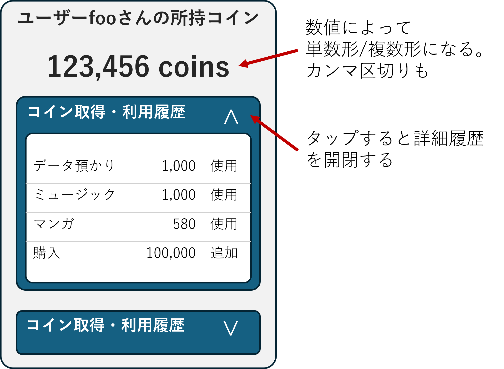

<!-- 
size: 16:9
paginate: true
-->
<!-- header: 勉強会# ― エンジニアとしての解像度を高めるための勉強会-->

# 読みやすいコードの作り方 - 状態(2)

_Code Readability_

---

## タネ本

### 『読みやすいコードのガイドライン<br>　 持続可能なソフトウェア開発のために』

- 石川宗寿(著)
- 技術評論社 2022/11/4 初版


---

## 状態とは？ (recap)

プログラムの振る舞いを決定するデータとその組み合わせ。

1. 変数の値（値の変化＝状態の変化）
2. オブジェクトの状態（メンバー変数の変化＝状態の変化）
3. プログラムや処理のフロー（状態変数の変化＝状態の変化）
4. 処理の状態（処理状況の変化＝状態の変化）

フラグ変数が５個あるだけで32($=2^5$)種類もの状態が存在することになる

<!--
突き詰めて言うと、プログラムは入力がまったく同じである場合は同じように動き、一方で入力のほんの一部でも異なっていれば異なる動きをする(ことがある)。
これはつまりそのプログラムが「変化しうる変数や入力情報のすべての組み合わせからなる状態数」を持っているということになる
-->

---

## 複雑な状態への対処方法

1. 変数の**直交性**を意識する
    * **手法1: 関数への置き換え**  **← ｷｮｳﾊｺｺ!**
    * **手法2: 直和型での置き換え**
2. 状態の**遷移**を設計する
    * 不変性
    * 冪(べき)等性
    * 非巡回


<!-- この本ではどのような点に注意すると良いと言っているか -->
<!-- 1は状態そのものの数を減らすという考え方、2は状態間の遷移を適切にすべきという考え方 -->

---

## （直交性に関する説明のねらい）

* <b>状態数が多いほどプログラムは複雑になり不具合も生まれやすい</b>
    * とはいえ状態を１つにすることはできない
* <b>状態には相互の関係性がある</b>
* <b>プログラミングにおいて、人間が管理できることには限界がある</b>
    * どこかで実装漏れが出てしまい、問題が後から見つかる(リリース後とか！)

↓ だから…

1. **状態そのものの数を減らしたい**
2. **安全に管理できる状況を設計時から作り出したい**
    * 異常な状態をコードとしてそもそも書けないようにする
    * なんならコンパイル時点で異常をエラーにしたい

<!-- (状態シリーズを自分ごとにするために) -->
<!-- 複数の変数があってそれらが非直交である場合、１つの値を変えたときに他の変数の値も変えてあげないと矛盾が発生してしまうことになります。それを毎回コードに書いていたら、いつかどこかで掻き落としが発生してしまい、不具合につながってしまう -->
<!-- プログラミング技法が
　「機械語(何でもあり)→構造化プログラミング(goto禁止)→オブジェクト指向プログラミング(情報隠蔽etc.)→関数型プログラミング(冪等性)」
と制限を増やす方向で進化していったように、より単純で制限のある環境を作り出すことで安全なソフトウェアを実現するというのが、状態シリーズの説明を理解するうえでのポイントです。 -->

---

## 非直交 = 不具合の温床


1. 状態そのものの数を減らしたい
2. 安全に管理できる状況を設計時から作り出したい

# 　

↓  設計として非直交性を回避するために…

#

> * **手法1**: 関数への置き換え
> * **手法2**: 直和型での置き換え


---

## 手法1: 関数への置き換え

複数の状態から「**従属**の関係」を導き出し、従属している状態を関数で置き換える

```cpp
/* BAD */
struct OwnedDisplayModel {
    int ownedCoins;     // コイン所持量
    std::string ownedCoinText; // コイン所持量を表示するときの文字列
}
```
```cpp
/* GOOD */
struct OwnedDisplayModel {
    // コイン所持量
    int ownedCoins;
    // コイン所持量を表示するときの文字列を返す
    std::string getOwnedCoinText() {
        /* ownedCoinsを使い、カンマ区切り・単数形/複数形を考慮した文字列を作成する */
    }
};
```

<!-- → ownedCoinTextという状態が減り、矛盾した状態を表現できないようになった -->

---

## 手法1: 関数への置き換え(別解)



データ自体を不変にして、不整合をなくしてしまう。（SwiftUIなど最近の潮流はこれ）

```cpp
/* GOOD */
struct OwnedDisplayModel {
    const int ownedCoins;
    const std::string ownedCoinText; // constがポイント

    OwnedDisplayModel(int coins) {
        this.ownedCoins = coins;
        this.ownedCoinText = /* 文字列生成処理 */
    }
};
```

→ コンストラクタで生成して書き換えられないようにすることで、状態の数を減らせた

<!-- そのほかにもコンストラクタをprivateにしておき、ファクトリーメソッドを用意してあげることで不正な作成方法を回避する方法もある -->

---

## 手法2: 直和型での置き換え

この場合はどうしたら良い？

```cs
/* 「ContactはEメール,住所のどちらかを持っていなければならない」を表したクラス
 *  → Eメール,住所のどちらも持っていない状態はNG
 */

/* BAD */
struct Contact {
    var name: String
    var emailContactInfo: String?  // どうやって「どちらか１つは非null」を
    var postalContactInfo: String? // 安全に実現したら良い？
};
```

→ この状態を将来に渡りどうやって安全に管理する？
<!-- ２つの値が従属の関係にないときは、値を関数に置き換える方法は使えません。片方がnullであったとしても、もう片方が非nullであることを保証できません

この例のような直交でも従属でもない関係に対しては、直和型での置き換えを検討します -->

---

## 学習: 『直積型』と『直和型』

* **直積型**
    * データ型のすべての情報が存在していることを前提にしたデータ
        * 複数の値を<b>必ず</b>同時に持つ
        * タプル(Tuple)やnull可能性のない構造体・クラスなど
* **直和型**
    * 複数の型のうち**どれか１つだけ**選ぶようにまとめたデータ
        * unionやenumが近い。…がちょっと違う
            * union: 特定の型に強制できない、同じ型をまとめることができない
            * enum: 違いは管理できるが、その状態に付随する値を持てない
        * C++のstd::variant型、Swiftのenum+associated value, Kotlinのsealed classなど

---

## 直積型と直和型の違い

### 直積型

```typescript
const point3d = {x: 1, y: 2, z: 3}; // x,y,zすべての状態を管理する(Typescript)
```

### 直和型

```haskell
-- Haskell: aというデータを持つLeft型か、bというデータを持つRight型のどちらかを持つEther型
data Either a b = Left a | Right b
```

```swift
// Swift: UPCコード(4つの数値を持つ)とQRコード(文字列)のどちらかのデータを持つ列挙型
enum Barcode {
    case upc(Int, Int, Int, Int)
    case qrCode(String)
}
```

<!-- 比較的簡単に表現できる言語で書いてます -->
<!-- どちらか一方の型としてしか存在できないので、それ以外の状態や、矛盾した状態には絶対にならないことが保証される -->

---

```cs
/* 「ContactはEメール,住所のどちらかを持っていなければならない」を表したクラス */
/* BAD */
struct Contact {
    var name: String
    var emailContactInfo: String?  // どうやって「どちらか１つは非null」を
    var postalContactInfo: String? // 安全に実現したら…？
};
```

|emailContactInfo|postalContactInfo|組み合わせの正当性|
|---|---|---|
|情報あり|情報あり|正当|
|情報あり|情報なし|正当|
|情報なし|情報あり|正当|
|**情報なし**|**情報なし**|**不当**|

<!-- さて、このデータ型です。どう表現したらよいでしょうか -->

---

## C# で直和型を表現する

```cs
/* GOOD */
public record Contact {
    public string Name { get; init; }
    public ContactInfo Info { get; init; }
    public Contact(string name, ContactInfo info) { Name = name; Info = info; }
}
public abstract record ContactInfo;

public record EmailOnlyContact(string Email) : ContactInfo;
public record PostalOnlyContact(string Address) : ContactInfo;
public record BothContact(string Email, string Address) : ContactInfo;
    :
var emailOnly = new Contact("John", new EmailOnlyContact("john@example.com"));
var both = new Contact("Alice", new BothContact("<email>", "<address>"));
```

<!-- C# 9.0から導入されたrecord型を使うと比較的かんたんに表現できる -->
<!-- record型はコンストラクタとか等値性の評価とかを自動でやってくれる便利な型 -->

---

## Swiftで直和型を表現する

```swift
/* GOOD */
enum ContactInfo {
    case email(String), postal(String), both(email: String, postal: String)
}
struct Contact {
    let name: String
    let info: ContactInfo
    func print() {
        print("Name: \(self.name)")
        switch self.info {
        case .email(let email):             print("Email: \(email)")
        case .postal(let address):          print("Address: \(address)")
        case .both(let email, let address): print("...")
        }
    }
}

let contact = Contact("John", ContactInfo.email("foobar@example.com"))
```

---

## C++で直和型を表現する

```cpp
#include <variant> ← C++17から使用可
struct EmailContact { std::string email; };
struct PostalContact { std::string address; };
struct BothContact { std::string email; std::string address; };
// ContactInfoの型を定義
using ContactInfo = std::variant<EmailContact, PostalContact, BothContact>;

struct Contact { // コンストラクタは省略
    std::string name;
    ContactInfo info;

    void print() {
        std::visit([](const auto& info) {
            using T = std::decay_t<decltype(info)>;
            if constexpr (std::is_same_v<T, EmailContact>) {
                 std::cout << "Email: " << info.email << std::endl;
            } else if constexpr (std::is_same_v<T, PostalContact>) { ... } ...
```

---

## C言語で直和型を表現する (図形を型で表現する例)

<!-- unionを使い、各状態にて表現する型を束ねる。さらに今どの状態を持っているかを保持しておく -->

「タグ付きunion(Tagged Union)」という技法を用いる

```c
// 形状の種類を表すenum
enum ShapeType { CIRCLE,  RECTANGLE, POINT };

// 異なる形状のデータを保持するunion
union ShapeData {
    struct { double radius; } circle;
    struct { double width, double height; } rectangle;
};

// 形状を表す構造体
struct Shape {
    enum ShapeType type;
    union ShapeData data;
};
```

---

## C言語で直和型を表現する (続き)

```c
// 円を作成する関数
struct Shape createCircle(double radius) {
    struct Shape shape;
    shape.type = CIRCLE;
    shape.data.circle.radius = radius;
    return shape;
}

// 長方形を作成する関数
struct Shape createRectangle(double width, double height) {
    struct Shape shape;
    shape.type = RECTANGLE;
    shape.data.rectangle.width = width;
    shape.data.rectangle.height = height;
    return shape;
}
```

<!-- createPointもだいたい同じなので省略 -->

---
## C言語で直和型を表現する (続き)

```c
// 面積を計算する関数
double calculateArea(struct Shape shape) {
    switch (shape.type) {
        case CIRCLE: return 3.14159 * shape.data.circle.radius * shape.data.circle.radius;
        case RECTANGLE: return shape.data.rectangle.width * shape.data.rectangle.height;
        case POINT: return 0.0;
        default:
            printf("Unknown shape type\n");
            return -1.0;
    }
}

int main() {
    struct Shape circle = createCircle(5.0);
    struct Shape rectangle = createRectangle(4.0, 3.0);
      :
    printf("Circle area: %f\n", calculateArea(circle));
      :
```

<!-- C++でもだいたい同じ。コンストラクタでそれぞれの制限を載せておくのもいいし、 C++17の std::variant型を使うのでも良い -->
<!-- 言語の優劣を話しているのではなく、こうした形式で状態を表現しておくと、間違ったプログラムが書けなくなることが強い -->

---

## よくある直和型の使用例 (Result型)

```swift
enum NetworkError: Error { case badURL, noData, decodingError }

func fetchUser(id: Int) -> Result<String, NetworkError> {
    // ～ネットワークごしにユーザーIDから名前情報を参照～
    if (成功) {
        return .success("User\(id)")
    } else {
        return .failure(.noData)
    }
}

// 使用例
let result = fetchUser(id: 123)
switch result {
case .success(let username): print("Fetched user: \(username)")
case .failure(let error): print("Error: \(error)")
}
```

<!-- 
memo: 成功のときと失敗のときとで異なるデータがほしいことを表現する
memo: 何かを取得するときに関数の戻りが成功か失敗かを返り値で返すのって実は悪手。失敗かどうかをチェックしないで使ってしまうことはよくある。仕様書に「失敗を返したときの戻りは不定である」って、よくよく考えるとわかりにくくない？
memo: 値を返すときに、失敗は異常値を返すという関数も良くない。失敗かどうかが同じ型で返すため、誤解したまま処理を書けてしまう。古臭いAPIのデザイン
    → どうしたらよいか、まずは成功と失敗とで明確に分ける。失敗は失敗で、多くの情報を返してあげる(errnoだとわかりにくいよね。例外は付随情報を多く返せる点で優れているけれど、何を投げるかが内部関数の深さ次第でわからなくなってしまうので網羅性に欠ける。けっきょく全部をまとめて受け取ってしまうことはよくある話)
 -->

<!--
**直和型**
複数の型のうち**どれか１つだけ**選ぶようにまとめたデータ。ありえない状態を作り出せない、状態の網羅性を高められる利点がある
* unionやenumが近いがちょっと違う
    * union: 特定の型に強制できない、同じ型をまとめることができない
    * enum: 違いは管理できるが、その状態に付随する値を持てない
* C++のstd::variant型、Swiftのenum+associated value, Kotlinのsealed classなどで表現可能
-->

---

## まとめ

1. プログラムは状態だらけ。できるだけ仕組みを単純にしたい
2. 状態について、安全に管理できる状況を設計時から作り出したい

# 　

↓  設計時点から非直交性を回避する

#

> * **手法1**: 従属関係にある状態を関数へ置き換える
> * **手法2**: 直和型で存在しない状態を書けないようにする
