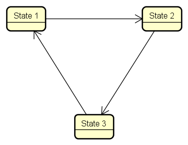
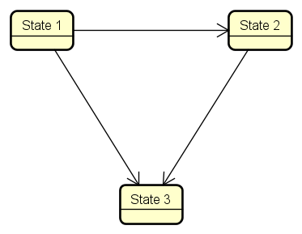
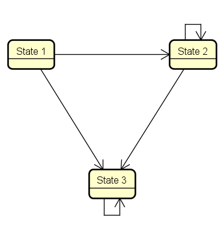
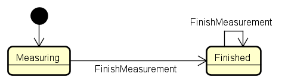
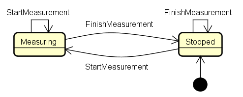
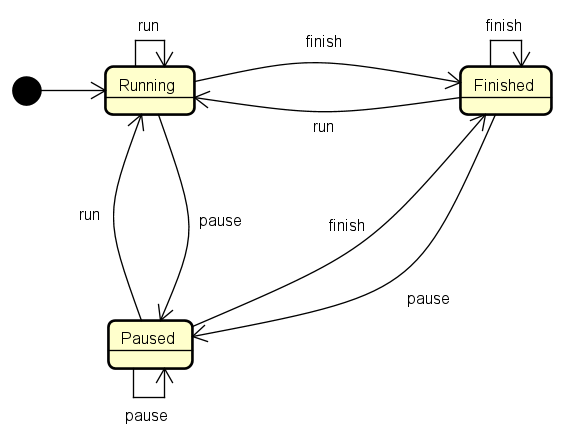
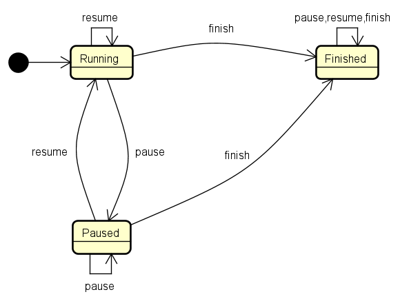
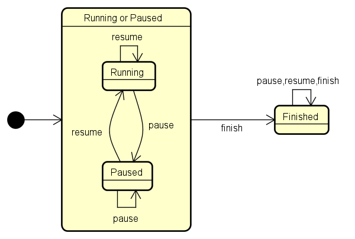

<!-- 
size: 16:9
paginate: true
-->
<!-- header: 勉強会# ― エンジニアとしての解像度を高めるための勉強会-->

# 読みやすいコードの作り方 - 状態(3)

_Code Readability_

---

## タネ本

### 『読みやすいコードのガイドライン<br>　 持続可能なソフトウェア開発のために』

- 石川宗寿(著)
- 技術評論社 2022/11/4 初版


---

## 状態とは？ (recap)

プログラムの振る舞いを決定するデータとその組み合わせ。

1. 変数の値（値の変化＝状態の変化）
2. オブジェクトの状態（メンバー変数の変化＝状態の変化）
3. プログラムや処理のフロー（状態変数の変化＝状態の変化）
4. 処理の状態（処理状況の変化＝状態の変化）

フラグ変数が５個あるだけで32($=2^5$)種類もの状態が存在することになる

<!--
突き詰めて言うと、プログラムは入力がまったく同じである場合は同じように動き、一方で入力のほんの一部でも異なっていれば異なる動きをする(ことがある)。
これはつまりそのプログラムが「変化しうる変数や入力情報のすべての組み合わせからなる状態数」を持っているということになる
-->

---

## 複雑な状態への対処方法

1. 変数の直交性を意識する
    * 手法1: 関数への置き換え
    * 手法2: 直和型での置き換え
2. 状態の**遷移**を設計する  ← ｷｮｳﾊｺｺ!
    * **不変性 :**
        * 状態遷移そのものを不可能にする
    * **冪(べき)等性 :**
        * 内部状態を隠し呼び出し前の状態確認を不要にする
    * **非巡回**
        * 状態の循環を止め複雑な管理をなくす


<!-- この本ではどのような点に注意すると良いと言っているか -->
<!-- 1は状態そのものの数を減らすという考え方、2は状態間の遷移を適切にすべきという考え方 -->

---

## 状態の不変性

状態遷移がない(=状態が変わらない)処理であれば状態遷移の問題は起こらない
* オブジェクト作成後に値が変化しない
* **変化が外から観測できない**

```cpp
class MyClass {
  public:
    MyClass(int val) : value{val} {}
  private:
    const int value;
};
```
↓
**不変性**を満たしていれば、余計な状態遷移が発生しない

---

## 不変性: 不変なクラスと可変なクラス比較(C++)

```cpp
struct MyClass { // 不変であるクラス。すべてのプロパティが再代入不可
    MyClass(int val) : value{val} {}
  private:
    const int value;
    const double double_value = 2.5;
};
```
↕ 
```cpp
struct MyClass { // 可変であるクラス。一部のプロパティが可変ならばmutable
    MyClass(int val) : value{val} {}
    int value;
    const double double_value = 2.5;
};
```

---

## 不変性: 不変なクラスと可変なクラス比較(C#)

```cs
class MyClass { // 不変であるクラス。すべてのプロパティが再代入不可
    public readonly int Value;
    public readonly double DoubleValue = 2.5;
    public MyClass(int val) { Value = val; }
}
```
↕ 
```cpp
class MyClass { // 可変であるクラス。一部のプロパティが可変ならばmutable
    public readonly int Value;
    public double DoubleValue = 2.5;
    public MyClass(int val) { Value = val; }
}
```

---

## 不変性: 不変(immutable)と読み取り専用(read-only)の違い

変更させないようにしているつもりが、変更できてしまう例

```cs
class NGSample // [BAD] C#で読み取り専用の配列を作ろうとしているが出来ていない
{
    private static readonly string Message1 = "hello,";
    private static readonly string Message2 = "world!";
    // 列挙用配列。しかし、この配列の公開はNG
    public static readonly string[] Messages = { Message1, Message2 };
}

:

NGSample.Messages[1] = "OUCH!";
foreach (var s in NGSample.Messages) { Console.WriteLine(s); }  // hello,\nOUCH!
```

<!-- 不変と読み取り専用とは明確に異なる概念として意識する

* 不変：immutable
* 読み取り専用: unmodifiable, read-only

この場合は言語機能の誤解から問題が生じている。
readonlyは、参照しているオブジェクトを変更することはできなくなるものの、その中の内容は自由に変更できてしまう。

ソースコード例： [[C#] 配列やList<T>を直接公開する代わりにするべきこと](https://qiita.com/laughter/items/b5e91d0eac5bac208d35)
-->

---

## 不変性: 不変(immutable)と読み取り専用(read-only)の違い - 改善例

変更できない型を正しく使って公開する

```cs
class NGSample // [GOOD] C#で読み取り専用の配列を作成する
{
    private static readonly string Message1 = "hello,";
    private static readonly string Message2 = "world!";
    public static IReadOnlyList<string> Messages = new[] { Message1, Message2 };
}

:

NGSample.Messages[1] = "OUCH!"; // コンパイルエラー
```

<!-- ReadOnlyListが使えない・用意されていない環境の場合には、たとえばリストそのものは見せないようにしておき、
その要素へのアクセスにはgetterメソッドを用意しておくなどした、カスタムコレクション型にするなど -->

---

## 不変性: 値と参照の可変性

```cs
// [BAD] 参照そのものと参照先のオブジェクトの両方を可変にしたせいで意図しない動作になる
class DidcouragedMutable {
    public static List<string> MutableList = new List<string> { "a", "b", "c" };
    public static void ResetList() { // 内容を初期値にリセット
        MutableList = new List<string> { "a", "b", "c" };
    }
}

var list = DidcouragedMutable.MutableList;
foreach (var s in list) { Console.Write(s); } // abc

DidcouragedMutable.MutableList.Add("d");
foreach (var s in list) { Console.Write(s); } // abcd (Addの影響を受ける)

DidcouragedMutable.ResetList();
foreach (var s in list) { Console.Write(s); } // abcd (リセットされない)

DidcouragedMutable.MutableList.Add("e");
foreach (var s in list) { Console.Write(s); } // abcd (abceにならない)
```

<!-- 変数を可変にする場合は、参照そのものと参照先のオブジェクトの両方を可変にしない -->
<!-- この場合は２通りの対策が考えられる。
1. 参照を書き込み可能にして、オブジェクトそのものを読み取り専用にする（MutableList）
2. 参照を読み取り専用にし、オブジェクトは更新可能にする
 -->

---

## 不変性のまとめ

* 不正な状態遷移を**起こせない**コードにする
    * そもそも状態遷移がないデータ構造を使えば、不正な状態遷移は発生しない
* ただし言語によっては抜け穴が存在できてしまうので要注意

不変にできる部分を局所化して安全地帯を設け、それを育てるのも良い

---

## 冪等性(べきとうせい)

冪等: 操作を１回行ったときの結果と、操作を複数回行ったときの結果が同じ

→ 何回でも安心して処理を実行できる

```cs
class GoodClosableClass {
    private bool isClosed {get; private set;} = false;
    public void Close() {
        if (isClosed) { return; }
        isClosed = true; ... 
    }
}
class BadClosableClass {
    public bool isClosed {get; private set;} = false;
    public void Close() {
        if (isClosed) { /*例外を投げる*/}
        : // 以降は同じ
    }
}
```

<!-- どちらもやっていることは同じ。しかし後者のケースはClose()を呼び出す前に状態の確認が必要。
 すべてのclose()の呼び出しに状態確認を強制していることになり、
 * 単純にはコードが煩雑になる
 * さらには確認を忘れた際にバグを発生させてしまう
 という問題を埋め込むことになる
  -->

---

## 冪等性: 内部状態の隠蔽

キャッシュや遅延評価を実装するときには冪等性により内部状態を隠せる

```cs
class NumberRepository {
    private int? _cachedValue;
    // キャッシュを保持していようがいまいがGetValue()を呼べば良い
    public int GetValue() {
        if (_cachedValue) { return _cachedValue; }
        else { return loadNewValue(); }
    }
    private int loadNewValue() {
        int newValue = /* 値の読み込み処理 */
        _cachedValue = newValue
        return _cachedValue;
    }
}
```

---

## 冪等性と参照透過性と副作用

冪等性と参照透過性とは少し異なる

* **冪等性**: 処理を何回実行しても同じ結果になること
* **参照透過性**: 処理を同じ引数で実行すると同じ結果になること
* **副作用**: 結果が引数以外に依存して決まる処理のこと

<!--
参照透過性： 足し算、引き算もそうだが、変数の再代入やグローバル変数の参照が処理内になければ、処理内では変数の参照について心配する必要がないので、参照が透過的と言える
副作用は「グローバル変数があるので処理を読んでも結果がわからない」とか「同じ実行の仕方をしても朝と夜で結果が変わる」とか言う感じ
-->

---

## 冪等性 and 参照透過性 クイズ

次の要素が冪等性・参照透過性を持つかを答えてください

1. HTTPのGETメソッド
2. HTTPのPOSTメソッド
3. 電源をオフにするボタン
4. 絶対値を求める関数
5. ファイルの内容を文字列で返す関数
6. 現在の通信状態を返す関数

<!--
1. 冪等性
2. なし
3. 冪等性
4. 冪等性・参照透過性
5. 冪等性
6. 冪等性

要するに、冪等性は操作の外から見た性質であり、利用者が同じ操作を繰り返しても同じ結果が得られるかどうかを判断する基準です。GETメソッドは読み取り専用であるため、冪等性を満たしますし、同様にファイルの内容や通信状態を返す関数も、同じ状況において同じ結果を返すことから冪等性を満たすことになります
-->

---

## 冪等性: まとめ

* 冪等性とは、何回呼んでも同じ結果になること
    * 関数を呼ぶ前のチェックが不要にできる(チェック漏れを防げる)
* 不正な状態遷移を排除できる
* 内部状態を隠蔽できる(キャッシュなど)

呼ぶ前に相手先の状態をチェックしている箇所に注意する

---

## 非巡回

可変なオブジェクトを作る際はcのような遷移にするのが望ましい
|a.巡回のある状態遷移|b.非巡回な状態遷移|c.自己ループを除けば<br/>非巡回な状態遷移|
|---|---|---|
||||

---

## 非巡回: 例) 非巡回なStopWatchクラス

```cs
class StopWatch {
    private DateTime _startTime = DateTime.Now;
    private DateTime _elapsedTime = DateTime.Now;

    private State _state = State.Measuring; // Measuring/Finished

    double FinishMeasurement() {
        if (_state == State.Finished) { return _elapsedTime.TotalMilliseconds; }

        _state = State.Finished;
        _elapsedTime = DateTime.Now - _startTime;
        return _elapsedTime.TotalMilliseconds;
    }
}
```

<!-- どういう使い方をするかの説明 -->

---

## 非巡回: 例) 非巡回なStopWatchクラス(使用例)

```cs
void RunSomeHeavyTask() {
    var stopWatch = new StopWatch(); // 計測開始
    : // 重い処理
    var elapsedTimeInMs = stopwatch.FinishMeasurement(); // 計測終了
}

void RunAnotherHeavyTask() {
    var stopWatch = new StopWatch(); // 計測開始
    : // 重い処理
    var elapsedTimeInMs = stopwatch.FinishMeasurement(); // 計測終了
}
```



---

## 非巡回: 例) 再利用可能(=巡回)なStopWatchクラス

```cs
class StopWatch { // [BAD]
    private DateTime _startTime = DateTime.Now;
    private DateTime _elapsedTime = DateTime.Now;
    private State _state = State.Stopped; // Measuring/Stopped

    void StartMeasurement() { if(_state == State.Stopped) { _startTime = DateTime.Now; } }

    double FinishMeasurement() {
        if (_state == State.Stopped) { return _elapsedTime.TotalMilliseconds; }

        _state = State.Finished;
        _elapsedTime = DateTime.Now - _startTime;
        return _elapsedTime.TotalMilliseconds;
    }
}
```

再利用可能になったことで、生成コストも減って便利なクラスになった気がする

<!-- これはヤバい、と思った時点で挙手してほしい。最後の人にしか当てないので、遠慮せずどんどん。 -->

---

## 非巡回: 例) 再利用可能(=巡回)なStopWatchクラス

クラスの状態遷移図。初期状態が変わり、`StartMeasurement()`を呼ぶとリセットされるようになった。

|非巡回なStopWatch|巡回なStopWatch|
|---|---|
|||

---

## 非巡回: 例) 再利用可能(=巡回)なStopWatchクラス(使用例)

```cs
class SomeRunner {
    private StopWatch _stopWatch = new StopWatch();
    public void RunSomeHeavyTask() {
        _stopWatch.StartMeasurement(); // 計測開始
        : // 重い処理
        var elapsedTimeInMs = stopwatch.FinishMeasurement(); // 計測終了
    }
    public void RunAnotherHeavyTask() {
        _stopWatch.StartMeasurement(); // 計測開始
        : // 重い処理
        var elapsedTimeInMs = stopwatch.FinishMeasurement(); // 計測終了
    }
}
```

<!-- 使い方もほとんど同じ -->

---

## 非巡回: 例) 再利用可能(=巡回)なStopWatchクラス(問題発生)

```cs
class SomeRunner {
    ...
    public void RunTask() {
        _stopWatch.StartMeasurement(); // 計測開始

        if (...) {
            this.RunSomeHeavyTask(); // バグ
        } else {
            this.RunAnotherHeavyTask(); // バグ
        }

        var elapsedTimeInMs = stopwatch.FinishMeasurement(); // バグ
    }
}
```

<!-- ((ここで最後の人に当てる)) -->
<!-- 
* RunSomeHeavyTask()が呼ばれるが、既にRunTask()先頭でstart～が呼ばれているので開始時刻が正しく設定されない
* RunAnotherHeavyTask()が呼ばれるが、既にRunTask()先頭でstart～が呼ばれているので開始時刻が正しく設定されない
* if文のどちらかでFinishMeasurementが呼ばれているので、何も計測されていない
 -->

<!-- こういうのを安全に作ろうとすると、内部設計が複雑になってしまうし、結局中身では使い捨てのインスタンスを作っていることもある。
特別な理由がない限りはインスタンスを使い捨て可能にして状態線が循環しない設計にすると良い -->

---

## 巡回が必要な場合も処理を抑え込む

|大きな巡回がある|巡回箇所を制限した遷移図|←を大局的に見ると…|
|---|---|---|
||||

巡回箇所を局所化し、非巡回な遷移に出来ている

---

## まとめ

複数の変数間の関係と状態遷移の設計の２観点から単純化する方法を説明

* 直交性を意識する
    * 変数を関数として置き換える
    * 直和型で置き換える
* 状態遷移の設計
    * 不変性・冪等性を用いる
    * 非巡回の状態遷移を用いる(巡回する範囲を狭める)
