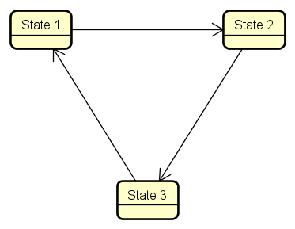
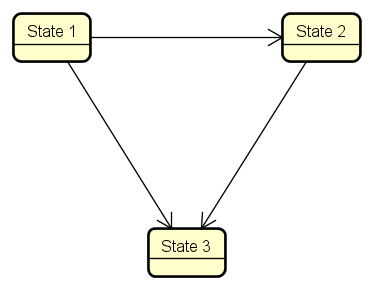
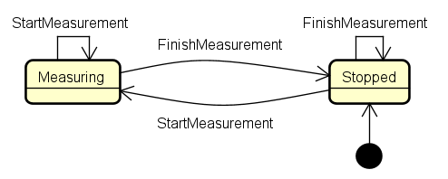
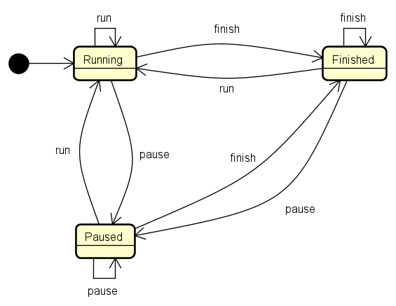
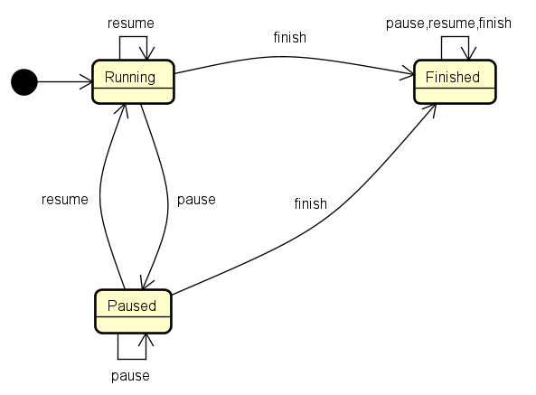

<!-- 
size: 16:9
paginate: true
-->
<!-- header: 勉強会# ― エンジニアとしての解像度を高めるための勉強会-->

# 読みやすいコードの作り方 - 状態(5)

_Code Readability_

---

## タネ本

### 『読みやすいコードのガイドライン<br>　 持続可能なソフトウェア開発のために』

- 石川宗寿(著)
- 技術評論社 2022/11/4 初版


---

## 状態とは？ (recap)

プログラムの振る舞いを決定するデータとその組み合わせ。

1. 変数の値（値の変化＝状態の変化）
2. オブジェクトの状態（メンバー変数の変化＝状態の変化）
3. プログラムや処理のフロー（状態変数の変化＝状態の変化）
4. 処理の状態（処理状況の変化＝状態の変化）

フラグ変数が５個あるだけで32($=2^5$)種類もの状態が存在することになる

<!--
突き詰めて言うと、プログラムは入力がまったく同じである場合は同じように動き、一方で入力のほんの一部でも異なっていれば異なる動きをする(ことがある)。
これはつまりそのプログラムが「変化しうる変数や入力情報のすべての組み合わせからなる状態数」を持っているということになる
-->

---

## 複雑な状態への対処方法

1. 変数の直交性を意識する
    * 手法1: 関数への置き換え
    * 手法2: 直和型での置き換え
2. 状態の**遷移**を設計する
    * **不変性 :**
        * 状態遷移そのものを不可能にする
    * **冪(べき)等性 :**
        * 内部状態を隠し呼び出し前の状態確認を不要にする
    * **非巡回**  ← ｷｮｳﾊｺｺ!
        * 状態の循環を止め複雑な管理をなくす


<!-- この本ではどのような点に注意すると良いと言っているか -->
<!-- 1は状態そのものの数を減らすという考え方、2は状態間の遷移を適切にすべきという考え方 -->

---

## 非巡回

可変なオブジェクトを作る際はb or cのような遷移にするのが望ましい
|a.巡回のある状態遷移|b.非巡回な状態遷移|c.自己ループを除けば<br/>非巡回な状態遷移|
|---|---|---|
||||

<!-- そのためには、可変なオブジェクトを再利用しないようにすることが重要。 -->
<!-- なぜか。状態が循環するということは、可能性の話として、プログラム内でいかなる状態にもなりうるので制御が効かなくなりうるということ。
循環をシーケンシャルに書き換えると、無限の状態数を持っているということになるから。
 -->

---

## 非巡回: 例) 非巡回なStopWatchクラス

```cs
class StopWatch {
    private DateTime _startTime = DateTime.Now;
    private DateTime _elapsedTime = DateTime.Now;

    private State _state = State.Measuring; // Measuring/Finished

    double FinishMeasurement() {
        if (_state == State.Finished) { return _elapsedTime.TotalMilliseconds; }

        _state = State.Finished;
        _elapsedTime = DateTime.Now - _startTime;
        return _elapsedTime.TotalMilliseconds;
    }
}
```

<!-- どういう使い方をするかの説明 -->

---

## 非巡回: 例) 非巡回なStopWatchクラス(使用例)

```cs
void RunSomeHeavyTask() {
    var stopWatch = new StopWatch(); // 計測開始
    : // 重い処理
    var elapsedTimeInMs = stopwatch.FinishMeasurement(); // 計測終了
}

void RunAnotherHeavyTask() {
    var stopWatch = new StopWatch(); // 計測開始
    : // 重い処理
    var elapsedTimeInMs = _stopwatch.FinishMeasurement(); // 計測終了
}
```


---

## 非巡回: 例) 再利用可能(=巡回)なStopWatchクラス

```cs
class StopWatch { // [BAD]
    private DateTime _startTime = DateTime.Now;
    private DateTime _elapsedTime = DateTime.Now;
    private State _state = State.Stopped; // Measuring/Stopped

    void StartMeasurement() { if(_state == State.Stopped) { _startTime = DateTime.Now; } }

    double FinishMeasurement() {
        if (_state == State.Stopped) { return _elapsedTime.TotalMilliseconds; }

        _state = State.Finished;
        _elapsedTime = DateTime.Now - _startTime;
        return _elapsedTime.TotalMilliseconds;
    }
}
```

再利用可能になったことで、生成コストも減って便利なクラスになった気がする

<!-- これはヤバい、と思った時点で挙手してほしい。最後の人にしか当てないので、遠慮せずどんどん。 -->

---

## 非巡回: 例) 再利用可能(=巡回)なStopWatchクラス

クラスの状態遷移図。初期状態が変わり、`StartMeasurement()`を呼ぶとリセットされるようになった。

|非巡回なStopWatch|巡回なStopWatch|
|---|---|
|||

---

## 非巡回: 例) 再利用可能(=巡回)なStopWatchクラス(使用例)

```cs
class SomeRunner {
    private StopWatch _stopWatch = new StopWatch();
    public void RunSomeHeavyTask() {
        _stopWatch.StartMeasurement(); // 計測開始
        : // 重い処理
        var elapsedTimeInMs = stopwatch.FinishMeasurement(); // 計測終了
    }
    public void RunAnotherHeavyTask() {
        _stopWatch.StartMeasurement(); // 計測開始
        : // 重い処理
        var elapsedTimeInMs = stopwatch.FinishMeasurement(); // 計測終了
    }
}
```

<!-- 使い方もほとんど同じ -->

---

## 非巡回: 例) 再利用可能(=巡回)なStopWatchクラス(問題発生)

```cs
class SomeRunner {
    ...
    public void RunTask() {
        _stopWatch.StartMeasurement(); // 計測開始

        if (...) {
            this.RunSomeHeavyTask(); // バグ
        } else {
            this.RunAnotherHeavyTask(); // バグ
        }

        var elapsedTimeInMs = stopwatch.FinishMeasurement(); // バグ
    }
}
```

<!-- ((ここで最後の人に当てる)) -->
<!-- 
* RunSomeHeavyTask()が呼ばれるが、既にRunTask()先頭でstart～が呼ばれているので開始時刻が正しく設定されない
* RunAnotherHeavyTask()が呼ばれるが、既にRunTask()先頭でstart～が呼ばれているので開始時刻が正しく設定されない
* if文のどちらかでFinishMeasurementが呼ばれているので、何も計測されていない
 -->

<!-- こういうのを安全に作ろうとすると、内部設計が複雑になってしまうし、結局中身では使い捨てのインスタンスを作っていることもある。
特別な理由がない限りはインスタンスを使い捨て可能にして状態線が循環しない設計にすると良い -->

---

## 巡回が必要な場合も処理を抑え込む

|大きな巡回がある|巡回箇所を制限した遷移図|←を大局的に見ると…|
|---|---|---|
||||

巡回箇所を局所化し、非巡回な遷移に出来ている

---

## 非巡回: まとめ

* 状態に巡回構造があると実装が複雑になりやすい
    * 再帰的に呼び出されたり、再利用のタイミングを意識しなければならない
* 単方向のオブジェクトを使い捨てる設計にする
    * 必要に応じて非巡回構造に再設計する
* 消せない巡回構造は局所化する

---

## まとめ

複数の変数間の関係と状態遷移の設計の２観点から単純化する方法を説明

* 直交性を意識する
    * 変数を関数として置き換える
    * 直和型で置き換える
* 状態遷移の設計
    * 不変性・冪等性を用いる
    * 非巡回の状態遷移を用いる(巡回する範囲を狭める)

