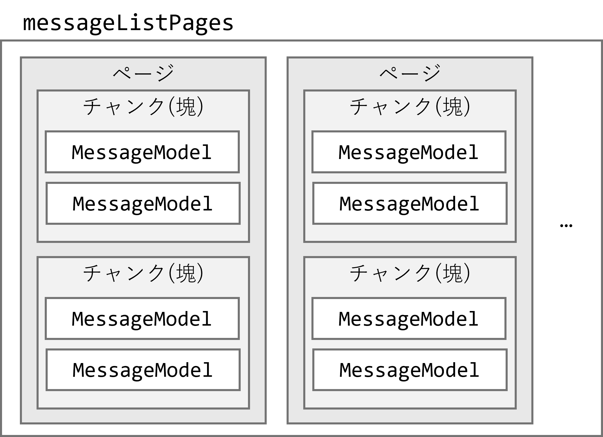

<!-- 
size: 16:9
paginate: true
-->
<!-- header: 勉強会# ― エンジニアとしての解像度を高めるための勉強会-->

# 読みやすいコードの作り方 - 関数(1)

_Code Readability_

---

## タネ本

### 『読みやすいコードのガイドライン<br>　 持続可能なソフトウェア開発のために』

- 石川宗寿(著)
- 技術評論社 2022/11/4 初版


---

## 目的

関数の動作が予測しやすくなっていれば、中身を意識しなくても良くなる。

* 関数名
* 仮引数
* 戻り値の型
* ドキュメンテーション

---

## 関数パートの説明内容

1. 関数の責任
    * 責任の分割の基本方針
    * コマンドとクエリの分割(Command-Query Separation. CQS)
1. 関数の流れ
    * 定義指向プログラミング
    * 早期リターン
    * 操作対象による分割

---

# 1. 関数の責任

---

## 関数の責任

関数においても単一責任の原則(SRP$^1$)を守る。責任範囲の曖昧な処理のまとまりを作らない。

<b>複数の責任を持っている</b>
→ **抽象的に理解しづらくなる・再利用性が低下する**

> **問題**:
> 関数`queryUserData(string userId) -> UserData`はどんな振る舞いを予想する？


>>> 1. Single Responsibility Principle

---

## 関数の責任

> **問題**:
> 関数`queryUserData(string userId) -> UserData`はどんな振る舞いを予想する？

- → ユーザーデータを取得する
    - → データ取得にネットワークなど外部へのアクセスが含まれるかも
* → データ削除や更新はする？何か他の処理はする？

>>> 1. Single Responsibility Principle

<!-- 想像から外れない実装にする。驚き最小の原則 -->

---

## 責任分割の良し悪し ∋ **処理の要約を１行で書けるかどうか**

```kt
// [GOOD]
fun ...(messageData: MessageData) {
    messageView.text = messageData.contentText
    senderNameView.text = messageData.senderName
    timestampView.text = messageData.sentTimeText
}
```

→ 「メッセージデータを画面にバインドする」

---

## 関数の責任: 要約を１行で書けるかどうか

```kt
// [BAD]
fun ...(messageData: MessageData) {
    messageView.text = messageData.contentText
    senderNameView.text = messageData.senderName
    timestampView.text = messageData.sentTimeText

    let data = getDataFromNetwork(messageData.userId)
    setDataToDatabase(data)
}
```

→ 「メッセージデータを画面にバインドし、ユーザーIDから新しいデータを受け取ったらデータベースに格納する」
↓
複数の責任を持ってしまっているので、前半と後半を別関数に分ける

---

## 関数の責任: 要約を１行で書けるかどうか

改善後のコード：

```kt
// [GOOD]
fun ...(messageData: MessageData) {
    messageView.text = messageData.contentText
    senderNameView.text = messageData.senderName
    timestampView.text = messageData.sentTimeText
}

 ＆

fun ...(userId: String) {
    let data = getDataFromNetwork(userId)
    setDataToDatabase(data)
}
```

---

## 関数の責任: コマンド・クエリ分離の原則(CQS$^1$)

「<b>状態を変更するための関数(Command)</b>」と「<b>状態を知るための関数(Query)</b>」とを別にする

- <b>コマンド</b>: 呼ばれたオブジェクトや実引数、外部の状態を変化させる関数。戻り値は持たない
- <b>クエリ</b>: 戻り値によって情報を取得する関数。呼ばれたオブジェクトや実引数、外部の状態は変化させない

この原則を守ると可読性や頑健性を高めやすい。

>>> 1. Command-Query Separation. 元はバートランド・メイヤーの1988年の本で出てきた概念。名前は後日与えられた

<!-- CQS はC/Qのメソッドの分割パターン、 CQRS はレイヤーやモデルの（アーキテクチャレベルでの）分割パターンという解釈が良さそう。

* CQS: https://martinfowler.com/bliki/CommandQuerySeparation.html
* CQRS: https://martinfowler.com/bliki/CQRS.html
-->

---

## 関数の責任: コマンド・クエリ分離の原則(CQS)

```cs
var a = new IntList([1, 2, 3])
var b = new IntList([4, 5])
var c = a.getAppended(b) // 言語はC#を想定
```

この結果でc行を実行したときに a が `[1, 2, 3, 4, 5]` になっていたらどう思う？

<!-- a<<bは演算子のオーバーロード。元は -->
---

## (補足: 驚き最小の原則$^※$ )

> 驚き最小の原則とは、ユーザインタフェースやプログラミング言語の設計および人間工学において、インタフェースの2つの要素が互いに矛盾あるいは不明瞭だったときに、その動作としては人間のユーザやプログラマが最も自然に思える（驚きが少ない）ものを選択すべきだとする考え方
>
> _――― Wikipedia「[驚き最小の原則](https://ja.wikipedia.org/wiki/%E9%A9%9A%E3%81%8D%E6%9C%80%E5%B0%8F%E3%81%AE%E5%8E%9F%E5%89%87)」より_

相手にとって(この場合は関数を使う側)、予想外の振る舞いをしないことを意識して設計するべし

>>> ※Principle of least astonishment または Rule of least surprise。1966年ごろから言及されている様子

<!--
驚き最小の原則: https://ja.wikipedia.org/wiki/%E9%A9%9A%E3%81%8D%E6%9C%80%E5%B0%8F%E3%81%AE%E5%8E%9F%E5%89%87
-->

<!-- https://www.hyuki.com/kokoro/#surprise -->

<!-- よくある例だと
* アプリのショートカットキーが独特
* Webページでリンク先をクリックしたときに広告が表示されたり、Backボタンで戻っているはずなのに「こんな記事もおすすめ」と別のページが挟まれて出てきたりする
のが驚き最小の原則に違反している例 -->

---

## 関数の責任: コマンド・クエリ分離の原則(CQS)

* コマンド
    * ユーザー情報を更新する、 設定変更する、 HTTP POST/UPDATE、…
* クエリ
    * オブジェクトが保持しているデータを返す、 HTTP GET、 …

<!-- データ送信の場合などで、送信するからコマンドなのかなと一括りで考えないようにする。
相手側の状態を変えるものであればコマンド(POST)、変えなければクエリ(GET)とか。
組込プログラミングの場合だと、何かの値を取得するための処理として

    1. ある命令を相手に送信して、相手の状態を送信状態に変更する
    2. 送信状態になった相手からデータが送られてくる
    3. 必要なデータを受け取ったら命令を送信して、相手のデータ送信モードを解除する

といった手順を踏むことがある。この場合、値の取得処理であっても
相手の状態を変更することがあるのでコマンドなのかクエリなのか分からなくなることがあるかもしれない。
この場合は、1-3をひとまとめにした処理として見て、処理が終わったあとに相手の状態が変化していないからクエリ、
という視点もできる。（ファイルから読み込むときもファイルをオープンして読んでクローズして…と状態変化するし）

なのでコマンド・クエリというのを考える時には１つ１つを細かくして考えず、責任範囲の前後において
どうなっているかを考えると良い
-->

---

## 関数の責任: CQS適用/不適用の境界

「これはCommandだから戻り値は絶対にvoid」は悪手。実行後に結果をgetするメソッドを書かないといけない処理は不具合の温床になる。

→ 関数の戻り値が主となる結果か、副次的な結果(メタデータ)かで判断する

* <b>主となる結果</b>:
    * `toInt()`や`splitByComma()`などの変換関数の変換後の値、算術演算の計算結果、ファクトリ関数で作成されたインスタンス
    * → **CQSを適用すべき**
* <b>副次的な結果</b>:
    * 失敗するかもしれない関数のエラー種別
    * → **CQSを適用しなくてよい**(クエリ系でも状態更新して良い)

---

# 2.関数の流れ

---

## 関数の流れ

処理の流れが明瞭であるほど、短時間で概要を把握できる

* 詳細な挙動を読み飛ばしても理解できる
    * ネストの中、定義の右辺、エラーの処理など
* 関数中のどこが重要な部分化が分かりやすい
* 条件分岐を網羅して読まなくても理解できる

そのための方法として「<b>定義指向プログラミング</b>」「<b>早期リターン</b>」「<b>操作対象による分割</b>」がある

---

## 関数の流れ: 定義指向プログラミング

ネスト・メソッドチェーン・リテラルを使わず、名前のついた変数・関数・クラスの定義を多用するプログラミングスタイル

### 目的
> * 高い抽象度を与える
> * 斜め読みで概要を把握できるにする
> * 関数内の読み返しを減らす


>>> 「定義指向プログラミング」について調べたが、その範囲ではこの本で表現されているのみでした。

<!-- ほかだとオブジェクト指向～、アスペクト指向～、データ指向～ -->

---

## 要改善パターン① : ネスト (例1)

```cs
[BAD]
someView.ShowDialogOnError(                   // (もし取得失敗したらエラーダイアログ表示)
    presenter.UpdateSelfProfileView(          // 2.得られたモデルをプロフィール画面に反映
        userRepository.queryUserModel(userId) // 1.ユーザーIDに紐づくデータを取得
    )
);
```

* 問題
    * どこが重要なコードなのか分かりにくい
    * 戻り値の意味/内容が読み取りにくい

---

## 要改善パターン① : ネスト (例1)

```cs
[BAD]
someView.ShowDialogOnError(                   // (もし取得失敗したらエラーダイアログ表示)
    presenter.UpdateSelfProfileView(          // 2.得られたモデルをプロフィール画面に反映
        userRepository.queryUserModel(userId) // 1.ユーザーIDに紐づくデータを取得
    )
);
```
↓
```cs
[GOOD]
try {
    var userModel = userRepository.queryUserModel(userId); // いちど変数に定義
    presenter.UpdateSelfProfileView(userModel);
}
catch (Exception e) { // エラーを変数に定義
    someView.ShowDialogOnError(e);
}
```

---

## 要改善パターン① : ネスト (例2)

```cs
[BAD]
if (messageModelList.HasValidModel(messageId)) {
    if (messageListPresenter.IsMessageShown(messageId)) {
        if (requestQueue.Contains(messageId)) {
            view.ShowStatusText("送信中です");
        }
    }
} // ↓↓↓↓ これを定義指向プログラミングで書き換えて見ようとした結果… ↓↓↓↓
```
```cs
[NOT GOOD] // なぜNOT GOODかを考えてみよう
var isMessageValid = messageModelList.HasValidModel(messageId);
var isMessageViewShown = messageListPresenter.IsMessageShown(messageId);
var isMessageSengingOngoing = requestQueue.Contains(messageId);

if (isMessageValid && isMessageViewShown && isMessageSengingOngoing) {
    view.ShowStatusText("送信中です");
}
```

---

## 要改善パターン① : ネスト (例2)

定義先を変数ではなく関数とすると良い（こともある）

```cs
[GOOD]
bool _IsValidMessage(messageId) => messageModelList.HasValidModel(messageId);
bool _IsViewShownFor(messageId) => messageListPresenter.IsMessageShown(messageId);
bool _IsUnderSending(messageId) => requestQueue.Contains(messageId);
︙
if (_IsValidMessage(messageId) &&
    _IsViewShownFor(messageId) &&
    _IsUnderSending(messageId))
{
    view.ShowStatusText("送信中です");
}
```

---

## 要改善パターン① : ネスト (例3)



ネストだからと何でも削れば良いわけではない。

```cs
[BAD]
void ...(List<MessageListPage> messageListPages) {
    // ページのまとまりからメッセージを順に取り出し格納する
    for (messageListPage in messageListPages) {
        for (messageListChunk in messageListPage) {
            for (messageModel in messageListChunk) {
                repository.storeMessage(messageModel);
            }
        }
    }
}
```

---

## 要改善パターン① : ネスト (例3)
かえって読みにくくなってしまっている。
```cs
[BAD] /* スペースの都合でfor文の括弧を省いているので注意 */
void ...(List<MessageListPage> messageListPages) {
    for (messageListPage in messageListPages)
        this.storeMessageForPage(messageListPage);
}

private void storeMessageForPage(MessageListPage page) {
    for (chunk in page)
        storeMessageForChunk(chunk);
}

private void storeMessageForChunk(MessageListChunk chunk) {
    for (messageModel in chunk)
        repository.storeMessage(messageModel);
}
```

---

## 要改善パターン① : ネスト (例3)

**[対象を取り出す処理]** と **[対象に対して行う処理]** とで分割する

```cs
[GOOD]
private void forEachMessage(List<MessageListPage> pages, Action<MessageModel> action) {
    // スペースの都合でfor文の括弧を省いているので注意
    for (page in pages)
        for (chunk in page)
            for(messageModel in chunk)
                action(messageModel);
}
```
```cs
// 使用方法
void ...(List<MessageListPage> messageListPages) {
    forEachMessage(messageListPages, (messageModel) => {
        repository.storeMessage(messageModel);
    }
}
```

---

## 要改善パターン② : メソッドチェーン

<b>メソッドチェーン</b>： メソッドの戻り値をレシーバとして、さらに別のメソッドを呼び出す書き方。

```swift
let label = UILabel()              // [Swift]ラベルオブジェクトを作成して
    .size(width: 100, height: 40)  // 幅と高さを設定し、
    .backgroundColor(.red)         // 背景色を赤にして、
    .text("テキスト")               // 表示する文字は「テキスト」
    .textColor(.white)             // 文字色は白(にしたものをlabelに代入)
self.view.addSubview(label) // 作成したラベルを画面に表示
```
```cs
var query = someList                // [C#]リスト構造のデータ
            .Where(x => x % 2 == 0) // 偶数の要素のみ取り出し
            .OrderBy(x => x)        // 昇順でソートして
            .Select(x => x * 3);    // 各値を３倍(したものをqueryに代入)
```

---
## 要改善パターン② : メソッドチェーンのメリット/デメリット

### :+1: メリット
* 関数評価や実行が上から順に行われるので、流れるように読める
* ネストが浅くなるため、メソッドと引数の関係が分かりやすい

### :-1: デメリット

* どこに重要なコードがあるのか分かりにくい
* 途中の状態やレシーバが何か分かりにくい
* 毎回全部読まないと処理が分からない
* あとからの機能変更がしにくい

→ 何もかもメソッドチェーンだけで書こうとしない。途中で分ける

<!-- （ブレークポイントが文の途中で設定できるものは一部のみ） -->
<!-- つまるところ途中状態のないクイズを作っている状態なので、神メソッドチェーンになっておいそれと触れなくなる -->

---

## 要改善パターン② : メソッドチェーン

→ 重要な部分でメソッドチェーンをいちど切る

```kt
[GOOD]
val friendProfileBitmaps = userModelList
    .filter { userModel -> userModel.isFriend }
    .map { userModel -> userModel.profileBitmap }

friendProfileBitmaps
    .forEach { bitmap → imageGridView.addImage(bitmap) }
```

<!-- ここでの分け方は、「データの抽出」と「(抽出した)データへの処理」。このパターンは本当に多いので意識してみると良い -->

---

## 要改善パターン③ : リテラル

<b>リテラル</b>： ソースコード内で直接表現された値や書式のこと

```cs
/* ※C#のコードです */

true, false // booleanリテラル
10000 // 整数リテラル
"文字列リテラル"
"""生文字リテラル"""
(x) => x * 3 // ラムダ
```

>>> C++ではユーザー定義リテラルなどもある

---

## 要改善パターン③ : リテラル

マジックナンバー$^1$にも「(使っても)良いマジックナンバー」と「悪いマジックナンバー」がある

* <b>良いマジックナンバー</b>
    * 意味が自明で変わることがないもの
        * 配列の先頭を表す「`0`」、中央の計算を表す「`/ 2`」など
* <b>悪いマジックナンバー</b>
    * それ以外のもの

**→ 悪いマジックナンバーは名前を付けて置き換えるべき**

>>> 1. 整数や文字列などのプリミティブなデータ型で、名前のついていないリテラルのこと

---
## 要改善パターン③ : リテラル

「悪いマジックナンバー」の解像度も上げよう

**[問題]**
このマジックナンバーが悪い理由を言語化してください。

```cs
const int TEN_THOUSAND = 10000;
```

---

## 要改善パターン③ : リテラル

「悪いマジックナンバー」の解像度も上げよう

**[問題]**
このマジックナンバーが悪い理由を言語化してください。

```cs
const int TEN_THOUSAND = 10000;
```

↓

**回答(例):**
* 名前による意味付けができていない
* 目的を絞れていない

>→ **同じ値が別の目的で使われないよう、マジックナンバーを定義・命名する**

---

## クラス内でメソッド分割を行うときの注意点

メンバ変数(プロパティ)を扱うメソッドを局所化する。

```cs
[BAD]
class SomeClass {
    private View userNameTextView;
    private View profileImageView;

    SomeClass() {
        userNameTextView = new View();
        /* …userNameTextViewに対する長い初期化処理… */

        profileImageView = new View();
        /* …profileImageViewに対する長い初期化処理… */
    }
}
```

---
## クラス内でメソッド分割を行うときの注意点

```cs
[BAD]
class SomeClass {
    private View userNameTextView;
    private View profileImageView;
    SomeClass() {
        this.InitializeUserNameTextView();
        this.InitializeProfileImageView();
    }

    private void InitializeUserNameTextView() {
        userNameTextView = new View();
        /* …userNameTextViewに対する長い初期化処理… */
    }
    private void InitializeProfileImageView() {
        profileImageView = new View();
        /* …profileImageViewに対する長い初期化処理… */
    }
}
```

---
## クラス内でメソッド分割を行うときの注意点

```cs
[GOOD]
class SomeClass {
    private View userNameTextView;
    private View profileImageView;
    SomeClass() {
        userNameTextView = this.CreateUserNameTextView();
        profileImageView = this.CreateProfileImageView();
    }

    private View CreateUserNameTextView() { // 名前がInitialize～からCreate～に変わった点も注目
        var view = new View();
        /* …userNameTextViewに対する長い初期化処理… */
        return view; // ローカル変数で作ったビューを返している(＝メンバー変数に触れていない)
    }
    private View CreateProfileImageView() {
        var view = new View();
        /* …profileImageViewに対する長い初期化処理… */
        return view;
    }
}
```
---