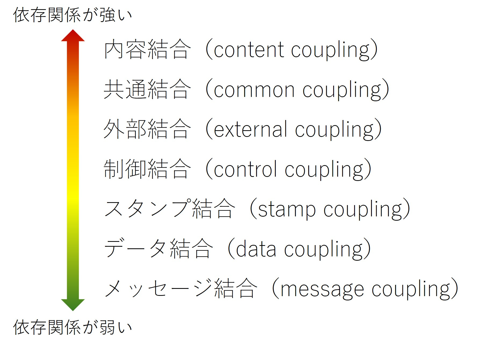

<!-- 
size: 16:9
paginate: true
-->
<!-- header: 勉強会# ― エンジニアとしての解像度を高めるための勉強会-->

# 読みやすいコードの作り方 - 依存関係(1)

_Code Readability_

---

## タネ本

### 『読みやすいコードのガイドライン<br>　 持続可能なソフトウェア開発のために』

- 石川宗寿(著)
- 技術評論社 2022/11/4 初版

> 見た目を美しく整えることや、流行りのテクニックを取り入れることが「改善」だと思い込んでいませんか？


---

## 依存関係

1. 依存の強さ(結合度)
1. 依存の方向
1. 依存の重複
1. 依存の明示性

---

## 依存関係とは

２つのクラス/関数/モジュールなどを組み合わせたときの『相手を使うクラス』『相手に使われるクラス』の関係のこと。

- <b>相手を使うクラス</b>: **依存元**
- <b>相手に使われるクラス</b>: **依存先**


```cs
class X { // 依存元クラス
    Y other;
    void act() { other.doSomething(); }
}

class Y { // 依存先クラス
    void doSomething() { ... }
}
```

<!-- クラスとして表現した場合の、依存元クラスXと依存先クラスYのその他の関係はこういうものもある

- XがプロパティとしてYのインスタンスを持つ(スライドのとおり)
- XのメソッドがYを引数として取るか、戻り値として返す
- Xの中でYのメンバー(メソッドやプロパティ)にアクセスする
- XがYを継承している
 -->

---
 
 ## 理想的な依存関係

- 依存関係が弱い
- 循環依存や重複した依存がない
- 明示的な依存関係になっている

記述するコードがこれらのルールを守れている状態にする

<!-- 派生開発や未知のコード・スキル不足などで「必要最小限の変更」を繰り返していると依存関係が簡単に崩れていく -->

---

## 悪い例１

```cs
[BAD] 循環依存が発生している
class X {
    Y other
    X() { other = new Y(this); }

    void func1() { other.func2(); }
    void func3() { ... }
}

class Y {
    X other
    Y(X x) { other = x; }

    void func2() { other.func3(); }
}
```

---
## 悪い例２

```cs
[BAD] 分かりにくい循環依存が発生している例
class X {
    Y other;

    X() { other = new Y(); }
    void func() { other.func2(this); }
}

class Y {
    private Object anyObject = null; // Objectはすべてのクラスの基底クラス
    
    void func2(Object any) {
        anyObject = any; // 循環依存の発生！
    }
}
```

 循環依存だけでなく、気をつける例は他にもある

 ---

## 依存関係

1. **依存の強さ(結合度)**
1. 依存の方向
1. 依存の重複
1. 依存の明示性

---

## 結合度

ソフトウェアの分割がどの程度行き届いているかを測る尺度。

Reliable software through composite design(*1)の定義 ＋ Software Architect's Handbookの定義(*2)



>>> 1. Glenford J. Myers. 1975
>>> 2. Joseph Ingeno. 2018.
>>> 注： 外部結合の定義は文献によって全く異なるため原典を明記しています

---

## 内容結合

隠蔽されるべきコードの詳細に依存するもの

- 依存先のコードを変更する
- 依存先に隠蔽された変数を、外部から参照する
- 依存先の内部のコードに直接ジャンプする

→ 現在でもそんなコード書ける？ … 書けます。

<!-- 昔は書けた。自分自身を書き換えながら処理を実行する。でも今は、読み込んだプログラムのメモリ領域はOSによって読み取り専用領域としてフラグを立てているので、そこを書き換えようとしても -->
---

## 内容結合: アンチパターン①: 内容結合を破れるコード

```cs
[BAD] // 内容結合を破れる、不正な使い方が可能なコード
class Calculator {
    int Result = -1; // Calculate()の結果を保持する
    void Prepare(int lhs, int rhs) { … } // 計算の準備をする
    void Calculate() { … } // 計算する
    void TearDown() { … } // 計算の後始末をする
}
// 使い方。Prepare→Calculate→TearDownの順に呼び、Resultを読む
calculator.Prepare(3, 5);
calculator.Calculate();
calculator.TearDown();
Console.WriteLine(calculator.Result);
```

**Quiz**: 内容結合を破る使い方を考えてみよう

---

## 内容結合: アンチパターン①: 内容結合を破るコード

クイズの回答

```cs
[BAD]
// 依存先のコードを変更する
calculator.Result = 42;

// 依存先の内部のコードに直接ジャンプする
calculator.Calculate(); // Prepare()を呼ばずに実行
```

---

## 内容結合: アンチパターン①

別回答。自分自身で結合してしまっている。

```cs
[BAD] // 内容結合を破るコードの例 2
void CalculateCells() {
    calculator.Prepare(…); // calculatorは共通とする
    calculator.Calculate();
    calculator.TearDown

    CalculateAnotherCell();
    Console.WriteLine(calculator.Result); // 意図したコード？
}

void CalculateAnotherCell() {
    calculator.Prepare(…);
    calculator.Calculate();
    calculator.TearDown
}
```

<!-- 重ねて使っていることにより、本来守るべき一連の行動が崩れてしまい、処理の途中で別の処理を結合してしまっている。 -->

---

## アンチパターン①の緩和策: 依存元に対する制約の最小化

```cs
[GOOD]
class Calculator {
    int Calculate(int lhs, int rhs) {
        this.Prepare(lhs, rhs);
        // ... 元のCalculateの処理 ...
        this.TearDown();
        return result;
    }
    // 見せる必要のないものはprivateに変更
    private int result = -1;
    private void Prepare(int lhs, int rhs) { … } // 計算の準備をする
    private void TearDown(…) { … } // 計算の後始末をする
}
```

---

## 


---

## 内容結合: アンチパターン②: 内部状態を共有するコード

```cs
[BAD]
class Foo {
    private IList<string> Users;
    public Foo(IList<string> users) { Users = users; }
    // :
    // Usersを使った処理。変更したときはFooから通知を飛ばす
    // :
}

var users = new List<string>();
var foo = new Foo(users);

users.Apped("new user"); // fooは変更を検知できない！
```

<!-- Dependency Injectionでやりがち -->

---

## 内容結合: アンチパターン②: 内部状態を共有するコード

```cs
class Foo {
    private IList<string> Users;
    public Foo(IList<string> users) { Users = users; }
    // Usersを変えた時には通知を飛ばす
}

class Bar {
    private IList<string> Users;
    public Bar(IList<string> users) { Users = users; }
    public void Add(string name) { Users.Append(name); }
}

var users = new List<string>();
var foo = new Foo(users);
var bar = new Bar(users);
bar.Add("new user"); // fooは変更を検知できない！
```

<!-- Dependency Injectionでやりがち -->

---

## アンチパターン②の緩和策: 責任の明確化

### 緩和策1.通知を行うクラスを用意する

リストを通知込みで管理するクラスを別に用意する
→ リスト操作APIをそのクラス内に用意し、通知処理をその中で実装する

### 緩和策2.Fooクラスのみリストを更新可能にする

BarクラスにはIReadOnlyListを渡す
→ Barクラスでの変更が不可能になり、想定外の変更を避けられる

---

## アンチパターン②の緩和策: 責任の明確化

### 緩和策1.通知を行うクラスを用意する → コレクションクラスの提供

```cs
class UserList {
    private List<string> users = new List<string>();
    void Append(string newUser) { /*ここに通知処理を書く*/ }
    string Get(int index) { ... }
}
// FooやBarではUserListを受け取り、通知を受信する処理も実装しておく
```


### 緩和策2.Fooクラスのみリストを更新可能にする → Barは読み取り専用で使う

```cs
class Bar {
    private IReadOnlyList<string> Users;
    public Bar(IList<string> users) { Users = users; }
}
```

---

## 内容結合のまとめ

- 古の災禍ではなく現代でも起こる問題
- 対策
    - 一息で行うべき処理をステップに分けない
    - 変更役/参照役の責任を分割する
    - 単一責任の原則 (SRP)、デメテルの法則など
- 外部APIを作るときに注意する
