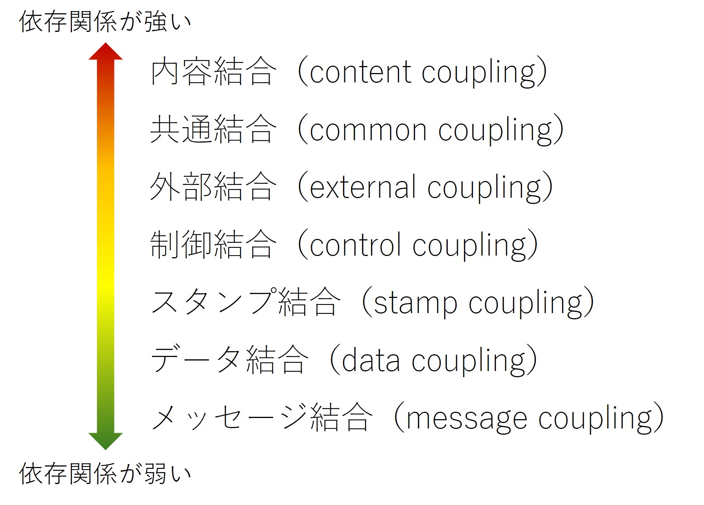

<!-- 
size: 16:9
paginate: true
-->
<!-- header: 勉強会# ― エンジニアとしての解像度を高めるための勉強会-->

# 読みやすいコードの作り方 - 依存関係(3)

_Code Readability_

---

## タネ本

### 『読みやすいコードのガイドライン<br>　 持続可能なソフトウェア開発のために』

- 石川宗寿(著)
- 技術評論社 2022/11/4 初版


---

## 依存関係とは

２つのクラス/関数/モジュールなどを組み合わせたときの『相手を使うクラス』『相手に使われるクラス』の関係のこと。

- <b>相手を使うクラス・関数</b>: **依存元**
- <b>相手に使われるクラス・関数</b>: **依存先**


```cs
class X { // 依存元クラス
    Y other;
    void act() { other.doSomething(); }
}

class Y { // 依存先クラス
    void doSomething() { ... }
}
```

<!-- クラスとして表現した場合の、依存元クラスXと依存先クラスYのその他の関係はこういうものもある

- XがプロパティとしてYのインスタンスを持つ(スライドのとおり)
- XのメソッドがYを引数として取るか、戻り値として返す
- Xの中でYのメンバー(メソッドやプロパティ)にアクセスする
- XがYを継承している
 -->

---
 
 ## 理想的な依存関係

- 依存関係が弱い（≠依存関係がない）
- 循環依存や重複した依存がない
- 明示的な依存関係になっている

記述するコードがこれらのルールを守れている状態にする

<!-- 派生開発や未知のコード・スキル不足などで「必要最小限の変更」を繰り返していると依存関係が簡単に崩れていく -->

---

## 依存関係

1. **依存の強さ(結合度)**
1. 依存の方向
1. 依存の重複
1. 依存の明示性

---

## 結合度

ソフトウェアの分割がどの程度行き届いているかを図る尺度。

Reliable software through composite design(*1)の定義 ＋ Software Architect's Handbookの定義(*2)



>>> 1. Glenford J. Myers. 1975
>>> 2. Joseph Ingeno. 2018.
>>> 注： 外部結合の定義は文献によって全く異なるため原典を明記しています

---

## 制御結合

フラグなどにより複数の処理を分岐させている。分岐はプログラミングの本質の１つであり悪とは言い切れない。

ただし、

- 条件分岐の粒度が不必要に大きい
- 条件分岐間での動作の関連性が薄い

という状態に注意する。

---

## 制御結合のアンチパターン①: 条件分岐の粒度が不必要に大きい

**✕各条件分岐内の操作対象が同じにも関わらず大きな範囲で条件分岐している**

```cs
[BAD]
void UpdateView(ErrorType errorType) {
    if (errorType == ...) { // 〇〇時はエラー発生を画面に表示する
        _resultView.Visible = false;
        _errorView.Visible = true;
        _iconView.Image = CROSS_MARK_IMAGE;
    } else if(errorType == ...) { // 〇〇時は結果を画面に表示する
        _resultView.Visible = true;
        _errorView.Visible = false;
        _iconView.Image = CHECK_MARK_IMAGE;
    } else if(errorType == ...) { ... }
}
```
- 分岐の全てを読まないと「何をしているか」が分からない、仕様変更に弱い

---

## アンチパターン①の緩和策: 操作対象による分割

条件ではなく操作対象ごとにコードを分割する

```cs
[GOOD]
public void UpdateView(ErrorType errorType) {
    _resultView.Visible = errorType == ...;
    _errorView.Visible = errorType != ...;
    _iconView.Image = GetIconImage(errorType);
}

private Image GetIconImage(ErrorType errorType) { 
    if (errorType == ...) { return isError ? CROSS_MARK_IMAGE }
    ...
    else { return CHECK_MARK_IMAGE; }
}
```

✔ 関数の流れが単純になり、制御結合をより細かい範囲に限定/隠蔽出来ている

---

## 制御結合のアンチパターン②: 条件分岐間での動作の関連性が薄い

```cs
[BAD]
void UpdateUserView(DataType dataType) {
    switch(dataType) {
    case DataType.UserName: // データ種別がユーザー名の場合
        _userNameView.Text = GetUserName(userId);
        break;
    case DataType.BirthDate: // データ種別が誕生日の場合
        _birthDateView.Text = GetBirthDate(userId);
        break;
    case DataType.ProfileImage: // プロフィール画像を更新
        _profileImageView.Image = FetchProfileImage(userId);
        ...
    }
}
```

- 抽象化しないと網羅表現できない
- 使う側がdataType値を決める際も同じ条件分岐を書いているかも(分岐の重複)

---

## アンチパターン②の緩和策: 不必要な条件分岐の消去

```cs
void UpdateUserNameView() {
    _userNameView.Text = GetUserName(userId);
}

void UpdateBirthDateView() {
    _birthDateView.Text = GetBirthDate(userId);
}

void UpdateProfileImageView() {
    _profileImageView.Image = FetchProfileImage(userId);
}
```

無駄なポータルサイト(Facade)を作ろうとしない。

>>> ただし各関数内での処理多い場合には重複コードが増えて管理コストが爆発するので、ポリモーフィズムや関数テーブルの適用を考える

---

## アンチパターン②の緩和策: 不必要な条件分岐の消去(失敗例)

操作対象が共通なものを別の関数で定義しない。保守性の悪化

```cs
[BAD]
void UpdateErrorView() { // エラー発生を画面に表示する
    _resultView.Visible = false;
    _errorView.Visible = true;
    _iconView.Image = CROSS_MARK_IMAGE;
}
void UpdateResultView() { // 結果を画面に表示する
    _resultView.Visible = true;
    _errorView.Visible = false;
    _iconView.Image = CHECK_MARK_IMAGE;
}
void Update〇〇View() { ... }
void Update〇〇View() { ... }
...
```

---

## 制御結合のまとめ

- 条件分岐によって以下の罠にハマっていないか
    - 分割すべき視点/範囲を誤って表現していないか
    - 関係のない処理を１つにまとめていないか
    - 様々な場所で同じ条件分岐が存在している
- 対策
    - 操作対象による分割で細かい範囲に限定/隠蔽する
    - 内部の条件分岐が必要かどうか考える
    - ポリモーフィズム(State/Strategyパターンなど)を考える

