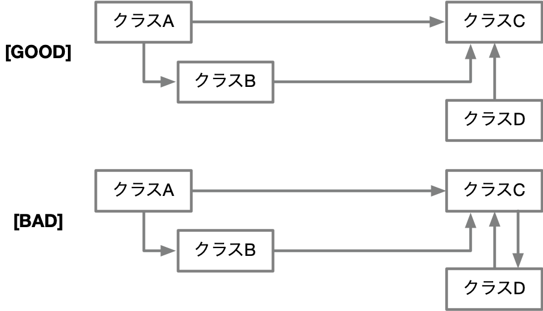
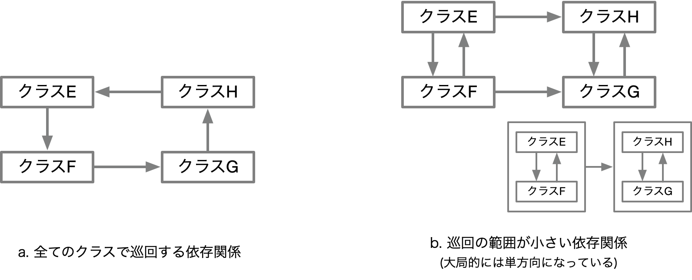
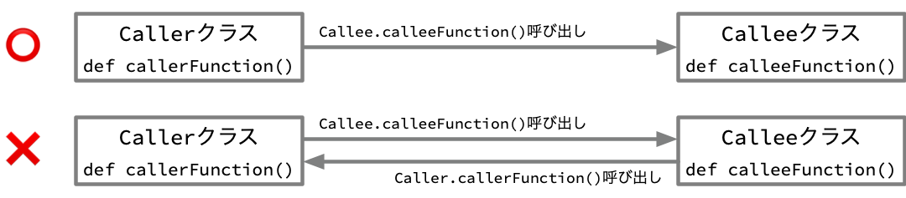
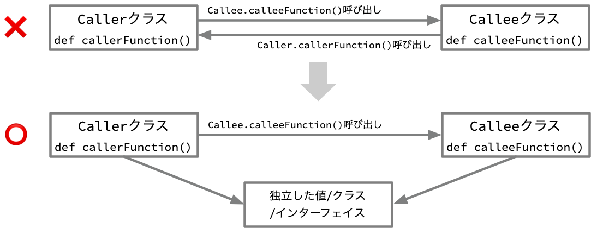
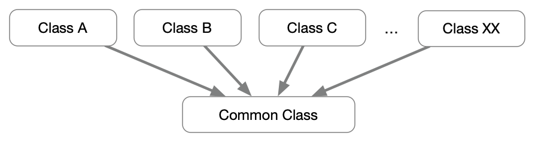
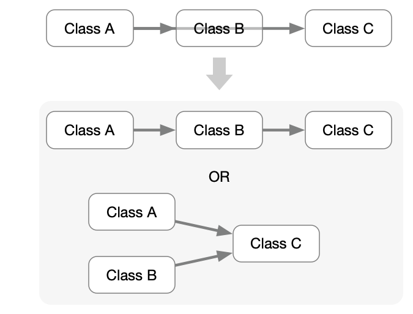
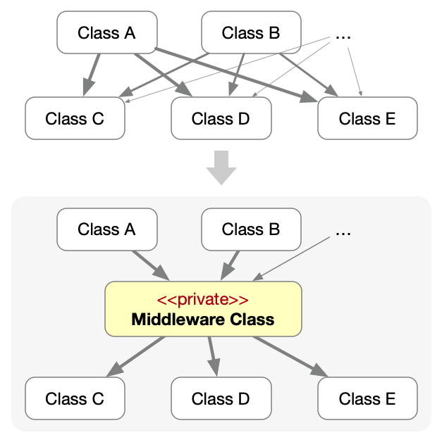

<!-- 
size: 16:9
paginate: true
-->
<!-- header: 勉強会# ― エンジニアとしての解像度を高めるための勉強会-->

# 読みやすいコードの作り方 - 依存関係(5)

_Code Readability_

---

## タネ本

### 『読みやすいコードのガイドライン<br>　 持続可能なソフトウェア開発のために』

- 石川宗寿(著)
- 技術評論社 2022/11/4 初版

> 見た目を美しく整えることや、流行りのテクニックを取り入れることが「改善」だと思い込んでいませんか？


---

## 依存関係とは

２つのクラス/関数/モジュールなどを組み合わせたときの『相手を使うクラス』『相手に使われるクラス』の関係のこと。

- <b>相手を使うクラス・関数</b>: **依存元**
- <b>相手に使われるクラス・関数</b>: **依存先**


```cs
class X { // 依存元クラス
    Y other;
    void act() { other.doSomething(); }
}

class Y { // 依存先クラス
    void doSomething() { ... }
}
```

<!-- クラスとして表現した場合の、依存元クラスXと依存先クラスYのその他の関係はこういうものもある

- XがプロパティとしてYのインスタンスを持つ(スライドのとおり)
- XのメソッドがYを引数として取るか、戻り値として返す
- Xの中でYのメンバー(メソッドやプロパティ)にアクセスする
- XがYを継承している
 -->

---
 
 ## 理想的な依存関係

- 依存関係が弱い（≠依存関係がない）
- 循環依存や重複した依存がない
- 明示的な依存関係になっている

記述するコードがこれらのルールを守れている状態にする

<!-- 派生開発や未知のコード・スキル不足などで「必要最小限の変更」を繰り返していると依存関係が簡単に崩れていく -->

---

## 依存関係

1. 依存の強さ(結合度)
1. **依存の方向**
1. **依存の重複**
1. 依存の明示性

---

## 依存の方向

依存関係に巡回構造を作らないことが原則。
→ クラスだけでなく、ファイル、パッケージなどでも同様。



>>> C/C++系は`#include`をうっかり巡回させがちなので特に注意

---

## やむを得ない巡回構造は局所化する



---

## 依存発生の種類

依存関係が生じるときの関係性

1. 呼び出し元 → 呼び出し先
2. 具体 → 抽象
3. 不安定 → 安定(複雑 → 単純, 可変 → 不変)
5. アルゴリズム→データモデル、etc.

これ以外の関係や逆方向の依存が発生している場合は**構造に問題を抱えているおそれがある**ので注意する

---

## 1.呼び出し元 → 呼び出し先

呼ばれる側のクラスから呼ぶ側のクラスを呼び出すと巡回依存が発生



図にすると間違えるはずないと思うかもしれないが…意外とあるケース
- MVVMでViewクラスとViewModelクラスで相互に呼び合う
- 通信モジュールを自作したときに送受信処理を相互に呼び合う
- （コールバック関数を渡して呼び出してもらうのも広義の巡回依存）

---

## 1.呼び出し元 → 呼び出し先

共有したいデータを値や別クラスに切り出して、巡回依存の関係を解消する



- 依存関係逆転の原則(DIP)$^1$を使っても良い
- 非同期処理でもActorモデルを使い捨てるなど

>>> 1. SOLIDのDです

---

## 3.不安定 → 安定<br>（複雑→単純, 可変→不変）

機能としての寿命が異なる。

> 単純,不変(＝安定) <br><b>||||||||||越えられない壁||||||||</b><br> 複雑,可変(＝不安定)

安定依存の法則(SDP。Stable Dependencies Principle)を守る。

**{安定度}** = **min({全ての依存先の安定度})**


>>> 『ちょうぜつソフトウェア設計入門』(田中ひさてる著)より転載

---

## オブジェクト指向設計あるある

データモデル(安定)がデータ取得処理(不安定)を持っている

```cs
[BAD]
class UserEntity {
    string userId;
    string displayName;
    UserDataRequester requester; // サーバーからデータ取得する

    void Initialize(string id) {
        var data = requester.FetchUserData(id); // NW経由で取得
        ...
    }
}
```

<!-- 初心者がデータとメソッドを一緒に持つ！と思って作り上げてしまうだけではなく、DDDをかじり始めた中級者も陥る罠なので要注意。 -->

---

## オブジェクト指向設計あるある

安定なコードの中に不安定さを混ぜない。

```cs
[GOOD]
class UserEntity { // requesterを持たず、データはデータとして管理
    string userId;
    string displayName;
}

var requester = new UserDataRequester();
var user = requester.FetchUserData(id); // サーバーからデータ取得する

```

ドメイン駆動設計でスマートなエンティティにこだわり道に迷ったときも注意

<!-- 初心者がデータとメソッドを一緒に持つ！と思って作り上げてしまうだけではなく、DDDをかじり始めた中級者も陥る罠なので要注意。 -->
<!-- 「データがメソッドを持ってはいけない」ではないので勘違いしないよう注意 -->

---

## 依存の重複

あるクラスを複数のクラスが利用している状態のこと。



共通クラス・データクラスでよくあるパターンなので、基本は問題のない状況

**ただし状況によっては悪い重複にもなる**

---

## 悪い依存の重複①<br>　　数珠つなぎの依存



あるオブジェクトを使いたいだけの理由で関係ないクラスに依存している

- そのオブジェクトの処理を使いたい(だけ)
- データをちょうど同じ目的で使っていたので…, etc.

→ 構造を見直し「Class Bが仲介する」「Class Cを共有する」など、**跨いだ依存をなくす**

<!-- Class CをClass Bを介して使っている(Bは不要) -->

---

> ### デメテルの法則
>
> 任意のオブジェクトが自分以外の構造やプロパティに対して持っている仮定を最小限にすべき。

…つまり<b>「直接の友達とだけ話すこと(友達のその先に関わらないこと)」</b>

```cs
[BAD]
var result = obj.otherObj.action(); // 友達の友達に問い合わせている。１行で２依存発生！
```

**それぞれが知っているべき・知るべきではない情報が整理されていない**のが原因

<!-- https://ja.wikipedia.org/wiki/%E3%83%87%E3%83%A1%E3%83%86%E3%83%AB%E3%81%AE%E6%B3%95%E5%89%87 より引用。
 犬を散歩に連れ出すことを考える。この際、犬の足に直接「歩け」と命じるのはおかしいだろう。この場合は、犬に対して命令し、自分の足の面倒は自分で見させるのが正しい方法だといえる。
 アーキテクチャで考えても良い。モジュールがレイヤー構造になっている図をイメージしたときに、あるレイヤーをスキップしてさらに先のレイヤーとで直接通信しているのはおかしいと思うはず。 -->

---

## 悪い依存の重複②<br>　　依存の集合の重複



「依存先のまとまり」が複数のクラスで似通っている

- 依存先を制御する処理が散らばりがち
    - 仕様変更等で変更漏れが生じてしまう

**「まとまり」を表す中間層クラスにまとめる。** ただし…

- 必要になるまで作らない(KISS, YAGNI)
- Middlewareクラスを公開しない
    - 「お、こんな便利なものが」と乱用

---

## まとめ

- 依存は極力単方向にする
    - やむを得ない巡回構造は局所化する
- パターンを外れた依存関係に敏感になる
    - 呼び出し元→呼び出し先, 具体→抽象, 不安定→安定, …
- (中級者〜)重複した依存にも注意を払う