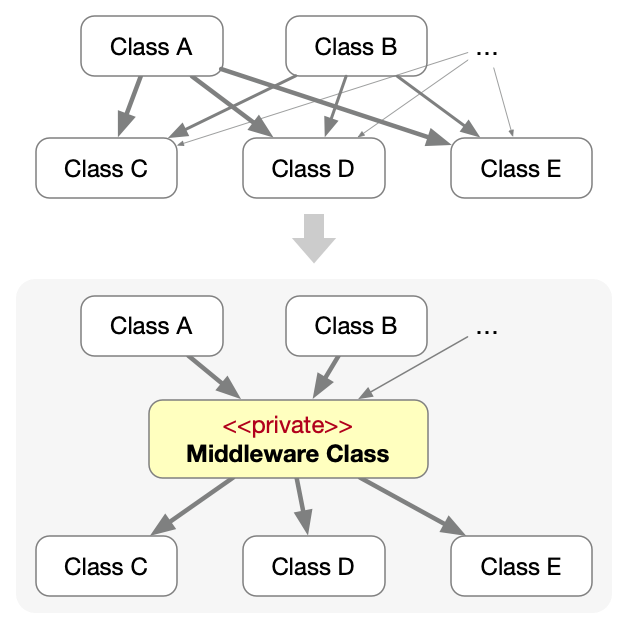

<!-- 
size: 16:9
paginate: true
-->
<!-- header: 勉強会# ― エンジニアとしての解像度を高めるための勉強会-->

# 読みやすいコードの作り方 - 依存関係(6)

_Code Readability_

---

## タネ本

### 『読みやすいコードのガイドライン<br>　 持続可能なソフトウェア開発のために』

- 石川宗寿(著)
- 技術評論社 2022/11/4 初版

> 見た目を美しく整えることや、流行りのテクニックを取り入れることが「改善」だと思い込んでいませんか？


---

## 依存関係とは

２つのクラス/関数/モジュールなどを組み合わせたときの『相手を使うクラス』『相手に使われるクラス』の関係のこと。

- <b>相手を使うクラス・関数</b>: **依存元**
- <b>相手に使われるクラス・関数</b>: **依存先**


```cs
class X { // 依存元クラス
    Y other;
    void act() { other.doSomething(); }
}

class Y { // 依存先クラス
    void doSomething() { ... }
}
```

<!-- クラスとして表現した場合の、依存元クラスXと依存先クラスYのその他の関係はこういうものもある

- XがプロパティとしてYのインスタンスを持つ(スライドのとおり)
- XのメソッドがYを引数として取るか、戻り値として返す
- Xの中でYのメンバー(メソッドやプロパティ)にアクセスする
- XがYを継承している
 -->

---
 
 ## 理想的な依存関係

- 依存関係が弱い（≠依存関係がない）
- 循環依存や重複した依存がない
- 明示的な依存関係になっている

記述するコードがこれらのルールを守れている状態にする

<!-- 派生開発や未知のコード・スキル不足などで「必要最小限の変更」を繰り返していると依存関係が簡単に崩れていく -->

---

## 依存関係

1. 依存の強さ(結合度)
1. 依存の方向
1. **依存の重複**
1. **依存の明示性**

<!--
今回の話は、具体的なコード例を取り出して説明するのではなく、クラス図やモジュール構成図を使った抽象的な話が多い。

つまり直接役立つという話よりは、色んな場面でじんわり役立つ話になるので、自分の仕事では似たような場面はないかなと思いを巡らせながら聞いてみてください。
-->

---

## 3.依存の重複

あるクラスを複数のクラスが利用している状態のこと。


共通クラス・データクラスでよくあるパターンなので、基本は問題のない状況

**ただし状況によっては悪い重複にもなる**

---

## 悪い依存の重複①<br>　　数珠つなぎの依存


あるオブジェクトを使いたいだけの理由で関係ないクラスに依存している。
例: `var x = b.c.getValue()`

- そのオブジェクトの値・処理を使いたい(だけ)
- データをちょうど同じ目的で使っていたので…, etc.

→ 構造を見直し「Class Bが仲介する」「Class Cを共有する」など、**跨いだ依存をなくす**

<!-- Class CをClass Bを介して使っている(Bは不要) -->

---

## 参考: デメテルの法則

> 任意のオブジェクトが自分以外の構造やプロパティに対して持っている仮定を<br>最小限にすべき。

…つまり<b>「関係の薄い相手を跨いだ話をしないこと」「直接の友達とだけ話すこと<br>(友達のその先に関わらないこと)」</b>という意味

```cs
[BAD]
var result = obj.otherObj.action(); // 友達の友達に問い合わせている。１行で２依存発生！
```

**それぞれが知っているべき・知るべきではない情報が整理されていない**のが原因

<!-- https://ja.wikipedia.org/wiki/%E3%83%87%E3%83%A1%E3%83%86%E3%83%AB%E3%81%AE%E6%B3%95%E5%89%87 より引用。
 犬を散歩に連れ出すことを考える。この際、犬の足に直接「歩け」と命じるのはおかしいだろう。この場合は、犬に対して命令し、自分の足の面倒は自分で見させるのが正しい方法だといえる。
 アーキテクチャで考えても良い。モジュールがレイヤー構造になっている図をイメージしたときに、あるレイヤーをスキップしてさらに先のレイヤーとで直接通信しているのはおかしいと思うはず。 -->

---

## 悪い依存の重複②<br>　　依存の集合の重複



「依存先や使い方」が複数クラス同士で似ている

- 依存先を制御する処理が散らばりがち
    - 仕様変更等で変更漏れが生じてしまう

**「まとまり」を表す中間層クラスにまとめる。**<br>ただし…

- 必要になるまで作らない(KISS, YAGNI)
- Middlewareクラスを公開しない
    - 「お、こんな便利なものが！」と乱用されてしまう→神クラスの発生

---

## 4.依存の明示性


明示的な依存関係だけでなく「コードから見えない依存関係(**暗黙的な依存関係**)」にも気を配る
（右のコードは実体の注入箇所を見て初めて分かる）

- ポリモーフィズムの実クラス
- 型定義のないデータフォーマット
- 引数や戻り値の変域
- 同じようなコードのコピー

過度な抽象化、極端な低結合度、… etc.
 → **「薬も過ぎれば毒になる」**

<!-- 本来は役立つ技術であるものもやり過ぎは良くないのでKISSに注意 -->

---

## アンチパターン(1) 過度な抽象化


```cs
class CurrentDatePresenter { // 現在の日付を表示するクラス
    private DateTextFormatter _dateTextFormatter; // 日付(数値)→文字列変換
    void showCurrentTime() { /* _dateTextFormatterを使った処理 */ }
}

class UserProfilePresenter { // ユーザー情報を表示するクラス
    private UserProfileRepository _repository; // ユーザーID(数値)→文字列取得
    void showProfile(int userId) { /* _repositoryを使った処理 */ }
}
```

🤔「どちらも数値→文字列の処理を持ってるな…そうだ、共通部分を抽象化だ！」

---

## アンチパターン(1) 過度な抽象化


```cs
[BAD]
// 数値を文字列に変換する最高のクラス
interface NumToStringConverter {
    string convert(int value);
}

class DateTextFormatter:  NumToStringConverter { ... }
class UserProfileRepository:  NumToStringConverter { ... }
```

🤔「変換部分をインターフェースとして切り出して…継承して…」

---

## アンチパターン(1) 過度な抽象化

```cs
[BAD]
class CurrentDatePresenter { // 現在の日付を表示するクラス
    private NumToStringConverter _dateTextFormatter; // 日付(数値)→文字列変換
    void showCurrentTime() { /* _dateTextFormatterを使った処理 */ }
}

class UserProfilePresenter { // ユーザー情報を表示するクラス
    private NumToStringConverter _repository; // ユーザーID(数値)→文字列取得
    void showProfile(int userId) { /* _repositoryを使った処理 */ }
}
```

🤔「できた…完璧すぎる…」 **→ 地獄の始まり**

---

## アンチパターン(1) 過度な抽象化

悪化。動作の流れが暗黙的になって追いにくく、入れ替えても意味がない処理が変えられるようになってしまっている

<center>

|状況|クラス図|
|---|---|
|before||
|after👎<br>**[BAD]**||

</center>

---

## [補足] DI(Dependency Injection.依存性注入)の光と闇

> DIとは、オブジェクト間の依存関係をハードコーディングせずに解決する設計パターンのこと。静的なオブジェクト指向言語ではインターフェースと実装クラスとを分離しておき自由に差し替えられるようにする。

DIにはメリットもデメリットもあるので盲信しない。↓のメリットを求めていないのであればDIを使う必要はない

<center>

|メリット|デメリット|
|---|---|
|・モジュール間の相互依存の解決<br>・実装の差し替え<br>・ビルドの高速化<br>・ツールによるインスタンス管理|・依存関係の暗黙化<br>・可読性の低下のおそれ|

<center>

---

## アンチパターン(2) 暗黙的な変域

『引数が受け取れる値の範囲 ≠ 値が表現可能な範囲』はわかりにくい

```cs
class SomeView {
    void SetBackgroundColor(String colorString) {
        if (colorString == "red") {
            self.BackgroundColor = 0xFF0000FF; // RGBAで赤
        } else if (colorString == "green") {
            self.BackgroundColor = 0x00FF00FF; // RGBAで緑
        } else if ( … ) { … } else if ( … ) { … } // いろんなパターンに対処
        else {
            self.BackgroundColor = 0x00000000; // マッチしない場合は透明にフォールバック
        }
    }
}
```

🤔 **QUIZ: このコードの問題を考えてみよう**

---

## アンチパターン(2) 暗黙的な変域

- 問題１: 有効値を知るためにはコードの詳細を読まないといけない
    - 失敗すると透明になってしまうので誤判定が分かりにくい
- 問題２: 仕様変更したときに全ての指定箇所を見ないといけない
    - 検索でヒットしない指定方法をしているかも(例:`"pale"+"blue"`)

```cs
class SomeView {
    void SetBackgroundColor(String colorString) {
        if (colorString == "red") { … }
        else if (colorString == "green") { … }
        else if ( … ) { … } else if ( … ) { … }
        else { … }
    }
}
```

<!-- 緑のgreenにスペルミスがあって、eが２つ多かったので直します、今後はグリーンボーイズにします。となったら全部の箇所で変えないと「道」とか「キセキ」とか歌ってくれなくなる。そうでなくても肌色を今後は薄橙とかペールオレンジ、ベージュにするということもありうる -->
<!-- これは「仕様について知っている」という暗黙の依存関係が発生している。システムは仕様から作るのでそれ自体は問題ないのだけれど、仕様をしっかり把握していないと簡単に使うことさえできない、というのはあまり良いコードとは言えない -->

---

## アンチパターン(2) 暗黙的な変域の対策

enumなどで明示的な型を用意する

```cs
enum ViewColor {
    RED = 0xFF0000FF,
    GREEN = 0x00FF00FF,
    ...
    TRANSPARENT = 0x00000000
}

class SomeView {
    void SetBackgroundColor(ViewColor color) { … }
}
```

---

## 依存関係のまとめ

- 結合度
    - 内容結合は断固解消、共通結合〜制御結合は緩和するべきケースあり
- 依存の方向
    - 依存方向を決める基準を使い、単方向にして相互・循環依存を避ける
- 依存の重複
    - デメテルの原則をもとに依存の不要な重なりを避ける
- 依存の明示性
    - 隠れた依存関係にも注意を払う

---

# :tada:おつかれさまでした！:tada:

これからも巨人の肩に乗り、解像度を高くしていってください!!

<!-- 使い方
https://hirohitokato.github.io/DesigningKatas/

- 個人勉強のフックポイント
- チームの共通言語
- 生成AIのキーワード
 -->