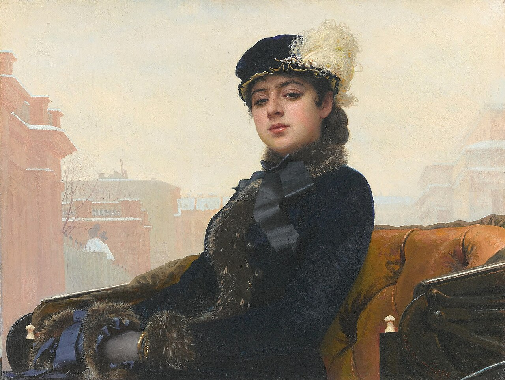

<!-- 
size: 16:9
paginate: true
-->
<!-- header: 勉強会#-->

# アンナ・カレーニナの法則

『アンナ・カレーニナ』（露: Анна Каренина）：1877年に発刊された帝政ロシアの作家レフ・トルストイの長編小説

<!-- 他の著作だと戦争と平和 -->

---

>>> Leo Tolstoy, Public domain, via Wikimedia Commons
>> イワン・クラムスコイ作「邦題:忘れえぬ女」（1883年）

<!-- 19世紀の貴族社会の中、アンナという除染を主人公にして、自身の気持ちに誠実に生き不倫という形とはいえ愛に生きたアンナと、農村で実直に生きて他人や神のために生きた別の女性・キティとの対比を圧倒的なリアリズムで描いた作品。戦争と平和に並ぶ有名作 -->

<!-- トルストイはエスペラント語の熱心な信奉者だったらしい。エスペラント語の第一話者でありエスペラント語を作ったザメンホフとも親交を深めた -->

---

## アンナ・カレーニナの書き出し

> 「すべての幸せな家庭は似ている。不幸な家庭は、それぞれ異なる理由で不幸である。」

 → 多数の要素によってその成功、失敗が左右されるような事象について、失敗の原因はたくさんありうること$^1$
* 成功する理由(=幸せな家庭である理由)は似ているが、失敗する理由は様々である

>>> 1: ["失敗する理由"を聞かれて答えにくいワケ 「アンナ・カレーニナの法則」とは”. PRESIDENT Online (2018年10月14日)](https://president.jp/articles/-/26130)より

<!-- 成功するためにはすべての失敗する要素を排除しなければならないという記述もあったが、それはちょっと極端 -->

---

> すべてきれいなコードは互いに似通っているが、クソコードはそれぞれにクソの趣を異にしているものである$^1$

>>> 1: https://nowokay.hatenablog.com/entry/2023/11/16/203512