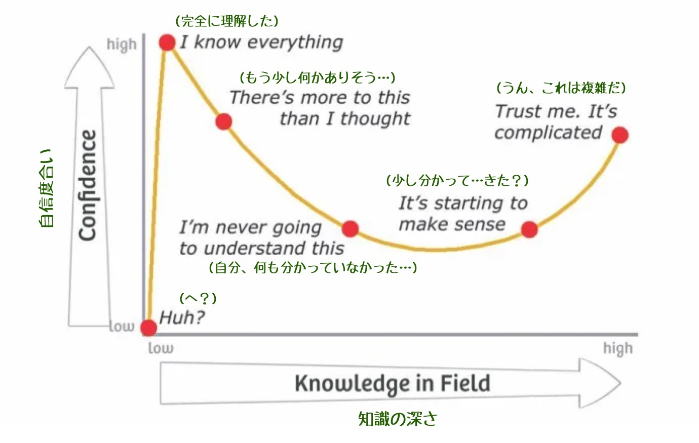

<!-- 
size: 16:9
paginate: true
-->
<!-- header: 勉強会#-->

# ダニング＝クルーガー効果

_Dunning–Kruger effect_

---

>>> 図: [「ダニングクルーガー効果とは？原因や対処法を具体例を用いて解説！」マネーフォーワード](https://biz.moneyforward.com/payroll/basic/63123/)

## 知識/能力と自信の関係を表した仮説

認知バイアスについての仮説

* 能力や専門性や経験の低い人は自分の能力を過大評価しがち
* 能力の高い人は自分の能力を過小評価しがち

<!-- 1999年に発表。 -->

---

>>> 図: [「ダニングクルーガー効果とは？原因や対処法を具体例を用いて解説！」マネーフォーワード](https://biz.moneyforward.com/payroll/basic/63123/)

<!-- 2005年のダニングの自著「Self-insight」で「あなたが無能なら、あなたは自分が無能であることを知ることはできない。正しい答えを生み出すために必要なスキルは、正解が何であるかを認識するために必要なスキルと同じである。」 -->

---

>>> [The Dunning Kruger Effect](https://dev.to/theiyd/the-dunning-kruger-effect-3cj2)

---

