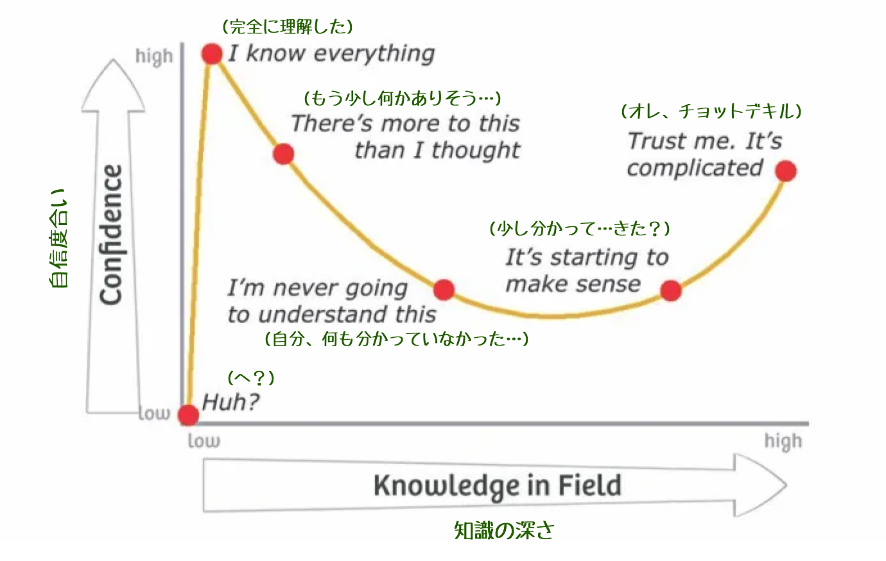

<!-- 
size: 16:9
paginate: true
-->
<!-- header: 勉強会# ― エンジニアとしての解像度を高めるための勉強会-->

# ダニング＝クルーガー効果

_Dunning–Kruger effect_

---

>>> 図: [「ダニングクルーガー効果とは？原因や対処法を具体例を用いて解説！」マネーフォーワード](https://biz.moneyforward.com/payroll/basic/63123/)

## 知識/能力と自信の関係を表した仮説

認知バイアスについての仮説

* 能力や専門性や経験の低い人は自分の能力を過大評価しがち
* 能力の高い人は自分の能力を過小評価しがち

<!-- 1999年に発表。 -->

---

>>> 図: [「ダニングクルーガー効果とは？原因や対処法を具体例を用いて解説！」マネーフォーワード](https://biz.moneyforward.com/payroll/basic/63123/)

<!-- 2005年のダニングの自著「Self-insight」で「あなたが無能なら、あなたは自分が無能であることを知ることはできない。正しい答えを生み出すために必要なスキルは、正解が何であるかを認識するために必要なスキルと同じである。」 -->

---

>>> [The Dunning Kruger Effect](https://dev.to/theiyd/the-dunning-kruger-effect-3cj2)

<!-- 一方で、『インポスター症候群』という言葉もある。インポスターは「詐欺師」や「偽物」といった意味。Among Usというゲームでも出てきた言葉
インポスター症候群(impostor syndrome)とは、自分を肯定することができないため、周りから称賛されても、それを受け入れることができず、詐欺師のように周りを「騙している」という感覚に陥ってしまう心理傾向のこと。
「自分に自信が持てない……」「周りから期待されることが息苦しい……」「本当はたいした人間でないと、いつ悟られるか不安……」などなど -->
<!-- 
1　現在に集中して、未来を心配しすぎない
2　自分にも他人にも完璧を求めない
3　自分より優秀だと思う人の中に身を置く
4　褒められたら否定せず受け止める
 -->
---

---

## 最新情報

> **「能力が低いほど自分を過大評価する」というダニング＝クルーガー効果への反論がさらなる反論を呼ぶ**
> [GIGAZINEの記事](https://gigazine.net/news/20231128-dunning-kruger-effect-autocorrelation/)

ダニングクルーガー効果は存在しない、統計の誤りであるという論も出ているそうで。
